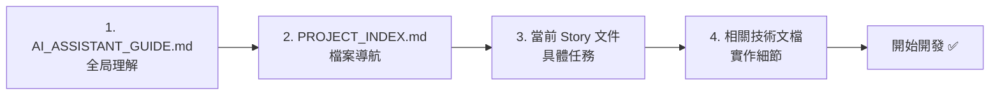
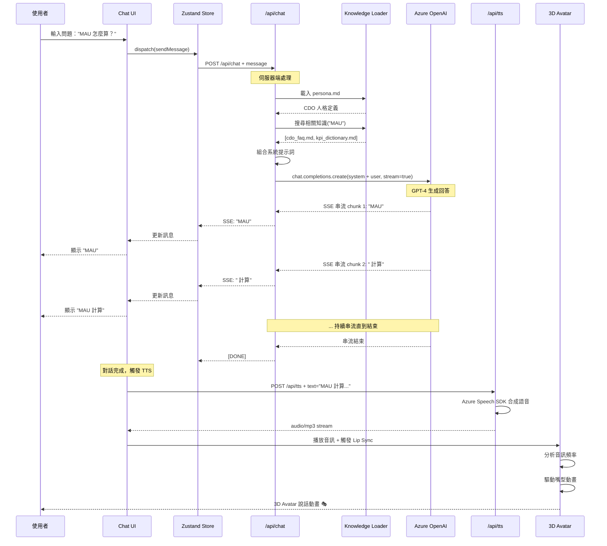
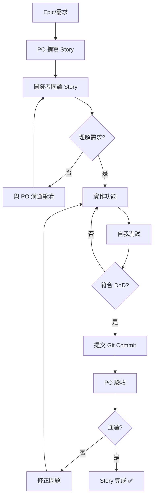

# AI Assistant Guide - 智能助手開發指南

> **目標讀者**: AI 開發助手（Claude, GPT, Copilot）與新加入的開發人員
> **用途**: 快速全面理解專案背景、架構、開發流程
> **最後更新**: 2025-10-15
> **專案版本**: v1.0.0 (Story 1.1 完成)

---

## 📋 使用說明（重要！請先閱讀）

### 🎯 這份文件的作用

當你（AI 助手或開發者）開始協助開發時，**請務必先閱讀這份文件**，它會告訴你：

1. ✅ 這個專案在做什麼
2. ✅ 為什麼要這樣設計
3. ✅ 當前開發到哪裡
4. ✅ 接下來要做什麼
5. ✅ 開發時應該遵守的規範

### 📖 閱讀順序建議



**推薦閱讀路徑**:
1. 🔴 **本文件** (`AI_ASSISTANT_GUIDE.md`) - 15 分鐘全面理解
2. 🟡 **專案索引** (`PROJECT_INDEX.md`) - 5 分鐘快速導航
3. 🟢 **當前 Story** (`docs/stories/X.X.story-name.md`) - 詳細需求
4. 🔵 **技術文檔** (依實作需求查閱)

---

## 🎯 Part 1: 專案核心理解

### 1.1 專案是什麼？（30 秒電梯簡報）

**Smart AI Avatar Agent** 是一個基於 Next.js 14、Three.js 和 Azure AI 的 **3D Avatar 即時對話系統**。

使用者可以透過網頁與一個 **模擬 CDO（數據長）的 3D Avatar** 進行自然對話，系統會：
- 🎨 **視覺化**: 渲染逼真的 3D Avatar（Three.js）
- 💬 **智能對話**: 使用 Azure OpenAI GPT-4 Turbo
- 🎤 **語音合成**: 使用 Azure Speech Services TTS（繁體中文）
- 👄 **嘴型同步**: 音訊驅動的 Lip Sync 動畫

**商業價值**: 讓員工能隨時與「虛擬老闆」討論數據策略、KPI 定義、專案決策等。

---

### 1.2 為什麼要做這個專案？（商業背景）

**痛點分析**:
```yaml
企業問題:
  - CDO 時間有限，無法回答所有員工問題
  - 重複性問題（KPI 定義、流程查詢）浪費時間
  - 新員工缺乏對數據戰略的理解
  - 決策邏輯未被系統化記錄

解決方案:
  - 24/7 可用的虛擬 CDO
  - 自動回答高頻問題（FAQ）
  - 傳承 CDO 的決策思維與溝通風格
  - 透過 3D Avatar 提升互動體驗
```

**市場機會**:
- 企業知識管理市場規模 $XX 億（待調研）
- AI Avatar 技術日趨成熟
- 混合辦公趨勢下，虛擬互動需求上升

---

### 1.3 專案目標（POC 階段）

**本專案是 POC (Proof of Concept)**，目標是在 **12 週內**驗證技術可行性：

```yaml
技術目標:
  - ✅ 證明 3D Avatar 可在瀏覽器流暢運行 (FPS ≥ 30)
  - ✅ 驗證 LLM + TTS + Lip Sync 的端到端對話體驗
  - ✅ 測試 Azure 服務的穩定性與成本
  - ✅ 建立可擴展的架構基礎

業務目標:
  - 內部 Demo 展示（第 10 週）
  - 收集 10+ 位員工的使用回饋
  - 決定是否進入 MVP 開發階段

非目標 (Out of Scope):
  - ❌ 多使用者並發（POC 僅支援單使用者）
  - ❌ 企業級身份驗證（僅基礎驗證）
  - ❌ 多語言支援（僅繁體中文）
  - ❌ 進階 Analytics（僅基礎日誌）
```

---

### 1.4 關鍵技術決策與原因

#### 為什麼選 Next.js 14？
```yaml
決策: Next.js 14 (App Router)
理由:
  - 同時支援 SSR（SEO 友好）和 CSR（互動體驗）
  - API Routes 可作為中間層（隱藏 Azure API Keys）
  - Vercel 部署簡單（但本專案使用 Azure）
  - React 生態系豐富（Three.js 整合成熟）
替代方案:
  - ❌ Pure React SPA: 需要額外後端服務
  - ❌ Vue.js: 團隊不熟悉
```

#### 為什麼用 Three.js 而非 Unity WebGL？
```yaml
決策: Three.js + React Three Fiber
理由:
  - 輕量級（Bundle < 1MB vs Unity 10MB+）
  - 瀏覽器原生支援（無需 WebAssembly）
  - React 整合簡單（@react-three/fiber）
  - 開發除錯方便（Chrome DevTools）
限制:
  - 複雜動畫需手動實作（Unity 更成熟）
  - 效能上限較低（適合 POC，不適合遊戲）
```

#### 為什麼用 Azure 而非 OpenAI 直接 API？
```yaml
決策: Azure OpenAI + Azure Speech Services
理由:
  - 企業合規（資料主權、隱私保護）
  - SLA 保證（99.9% 可用性）
  - 統一帳單與管理（Azure 生態系）
  - 支援繁體中文 TTS（OpenAI 不支援）
成本:
  - Azure OpenAI: ~$0.03/1K tokens
  - Azure Speech TTS: ~$16/1M characters
  - 預估 POC 總成本: <$500/月
```

---

## 🏗️ Part 2: 系統架構理解

### 2.1 整體架構圖

```
┌─────────────────────────────────────────────────────────────┐
│                    使用者瀏覽器 (Client)                      │
│  ┌────────────────────────────────────────────────────────┐ │
│  │          Next.js 前端應用 (App Router)                 │ │
│  │  ┌──────────────┐  ┌──────────────┐  ┌─────────────┐ │ │
│  │  │  Chat UI     │  │ 3D Avatar    │  │ Audio       │ │ │
│  │  │  (React)     │  │ (Three.js)   │  │ (Web Audio) │ │ │
│  │  └──────────────┘  └──────────────┘  └─────────────┘ │ │
│  │         ↓                  ↓                  ↓        │ │
│  │  ┌──────────────────────────────────────────────────┐ │ │
│  │  │         Zustand State Management                 │ │ │
│  │  └──────────────────────────────────────────────────┘ │ │
│  └────────────────────────────────────────────────────────┘ │
└───────────────────────┬─────────────────────────────────────┘
                        │ HTTPS / Fetch API
                        ↓
┌─────────────────────────────────────────────────────────────┐
│         Next.js API Routes (Server-Side, Serverless)        │
│  ┌──────────────┐  ┌──────────────┐  ┌──────────────┐     │
│  │ /api/chat    │  │  /api/tts    │  │ /api/health  │     │
│  │  (SSE 串流)  │  │ (語音合成)    │  │ (健康檢查)    │     │
│  └──────────────┘  └──────────────┘  └──────────────┘     │
│         ↓                  ↓                                │
│  ┌─────────────────────────────────────────────────────┐   │
│  │      Knowledge Loader (agent-brain/ 知識庫)         │   │
│  │  - persona.md (人格定義)                            │   │
│  │  - cdo_faq.md (常見問答)                            │   │
│  │  - kpi_dictionary.md (KPI 定義)                     │   │
│  └─────────────────────────────────────────────────────┘   │
└───────────────────────┬─────────────────────────────────────┘
                        │ Azure SDK
                        ↓
┌─────────────────────────────────────────────────────────────┐
│               Azure 雲端服務層                               │
│  ┌──────────────────┐  ┌───────────────────────────────┐   │
│  │  Azure OpenAI    │  │ Azure Speech Services         │   │
│  │  (GPT-4 Turbo)   │  │  - TTS (繁中語音合成)         │   │
│  │  - 對話生成      │  │  - 可選: STT (語音識別)       │   │
│  └──────────────────┘  └───────────────────────────────┘   │
└─────────────────────────────────────────────────────────────┘
```

---

### 2.2 資料流程（對話流程為例）



---

### 2.3 目錄結構詳解

```bash
smart-ai-avatar-agent/
│
├── 📋 專案管理與文檔 (Project Management & Documentation)
│   ├── AI_ASSISTANT_GUIDE.md        # 🔴 你現在讀的這份文件
│   ├── PROJECT_INDEX.md             # 🟡 完整專案索引
│   ├── PROJECT_OVERVIEW.md          # 專案總覽
│   ├── DEVELOPMENT_ROADMAP.md       # 12週開發路線圖
│   ├── QUICK_START.md               # 5分鐘快速上手
│   ├── README.md                    # 專案說明（對外）
│   └── docs/                        # 詳細文檔目錄
│       ├── prd.md                   # 產品需求文件
│       ├── architecture.md          # 架構設計文件
│       ├── sprint-planning.md       # Sprint 規劃
│       └── stories/                 # User Stories (29 個)
│
├── 🧠 AI 知識庫 (AI Knowledge Base)
│   └── agent-brain/                 # CDO 知識庫根目錄
│       ├── persona.md               # 🔴 CDO 人格定義（最重要）
│       ├── KNOWLEDGE_BASE_GUIDE.md  # 知識庫結構說明
│       ├── MAINTENANCE_GUIDE.md     # 維護工作流程
│       ├── TECHNICAL_FLOW.md        # 技術流程詳解
│       ├── core/                    # 核心知識（FAQ、KPI）
│       ├── experience/              # 經驗層（決策日誌、觀點）
│       └── temporal/                # 時效層（會議摘要）
│
├── ⚙️ Next.js 應用程式 (Application Code)
│   ├── app/                         # Next.js 14 App Router
│   │   ├── layout.tsx               # 全域佈局
│   │   ├── page.tsx                 # 首頁
│   │   ├── globals.css              # 全域樣式
│   │   └── api/                     # API Routes (後續實作)
│   │       ├── chat/route.ts        # 💬 LLM 對話 API
│   │       ├── tts/route.ts         # 🎤 TTS 語音合成 API
│   │       └── health/route.ts      # 🏥 健康檢查 API
│   │
│   ├── components/                  # React 組件
│   │   ├── avatar/                  # 3D Avatar 組件（後續實作）
│   │   ├── chat/                    # 對話介面組件（後續實作）
│   │   └── ui/                      # 通用 UI 組件（後續實作）
│   │
│   ├── lib/                         # 工具函式與配置
│   │   ├── ai/                      # AI 相關工具（後續實作）
│   │   │   ├── knowledge-loader.ts  # 知識庫載入器
│   │   │   └── context-builder.ts   # 上下文建構器
│   │   ├── azure/                   # Azure SDK 配置（後續實作）
│   │   │   ├── openai.ts            # OpenAI 客戶端
│   │   │   └── speech.ts            # Speech 客戶端
│   │   └── three/                   # Three.js 工具（後續實作）
│   │       ├── avatar-loader.ts     # Avatar 載入器
│   │       └── lipsync.ts           # Lip Sync 分析
│   │
│   ├── store/                       # Zustand 狀態管理（後續實作）
│   │   ├── chatStore.ts             # 對話狀態
│   │   ├── audioStore.ts            # 音訊狀態
│   │   └── avatarStore.ts           # Avatar 狀態
│   │
│   ├── types/                       # TypeScript 型別定義（後續實作）
│   │   ├── chat.ts                  # 對話型別
│   │   ├── audio.ts                 # 音訊型別
│   │   └── api.ts                   # API 型別
│   │
│   └── public/                      # 靜態資源
│       └── avatars/                 # Avatar 模型檔案（後續實作）
│
├── 🔧 配置檔案 (Configuration Files)
│   ├── package.json                 # npm 依賴管理
│   ├── tsconfig.json                # TypeScript 配置
│   ├── next.config.js               # Next.js 配置
│   ├── tailwind.config.ts           # Tailwind CSS 配置
│   ├── postcss.config.js            # PostCSS 配置
│   ├── .eslintrc.json               # ESLint 規則
│   ├── .prettierrc                  # Prettier 格式化
│   ├── .env.local.example           # 環境變數範例
│   └── .gitignore                   # Git 忽略規則
│
└── 🧪 測試與工具 (Testing & Tools) - 後續建立
    ├── tests/                       # 測試檔案（E2E, Unit）
    └── scripts/                     # 自動化腳本
        └── generate-index.js        # 自動生成專案索引
```

---

## 📖 Part 3: 開發流程與規範

### 3.1 開發流程（基於 BMad 方法論）



**Definition of Done (DoD)** - 每個 Story 完成的標準:
```yaml
程式碼品質:
  - ✅ 通過 ESLint 檢查 (npm run lint)
  - ✅ 通過 TypeScript 型別檢查
  - ✅ 符合 Prettier 格式化規範
  - ✅ 無 console.log（除非是正式 logging）

功能完整性:
  - ✅ 所有 Acceptance Criteria 都達成
  - ✅ 手動測試通過（瀏覽器驗證）
  - ✅ 無明顯 Bug 或錯誤

文檔:
  - ✅ 關鍵函式有 TSDoc 註解
  - ✅ README 更新（如果有新功能）
  - ✅ 環境變數文件更新（如果有新變數）

Git:
  - ✅ Commit message 符合規範
  - ✅ 無敏感資訊（API Keys）提交
```

---

### 3.2 Git Commit 規範

**Commit Message 格式**:
```bash
<type>(<scope>): <subject>

<body>

<footer>
```

**Type 類型**:
```yaml
feat:     新功能
fix:      Bug 修復
docs:     文檔變更
style:    程式碼格式（不影響功能）
refactor: 重構（不改變功能）
test:     測試相關
chore:    建置工具、CI/CD 相關
```

**範例**:
```bash
# ✅ 好的 Commit
feat(chat): implement SSE streaming for LLM responses

- Add /api/chat endpoint with Server-Sent Events
- Integrate Azure OpenAI GPT-4 Turbo
- Load persona.md and relevant knowledge
- Return streaming response to frontend

Closes #12

Co-Authored-By: Claude <noreply@anthropic.com>

# ❌ 壞的 Commit
update files
fix bug
WIP
```

---

### 3.3 程式碼風格與最佳實踐

#### TypeScript 規範
```typescript
// ✅ 好的範例: 明確的型別定義
interface ChatMessage {
  id: string;
  role: 'user' | 'assistant' | 'system';
  content: string;
  timestamp: Date;
}

async function sendMessage(message: ChatMessage): Promise<void> {
  // 實作...
}

// ❌ 壞的範例: 使用 any
function sendMessage(message: any): any {
  // 實作...
}
```

#### React 組件規範
```typescript
// ✅ 好的範例: 功能型組件 + TypeScript
interface ChatInterfaceProps {
  initialMessages?: ChatMessage[];
  onSendMessage: (message: string) => void;
}

export function ChatInterface({
  initialMessages = [],
  onSendMessage
}: ChatInterfaceProps) {
  // 使用 hooks
  const [messages, setMessages] = useState<ChatMessage[]>(initialMessages);

  return (
    <div className="chat-interface">
      {/* JSX */}
    </div>
  );
}

// ❌ 壞的範例: Class 組件（除非必要）
class ChatInterface extends React.Component {
  // ...
}
```

#### API Route 規範
```typescript
// ✅ 好的範例: 明確的錯誤處理
export async function POST(request: NextRequest) {
  try {
    const { message } = await request.json();

    // 驗證輸入
    if (!message || typeof message !== 'string') {
      return NextResponse.json(
        { error: 'Invalid message format' },
        { status: 400 }
      );
    }

    // 業務邏輯...

    return NextResponse.json({ success: true });

  } catch (error) {
    console.error('API error:', error);
    return NextResponse.json(
      { error: 'Internal server error' },
      { status: 500 }
    );
  }
}

// ❌ 壞的範例: 沒有錯誤處理
export async function POST(request: NextRequest) {
  const { message } = await request.json();
  // 業務邏輯...（如果出錯會導致 500 錯誤且無日誌）
}
```

---

### 3.4 測試策略（後續實作）

```yaml
測試金字塔:
  E2E 測試 (10%):
    - 使用 Playwright
    - 測試關鍵使用者流程（對話、TTS、Lip Sync）

  整合測試 (30%):
    - API Routes 測試
    - Azure 服務整合測試
    - 知識庫載入測試

  單元測試 (60%):
    - 工具函式測試
    - React 組件測試（React Testing Library）
    - Store 邏輯測試

目標覆蓋率:
  - 整體: ≥ 70%
  - 關鍵路徑: ≥ 90%
```

---

## 🎯 Part 4: 當前開發狀態

### 4.1 已完成的 Stories（截至 2025-10-15）

| Story | 標題 | 狀態 | 完成日期 |
|-------|------|------|---------|
| **1.1** | Next.js 專案初始化 | ✅ 完成 | 2025-10-15 |
| **1.2** | Azure Services 設定 | ⏳ 待開始 | - |
| **1.3** | 基礎 UI 框架 | ⏳ 待開始 | - |
| **1.4** | Health Check API | ⏳ 待開始 | - |
| **1.5** | CI/CD 與 Azure 部署 | ⏳ 待開始 | - |

**當前 Sprint**: Sprint 1 (Week 1-2)
**當前進度**: Story 1.1 完成 (12.5% of Sprint 1)

---

### 4.2 Story 1.1 完成總結

**Story 1.1: Next.js 專案初始化**

✅ **已完成的工作**:
1. 建立 Next.js 15.5.5 專案結構
2. 配置 TypeScript（嚴格模式）
3. 配置 Tailwind CSS 4.1.14
4. 配置 ESLint + Prettier
5. 建立基礎 app/ 結構
6. 建立環境變數範例
7. 建立 README.md
8. 通過 `npm run dev` 和 `npm run lint` 驗證

**檔案清單**:
```bash
✅ app/layout.tsx
✅ app/page.tsx
✅ app/globals.css
✅ next.config.js
✅ tsconfig.json
✅ tailwind.config.ts
✅ postcss.config.js
✅ .eslintrc.json
✅ .prettierrc
✅ .env.local.example
✅ package.json（含正確的 scripts）
✅ README.md
```

**Git Commit**: `efd0ee8` - "feat: complete Story 1.1 Next.js project initialization"

---

### 4.3 下一個 Story：Story 1.2 Azure Services 設定

**Story 1.2 概覽**:
- **目標**: 建立 Azure OpenAI 和 Azure Speech Services 資源
- **預估時間**: 1 天
- **優先級**: P0（阻塞後續開發）

**Acceptance Criteria**:
1. Azure OpenAI 資源已建立（East US 區域）
2. GPT-4 Turbo 模型已部署
3. Azure Speech Services 資源已建立（East Asia 區域）
4. API Keys 和 Endpoints 已取得
5. `.env.local` 已配置且可用
6. 簡單的連線測試通過

**預期產出**:
```bash
.env.local  # 包含真實的 API Keys（不提交到 Git）
lib/azure/openai.ts  # Azure OpenAI 客戶端配置
lib/azure/speech.ts  # Azure Speech 客戶端配置
tests/azure-connection.test.ts  # 連線測試腳本
```

**詳細文件**: `docs/stories/1.2.azure-services-setup.md`

---

## 🔧 Part 5: 開發工具與環境

### 5.1 必要工具安裝

```yaml
開發環境:
  Node.js: 18.x 或更高
  npm: 9.x 或更高
  Git: 最新版本
  IDE: VS Code（推薦）

VS Code 擴充套件（推薦）:
  - ESLint (dbaeumer.vscode-eslint)
  - Prettier (esbenp.prettier-vscode)
  - Tailwind CSS IntelliSense (bradlc.vscode-tailwindcss)
  - TypeScript and JavaScript (ms-vscode.vscode-typescript-next)

瀏覽器:
  - Chrome 或 Edge（需支援 WebGL 2.0）
  - Chrome DevTools 熟練使用
```

---

### 5.2 本地開發環境設定

```bash
# 1. 克隆專案
git clone https://github.com/laitim2001/smart-ai-avatar-agent.git
cd smart-ai-avatar-agent

# 2. 安裝依賴
npm install

# 3. 配置環境變數（Story 1.2 完成後）
cp .env.local.example .env.local
# 編輯 .env.local 填入真實的 Azure API Keys

# 4. 啟動開發伺服器
npm run dev
# 訪問 http://localhost:3000

# 5. 執行 Lint 檢查
npm run lint

# 6. 執行程式碼格式化
npm run format
```

---

### 5.3 常用開發指令

```bash
# 開發相關
npm run dev          # 啟動開發伺服器（熱重載）
npm run build        # 建置生產版本
npm start            # 執行生產版本
npm run lint         # ESLint 檢查
npm run format       # Prettier 格式化

# Git 相關
git status           # 查看變更
git add .            # 暫存所有變更
git commit -m "..."  # 提交變更
git push origin main # 推送到遠端

# 除錯相關
npm run dev -- --turbo     # 使用 Turbopack（更快）
npm run build -- --debug   # 除錯模式建置
```

---

## 🚨 Part 6: 常見問題與疑難排解

### 6.1 開發常見問題

#### Q1: 修改程式碼後沒有生效？
```bash
# 解決方案 1: 清除 Next.js 快取
rm -rf .next
npm run dev

# 解決方案 2: 重啟開發伺服器
# Ctrl+C 停止 → npm run dev 重啟
```

#### Q2: TypeScript 型別錯誤但功能正常？
```bash
# 檢查 tsconfig.json 是否正確
cat tsconfig.json

# 重新安裝型別定義
npm install --save-dev @types/node @types/react @types/react-dom
```

#### Q3: Tailwind CSS 樣式沒有生效？
```bash
# 確認檔案在 tailwind.config.ts 的 content 中
# 確認有 import './globals.css' 在 layout.tsx
# 清除快取重啟
rm -rf .next && npm run dev
```

---

### 6.2 AI 助手特別注意事項

#### ⚠️ 不要假設檔案存在
```typescript
// ❌ 錯誤: 假設檔案已存在
import { chatStore } from '@/store/chatStore';

// ✅ 正確: 先確認檔案是否存在（閱讀 PROJECT_INDEX.md）
// 如果不存在，先建立檔案
```

#### ⚠️ 不要跳過 Story 順序
```yaml
# ❌ 錯誤流程
使用者: "幫我實作 Chat API"
AI: "好的，我來建立 app/api/chat/route.ts..."
# （但 Story 1.2 Azure 設定還沒完成，會報錯）

# ✅ 正確流程
使用者: "幫我實作 Chat API"
AI: "注意：Chat API 是 Story 3.3 的內容，但目前只完成到 Story 1.1。
     需要先完成 Story 1.2 (Azure 設定) 才能實作 Chat API。
     是否要先完成 Story 1.2？"
```

#### ⚠️ 檢查依賴關係
```yaml
Story 3.3 (Chat API) 依賴:
  - ✅ Story 1.1: Next.js 初始化
  - ❌ Story 1.2: Azure OpenAI 設定（必須）
  - ❌ Story 3.2: Zustand State 管理（建議）

建議: "你需要先完成 Story 1.2 和 3.2，才能實作 Story 3.3"
```

---

## 📚 Part 7: 重要文件索引

### 7.1 快速導航

**立即需要閱讀**:
- 🔴 `AI_ASSISTANT_GUIDE.md` (本文件)
- 🔴 `PROJECT_INDEX.md` (檔案索引)
- 🟡 當前 Story 文件 (`docs/stories/1.2.azure-services-setup.md`)

**背景知識**:
- `PROJECT_OVERVIEW.md` - 專案總覽與架構
- `DEVELOPMENT_ROADMAP.md` - 12週開發計畫
- `docs/prd.md` - 產品需求文件
- `docs/architecture.md` - 技術架構文件

**開發指南**:
- `QUICK_START.md` - 5分鐘快速上手
- `agent-brain/TECHNICAL_FLOW.md` - AI 知識庫技術流程
- `agent-brain/MAINTENANCE_GUIDE.md` - 知識庫維護指南

**參考資料**:
- `docs/sprint-planning.md` - Sprint 規劃
- `.env.local.example` - 環境變數範例
- `README.md` - 專案說明（對外）

---

### 7.2 檔案變更追蹤

**如何知道哪些檔案最近被修改？**
```bash
# 查看最近 10 次 commit
git log --oneline -10

# 查看特定 commit 的檔案變更
git show <commit-hash>

# 查看當前未提交的變更
git status
git diff
```

**專案索引更新機制**:
- 每次 Sprint 結束後更新 `PROJECT_INDEX.md`
- 新增重要檔案時立即更新索引
- 使用自動化腳本（`scripts/generate-index.js`）輔助更新

---

## 🎓 Part 8: AI 助手工作流程建議

### 8.1 開始協助開發時

```yaml
Step 1: 理解需求 (5 分鐘)
  - 閱讀使用者的請求
  - 識別是哪個 Story 或 Epic
  - 確認當前專案進度（檢查 Git log）

Step 2: 閱讀文件 (10 分鐘)
  - 本文件 (AI_ASSISTANT_GUIDE.md)
  - PROJECT_INDEX.md
  - 對應的 Story 文件

Step 3: 檢查依賴 (2 分鐘)
  - 該 Story 依賴哪些前置 Stories？
  - 是否都已完成？
  - 如果沒有，建議使用者先完成前置任務

Step 4: 規劃實作 (3 分鐘)
  - 需要建立哪些檔案？
  - 需要修改哪些現有檔案？
  - 需要安裝哪些新依賴？

Step 5: 開始編碼 (變動時間)
  - 遵循程式碼規範
  - 逐步實作，頻繁測試
  - 提供清晰的註解

Step 6: 驗證與測試 (5 分鐘)
  - 執行 npm run lint
  - 執行 npm run dev 測試
  - 確認符合 DoD

Step 7: 提交 Git (2 分鐘)
  - 撰寫清晰的 Commit Message
  - 建議使用者提交變更
```

---

### 8.2 提問模板（AI 助手使用）

**當不確定時，使用這些問題模板**:

```markdown
# 釐清需求
- "你想實作的是 Story X.X 嗎？還是其他功能？"
- "這個功能是否依賴其他未完成的 Story？"

# 確認範圍
- "這個功能是否包含 [A, B, C]？還是只需要 [A]？"
- "是否需要撰寫測試？還是先完成功能即可（POC 階段）？"

# 技術決策
- "這裡有兩種實作方式：[方案 A] 或 [方案 B]，你偏好哪一種？"
- "是否需要考慮效能優化？還是先求功能完整？"

# 進度確認
- "Story X.X 已完成，是否繼續 Story X.Y？"
- "需要我幫忙更新文件嗎？（如 PROJECT_INDEX.md）"
```

---

## 🎯 Part 9: 成功標準

### 9.1 如何判斷「理解了專案」？

**自我檢查清單**:
- [ ] 能用 1 分鐘解釋專案是什麼
- [ ] 知道目前開發到哪個 Story
- [ ] 能說出下一個 Story 要做什麼
- [ ] 知道去哪裡找對應的文件
- [ ] 能快速定位檔案位置（透過 PROJECT_INDEX.md）
- [ ] 理解 Git Commit 規範
- [ ] 知道 DoD（Definition of Done）包含什麼

---

### 9.2 協助開發的品質標準

**AI 助手產出品質檢查**:
```yaml
程式碼品質:
  - ✅ 有明確的型別定義（TypeScript）
  - ✅ 有適當的錯誤處理
  - ✅ 有關鍵邏輯的註解
  - ✅ 符合現有程式碼風格

功能完整性:
  - ✅ 滿足 Story 的 Acceptance Criteria
  - ✅ 考慮邊界情況（Edge Cases）
  - ✅ 提供使用範例或說明

溝通品質:
  - ✅ 解釋為什麼這樣實作
  - ✅ 提醒潛在風險或限制
  - ✅ 建議後續優化方向
```

---

## 🔄 Part 10: 文件維護

### 10.1 這份文件的更新時機

**何時需要更新 AI_ASSISTANT_GUIDE.md？**
```yaml
重大架構變更:
  - 新增主要技術堆疊
  - 改變專案目錄結構
  - 修改開發流程

里程碑完成:
  - 每個 Epic 完成後
  - 重要 Sprint 完成後
  - POC 階段結束後

問題累積:
  - 發現常見誤解或錯誤
  - 收到多次相同問題
  - 新增重要的疑難排解
```

### 10.2 維護責任

```yaml
負責人:
  主要維護者: Tech Lead / Senior Developer
  協作者: 所有開發者
  審核者: PO / Architect

更新流程:
  1. 識別需要更新的內容
  2. 編輯對應章節
  3. 更新「最後更新」日期
  4. Git 提交並註明變更原因
  5. 通知團隊
```

---

## 📞 Part 11: 聯絡與支援

### 11.1 遇到問題時

```yaml
技術問題:
  Step 1: 查閱本文件 Part 6 (常見問題)
  Step 2: 搜尋 Git commit history
  Step 3: 檢查 GitHub Issues
  Step 4: 詢問 Tech Lead

流程問題:
  Step 1: 查閱 docs/sprint-planning.md
  Step 2: 確認當前 Story 的 DoD
  Step 3: 詢問 PO

架構問題:
  Step 1: 查閱 docs/architecture.md
  Step 2: 查閱 PROJECT_OVERVIEW.md
  Step 3: 詢問 Architect
```

---

## 🎉 總結

**這份文件的目的**:
- ✅ 幫助 AI 助手快速理解專案
- ✅ 提供開發者完整的入職指南
- ✅ 建立統一的開發規範
- ✅ 減少重複性問題

**記住**:
1. 🔴 **先讀這份文件** → 理解全局
2. 🟡 **再看 PROJECT_INDEX.md** → 快速導航
3. 🟢 **最後讀 Story 文件** → 具體實作

**祝開發順利！🚀**

---

**文件版本**: v1.0.0
**最後更新**: 2025-10-15
**維護者**: Dev Team
**審核者**: Tech Lead
