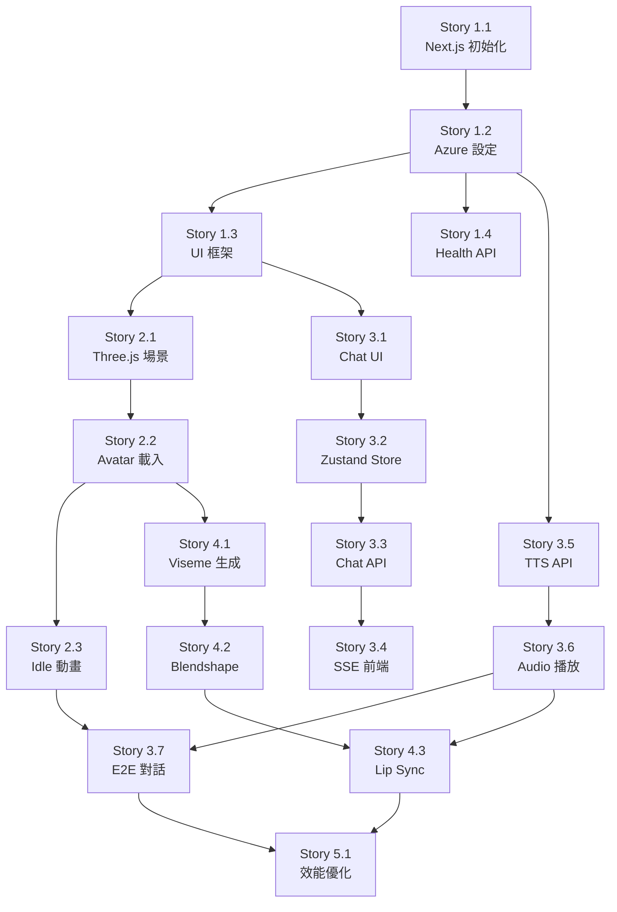

# Project Index - 專案完整索引

> **目標**: 提供專案所有檔案的完整索引與說明，讓 AI 助手和開發者快速定位所需資源
> **維護頻率**: 每個 Story 完成後更新
> **最後更新**: 2025-10-15 (Story 1.1 完成)
> **版本**: v1.1.13

---

## 🎯 使用說明

### 如何使用這份索引？

1. **🔍 快速搜尋**: 使用 `Ctrl+F` 搜尋關鍵字（如 "Chat API", "persona", "Story 3.3"）
2. **📂 分類瀏覽**: 按照檔案類型或功能分類查看
3. **🔗 快速跳轉**: 檔案路徑可直接複製用於編輯器跳轉
4. **📊 狀態追蹤**: 每個檔案標記了當前狀態（✅ 已完成 / 🔄 開發中 / ⏳ 待建立）

---

## 📊 索引統計

```yaml
檔案總數: 85+
  - 專案管理文檔: 8
  - AI 知識庫: 8
  - Next.js 程式碼: 12 (已建立) + 30+ (待建立)
  - 配置檔案: 12
  - Story 文檔: 29
  - 其他文檔: 15+

當前完成度:
  - Epic 1 (專案基礎): 12.5% (1/8 Stories)
  - Epic 2 (3D Avatar): 0% (0/5 Stories)
  - Epic 3 (LLM 對話): 0% (0/7 Stories)
  - Epic 4 (Lip Sync): 0% (0/5 Stories)
  - Epic 5 (優化部署): 0% (0/7 Stories)
```

---

## 📚 目錄

- [1. 核心導航文檔](#1-核心導航文檔)
- [2. 專案管理文檔](#2-專案管理文檔)
- [3. AI 知識庫](#3-ai-知識庫)
- [4. Next.js 應用程式](#4-nextjs-應用程式)
- [5. Story 文檔](#5-story-文檔)
- [6. 配置檔案](#6-配置檔案)
- [7. 測試與工具](#7-測試與工具)
- [8. 靜態資源](#8-靜態資源)

---

## 1. 核心導航文檔

### 🔴 必讀文檔（AI 助手和新開發者）

| 檔案路徑 | 狀態 | 說明 | 閱讀時間 |
|---------|------|------|---------|
| `AI_ASSISTANT_GUIDE.md` | ✅ | **最重要！** AI 助手與開發者完整指南 | 15 分鐘 |
| `PROJECT_INDEX.md` | ✅ | **本文件** 完整專案索引 | 5 分鐘 |
| `README.md` | ✅ | 專案說明（對外展示用） | 3 分鐘 |

### 🟡 快速上手文檔

| 檔案路徑 | 狀態 | 說明 | 閱讀時間 |
|---------|------|------|---------|
| `QUICK_START.md` | ✅ | 5 分鐘快速啟動指南 | 5 分鐘 |
| `PROJECT_OVERVIEW.md` | ✅ | 專案總覽與架構說明 | 10 分鐘 |
| `DEVELOPMENT_ROADMAP.md` | ✅ | 12 週完整開發路線圖 | 10 分鐘 |

---

## 2. 專案管理文檔

### 📋 需求與規劃文檔

| 檔案路徑 | 狀態 | 說明 | 關鍵內容 |
|---------|------|------|---------|
| `docs/prd.md` | ✅ | 產品需求文件 | 功能需求、使用者故事、成功指標 |
| `docs/architecture.md` | ✅ | 技術架構文件 | 系統架構、技術選型、資料流程 |
| `docs/sprint-planning.md` | ✅ | Sprint 規劃（Sprint 1-10） | 每個 Sprint 的 Stories 分配與時程 |

### 📊 Epic 與 Story 文檔

**Epic 總覽**:

| Epic | 標題 | Stories 數量 | 狀態 | 文檔路徑 |
|------|------|------------|------|---------|
| **Epic 1** | 專案基礎建設與部署 | 8 | 🔄 12.5% | `docs/stories/1.*.md` |
| **Epic 2** | 3D Avatar 視覺化與動畫 | 5 | ⏳ 0% | `docs/stories/2.*.md` |
| **Epic 3** | LLM 對話與 TTS 整合 | 7 | ⏳ 0% | `docs/stories/3.*.md` |
| **Epic 4** | Lip Sync 嘴型同步 | 5 | ⏳ 0% | `docs/stories/4.*.md` |
| **Epic 5** | 效能優化、測試與部署 | 7 | ⏳ 0% | `docs/stories/5.*.md` |

### 📝 驗證報告

| 檔案路徑 | 狀態 | 說明 |
|---------|------|------|
| `docs/stories/epic-1-validation-report.md` | ✅ | Epic 1 驗證報告 |
| `docs/stories/epic-2-validation-report.md` | ✅ | Epic 2 驗證報告 |
| `docs/stories/epic-3-validation-report.md` | ✅ | Epic 3 驗證報告 |
| `docs/stories/epic-4-validation-report.md` | ✅ | Epic 4 驗證報告 |
| `docs/stories/epic-5-validation-report.md` | ✅ | Epic 5 驗證報告 |

---

## 3. AI 知識庫

### 🧠 agent-brain/ 目錄結構

```
agent-brain/
├── 📄 核心定義檔案
│   ├── persona.md                      # 🔴 CDO 人格定義（最重要）
│   ├── KNOWLEDGE_BASE_GUIDE.md         # 知識庫結構說明
│   ├── MAINTENANCE_GUIDE.md            # 維護工作流程
│   └── TECHNICAL_FLOW.md               # 技術流程詳解
│
├── 📁 core/ (核心知識)
│   ├── cdo_faq.md                      # 常見問題集
│   ├── kpi_dictionary.md               # KPI 定義字典
│   └── company_policies.md             # ⏳ 待建立
│
├── 📁 experience/ (經驗層)
│   ├── decision_logs/                  # 決策日誌
│   │   └── decision_log_project_phoenix.md
│   └── pov_briefings/                  # 戰略觀點
│       └── pov_briefing_generative_ai_strategy.md
│
└── 📁 temporal/ (時效層)
    └── meeting_summaries/              # 會議摘要
        └── meeting_summary_2025-10-14_Q4數據策略覆盤.md
```

### 知識庫檔案詳細說明

| 檔案路徑 | 狀態 | 說明 | 更新頻率 |
|---------|------|------|---------|
| `agent-brain/persona.md` | ✅ | **最關鍵** CDO 人格、語氣、決策框架 | 每月或發現語氣問題時 |
| `agent-brain/KNOWLEDGE_BASE_GUIDE.md` | ✅ | 知識庫結構與模板說明 | 架構變更時 |
| `agent-brain/MAINTENANCE_GUIDE.md` | ✅ | 維護工作流程與最佳實踐 | 發現新流程時 |
| `agent-brain/TECHNICAL_FLOW.md` | ✅ | 技術實作流程詳解 | 技術架構變更時 |
| `agent-brain/cdo_faq.md` | ✅ | 高頻問題標準答案 | 每週或收到新問題時 |
| `agent-brain/kpi_dictionary.md` | ✅ | KPI 定義與計算口徑 | KPI 變更時立即更新 |

**關鍵提醒**:
- 🔴 每次對話都會載入 `persona.md`
- 🟡 其他檔案透過關鍵字搜尋動態載入

---

## 4. Next.js 應用程式

### 4.1 App Router 結構

#### ✅ 已建立的檔案

| 檔案路徑 | 狀態 | 說明 | Story |
|---------|------|------|-------|
| `app/layout.tsx` | ✅ | 全域佈局（繁體中文支援） | 1.1 |
| `app/page.tsx` | ✅ | 首頁展示 | 1.1 |
| `app/globals.css` | ✅ | Tailwind 全域樣式 | 1.1 |

#### ⏳ 待建立的 API Routes

| 檔案路徑 | 狀態 | 說明 | Story | 優先級 |
|---------|------|------|-------|--------|
| `app/api/health/route.ts` | ✅ | 健康檢查 API | 1.4 | P0 |
| `app/api/chat/route.ts` | ✅ | LLM 對話 API（SSE 串流） | 3.3 | P0 |
| `app/api/tts/route.ts` | ✅ | TTS 語音合成 API | 3.5 | P0 |
| `app/api/stt/route.ts` | ⏳ | STT 語音識別 API（選做） | 5.2 | P2 |

---

### 4.2 Components 組件結構

#### ⏳ 待建立的組件

**UI 基礎組件** (`components/ui/`):
| 檔案路徑 | 狀態 | 說明 | Story |
|---------|------|------|-------|
| `components/ui/Button.tsx` | ✅ | 通用按鈕組件 | 1.3 |
| `components/ui/Input.tsx` | ⏳ | 輸入框組件 | 1.3 |
| `components/ui/Card.tsx` | ⏳ | 卡片容器 | 1.3 |
| `components/ui/Loading.tsx` | ⏳ | 載入動畫 | 1.3 |

**Chat 對話組件** (`components/chat/`):
| 檔案路徑 | 狀態 | 說明 | Story |
|---------|------|------|-------|
| `components/chat/ChatInterface.tsx` | ✅ | 對話介面主組件 | 3.1 |
| `components/chat/MessageBubble.tsx` | ⏳ | 訊息氣泡 | 3.1 |
| `components/chat/InputArea.tsx` | ⏳ | 輸入區域 | 3.1 |
| `components/chat/MessageList.tsx` | ⏳ | 訊息列表 | 3.1 |

**Avatar 3D 組件** (`components/avatar/`):
| 檔案路徑 | 狀態 | 說明 | Story |
|---------|------|------|-------|
| `components/avatar/AvatarCanvas.tsx` | ✅ | Three.js 場景容器 | 2.1 |
| `components/avatar/AvatarModel.tsx` | ✅ | 3D Avatar 模型載入 | 2.2 |
| `components/avatar/LipSyncController.tsx` | ⏳ | Lip Sync 控制器 | 4.3 |
| `components/avatar/AnimationController.tsx` | ⏳ | 動畫控制器 | 2.3 |
| `components/avatar/AvatarSelector.tsx` | ✅ | Avatar 選擇器 | 2.5 |

---

### 4.3 Lib 工具函式庫

#### ⏳ 待建立的工具函式

**AI 相關** (`lib/ai/`):
| 檔案路徑 | 狀態 | 說明 | Story | 關鍵功能 |
|---------|------|------|-------|---------|
| `lib/ai/knowledge-loader.ts` | ⏳ | 知識庫載入器 | 3.3 | 載入 persona.md、搜尋知識 |
| `lib/ai/context-builder.ts` | ⏳ | 上下文建構器 | 3.3 | 組合系統提示詞 |
| `lib/ai/prompt-templates.ts` | ⏳ | 提示詞模板 | 3.3 | 預定義的提示詞格式 |

**Azure SDK 配置** (`lib/azure/`):
| 檔案路徑 | 狀態 | 說明 | Story | 關鍵功能 |
|---------|------|------|-------|---------|
| `lib/azure/openai.ts` | ✅ | Azure OpenAI 客戶端 | 1.2 | GPT-4 Turbo 配置 |
| `lib/azure/speech.ts` | ✅ | Azure Speech 客戶端 | 1.2 | TTS/STT 配置 |

**Three.js 工具** (`lib/three/`):
| 檔案路徑 | 狀態 | 說明 | Story | 關鍵功能 |
|---------|------|------|-------|---------|
| `lib/three/avatar-loader.ts` | ⏳ | Avatar 模型載入器 | 2.2 | 載入 .glb 模型 |
| `lib/three/animator.ts` | ⏳ | 動畫控制器 | 2.3 | 播放動畫 clip |
| `lib/three/lipsync.ts` | ⏳ | Lip Sync 分析器 | 4.1 | 音訊 → Viseme 轉換 |
| `lib/three/scene-setup.ts` | ⏳ | 場景初始化 | 2.1 | 燈光、相機、渲染器 |

**通用工具** (`lib/utils/`):
| 檔案路徑 | 狀態 | 說明 | Story | 關鍵功能 |
|---------|------|------|-------|---------|
| `lib/utils/audio.ts` | ⏳ | 音訊處理工具 | 3.6 | Web Audio API 封裝 |
| `lib/utils/error-handler.ts` | ✅ | 錯誤處理工具 | 5.2 | 統一錯誤處理 |
| `lib/utils/logger.ts` | ⏳ | 日誌工具 | 5.2 | 結構化日誌 |

---

### 4.4 Store 狀態管理

#### ⏳ 待建立的 Zustand Stores

| 檔案路徑 | 狀態 | 說明 | Story | 管理的狀態 |
|---------|------|------|-------|-----------|
| `store/chatStore.ts` | ⏳ | 對話狀態管理 | 3.2 | messages, isLoading, sendMessage |
| `store/audioStore.ts` | ⏳ | 音訊狀態管理 | 3.2 | isPlaying, currentAudio, volume |
| `store/avatarStore.ts` | ⏳ | Avatar 狀態管理 | 3.2 | currentAvatar, animation, lipSync |
| `store/uiStore.ts` | ⏳ | UI 狀態管理 | 3.2 | theme, sidebarOpen, modalState |

**範例結構** (`store/chatStore.ts`):
```typescript
interface ChatState {
  messages: ChatMessage[];
  isLoading: boolean;
  sendMessage: (content: string) => Promise<void>;
  clearMessages: () => void;
}

export const useChatStore = create<ChatState>((set, get) => ({
  messages: [],
  isLoading: false,
  sendMessage: async (content) => { /* ... */ },
  clearMessages: () => set({ messages: [] }),
}));
```

---

### 4.5 Types 型別定義

#### ⏳ 待建立的 TypeScript 型別

| 檔案路徑 | 狀態 | 說明 | Story | 定義的型別 |
|---------|------|------|-------|-----------|
| `types/chat.ts` | ✅ | 對話相關型別 | 3.2 | ChatMessage, ConversationHistory |
| `types/audio.ts` | ✅ | 音訊相關型別 | 3.2 | AudioConfig, TTSOptions |
| `types/avatar.ts` | ✅ | Avatar 相關型別 | 2.1 | AvatarConfig, Animation |
| `types/api.ts` | ✅ | API 回應型別 | 3.3 | ChatResponse, HealthCheckResponse |
| `types/knowledge.ts` | ⏳ | 知識庫型別 | 3.3 | KnowledgeDocument, SearchResult |

---

## 5. Story 文檔

### 5.1 Epic 1: 專案基礎建設與部署（8 Stories）

| Story | 檔案路徑 | 狀態 | 優先級 | 預估時間 |
|-------|---------|------|--------|---------|
| **1.1** | `docs/stories/1.1.next-js-project-init.md` | ✅ | P0 | 1 天 |
| **1.2** | `docs/stories/1.2.azure-services-setup.md` | ✅ | P0 | 1 天 |
| **1.3** | `docs/stories/1.3.base-ui-framework.md` | ✅ | P0 | 1 天 |
| **1.4** | `docs/stories/1.4.health-check-api.md` | ✅ | P0 | 0.5 天 |
| **1.5** | `docs/stories/1.5.cicd-azure-deployment.md` | ✅ | P1 | 1 天 |

### 5.2 Epic 2: 3D Avatar 視覺化與動畫（5 Stories）

| Story | 檔案路徑 | 狀態 | 優先級 | 預估時間 |
|-------|---------|------|--------|---------|
| **2.1** | `docs/stories/2.1.threejs-scene-setup.md` | ✅ | P0 | 1 天 |
| **2.2** | `docs/stories/2.2.avatar-model-loading.md` | ✅ | P0 | 1 天 |
| **2.3** | `docs/stories/2.3.idle-animations.md` | ✅ | P0 | 1 天 |
| **2.4** | `docs/stories/2.4.facial-expressions-head-movements.md` | ✅ | P1 | 1 天 |
| **2.5** | `docs/stories/2.5.avatar-selector.md` | ✅ | P1 | 0.5 天 |

### 5.3 Epic 3: LLM 對話與 TTS 整合（7 Stories）

| Story | 檔案路徑 | 狀態 | 優先級 | 預估時間 |
|-------|---------|------|--------|---------|
| **3.1** | `docs/stories/3.1.chat-interface-ui.md` | ✅ | P0 | 0.5 天 |
| **3.2** | `docs/stories/3.2.zustand-state-management.md` | ✅ | P0 | 0.5 天 |
| **3.3** | `docs/stories/3.3.chat-api-sse.md` | ✅ | P0 | 1 天 |
| **3.4** | `docs/stories/3.4.sse-stream-reception.md` | ✅ | P0 | 1 天 |
| **3.5** | `docs/stories/3.5.tts-api.md` | ✅ | P0 | 1 天 |
| **3.6** | `docs/stories/3.6.web-audio-integration.md` | ✅ | P0 | 0.5 天 |
| **3.7** | `docs/stories/3.7.e2e-conversation-flow.md` | ✅ | P0 | 1 天 |

### 5.4 Epic 4: Lip Sync 嘴型同步（5 Stories）

| Story | 檔案路徑 | 狀態 | 優先級 | 預估時間 |
|-------|---------|------|--------|---------|
| **4.1** | `docs/stories/4.1.audio-analysis-viseme-generation.md` | ✅ | P0 | 1 天 |
| **4.2** | `docs/stories/4.2.avatar-blendshape-control.md` | ✅ | P0 | 1 天 |
| **4.3** | `docs/stories/4.3.lipsync-controller-audio-sync.md` | ✅ | P0 | 1 天 |
| **4.4** | `docs/stories/4.4.lipsync-visual-optimization.md` | ✅ | P1 | 1 天 |
| **4.5** | `docs/stories/4.5.lipsync-fallback-error-handling.md` | ✅ | P1 | 1 天 |

### 5.5 Epic 5: 效能優化、測試與部署（7 Stories）

| Story | 檔案路徑 | 狀態 | 優先級 | 預估時間 |
|-------|---------|------|--------|---------|
| **5.1** | `docs/stories/5.1.performance-optimization.md` | ✅ | P1 | 2 天 |
| **5.2** | `docs/stories/5.2.error-handling-ux-enhancement.md` | ✅ | P1 | 1 天 |
| **5.3** | `docs/stories/5.3.ui-ux-polish.md` | ✅ | P1 | 1 天 |
| **5.4** | `docs/stories/5.4.browser-compatibility-testing.md` | ✅ | P2 | 1 天 |
| **5.5** | `docs/stories/5.5.azure-static-web-apps-deployment.md` | ✅ | P0 | 1 天 |
| **5.6** | `docs/stories/5.6.technical-validation-report.md` | ✅ | P1 | 1 天 |
| **5.7** | `docs/stories/5.7.documentation-deployment-guide.md` | ✅ | P2 | 0.5 天 |

---

## 6. 配置檔案

### ✅ 已建立的配置檔案

| 檔案路徑 | 狀態 | 說明 | Story |
|---------|------|------|-------|
| `package.json` | ✅ | npm 依賴與腳本 | 1.1 |
| `tsconfig.json` | ✅ | TypeScript 配置（嚴格模式） | 1.1 |
| `next.config.js` | ✅ | Next.js 配置 | 1.1 |
| `tailwind.config.ts` | ✅ | Tailwind CSS 配置 | 1.1 |
| `postcss.config.js` | ⏳ | PostCSS 配置 | 1.1 |
| `.eslintrc.json` | ✅ | ESLint 規則 | 1.1 |
| `.prettierrc` | ✅ | Prettier 格式化 | 1.1 |
| `.env.local.example` | ✅ | 環境變數範例 | 1.1 |
| `.gitignore` | ✅ | Git 忽略規則 | 1.1 |

### 📝 配置檔案詳細說明

#### `package.json`
```json
{
  "scripts": {
    "dev": "next dev",        // 開發伺服器
    "build": "next build",    // 生產建置
    "start": "next start",    // 執行生產版本
    "lint": "next lint",      // ESLint 檢查
    "format": "prettier --write \"**/*.{js,jsx,ts,tsx,json,md}\""
  }
}
```

#### `.env.local.example`（需複製為 `.env.local` 並填入真實值）
```bash
# Azure OpenAI
AZURE_OPENAI_API_KEY=your_key_here
AZURE_OPENAI_ENDPOINT=https://your-resource.openai.azure.com/
AZURE_OPENAI_DEPLOYMENT=gpt-4-turbo

# Azure Speech
AZURE_SPEECH_KEY=your_key_here
AZURE_SPEECH_REGION=eastasia

# Next.js
NEXT_PUBLIC_APP_URL=http://localhost:3000
```

---

## 7. 測試與工具

### ⏳ 待建立的測試檔案

| 檔案路徑 | 狀態 | 說明 | Story |
|---------|------|------|-------|
| `tests/unit/knowledge-loader.test.ts` | ⏳ | 知識庫載入器測試 | 3.3 |
| `tests/unit/lipsync.test.ts` | ⏳ | Lip Sync 分析測試 | 4.1 |
| `tests/integration/chat-api.test.ts` | ⏳ | Chat API 整合測試 | 3.3 |
| `tests/e2e/conversation-flow.spec.ts` | ⏳ | 端到端對話測試 | 3.7 |

### ⏳ 待建立的工具腳本

| 檔案路徑 | 狀態 | 說明 | 用途 |
|---------|------|------|------|
| `scripts/generate-index.js` | ✅ | 自動生成專案索引 | 維護 PROJECT_INDEX.md |
| `scripts/validate-knowledge-base.js` | ⏳ | 驗證知識庫格式 | 確保 MD 格式正確 |
| `scripts/deploy-azure.sh` | ⏳ | Azure 部署腳本 | 自動化部署流程 |

---

## 8. 靜態資源

### ⏳ 待新增的靜態資源

| 目錄路徑 | 狀態 | 說明 | Story |
|---------|------|------|-------|
| `public/avatars/` | ⏳ | 3D Avatar 模型檔案 (.glb) | 2.2 |
| `public/images/` | ⏳ | 圖片資源 | 各 Story |
| `public/fonts/` | ⏳ | 自訂字型（如需） | 5.3 |

---

## 📊 依賴關係圖

### Story 依賴關係（關鍵路徑）



### 檔案依賴關係（範例：Chat API）

```
Story 3.3: Chat API 實作
├── 依賴檔案:
│   ├── ✅ app/layout.tsx (Story 1.1)
│   ├── ⏳ lib/azure/openai.ts (Story 1.2)
│   ├── ⏳ lib/ai/knowledge-loader.ts (Story 3.3 同步建立)
│   ├── ⏳ store/chatStore.ts (Story 3.2)
│   └── ⏳ types/chat.ts (Story 3.2)
│
└── 產出檔案:
    ├── app/api/chat/route.ts
    ├── lib/ai/knowledge-loader.ts
    └── lib/ai/context-builder.ts
```

---

## 🔍 快速搜尋參考

### 按功能搜尋

| 功能 | 相關檔案路徑 |
|------|------------|
| **LLM 對話** | `app/api/chat/route.ts`, `lib/ai/knowledge-loader.ts`, `store/chatStore.ts` |
| **TTS 語音** | `app/api/tts/route.ts`, `lib/azure/speech.ts`, `lib/utils/audio.ts` |
| **3D Avatar** | `components/avatar/*.tsx`, `lib/three/*.ts` |
| **Lip Sync** | `lib/three/lipsync.ts`, `components/avatar/LipSyncController.tsx` |
| **知識庫** | `agent-brain/*.md`, `lib/ai/knowledge-loader.ts` |
| **狀態管理** | `store/*.ts` |
| **UI 組件** | `components/ui/*.tsx`, `components/chat/*.tsx` |

### 按技術棧搜尋

| 技術 | 相關檔案路徑 |
|------|------------|
| **Next.js** | `app/**/*.tsx`, `next.config.js` |
| **React** | `components/**/*.tsx` |
| **TypeScript** | `types/*.ts`, `tsconfig.json` |
| **Three.js** | `lib/three/*.ts`, `components/avatar/*.tsx` |
| **Zustand** | `store/*.ts` |
| **Tailwind** | `tailwind.config.ts`, `app/globals.css` |
| **Azure OpenAI** | `lib/azure/openai.ts`, `app/api/chat/route.ts` |
| **Azure Speech** | `lib/azure/speech.ts`, `app/api/tts/route.ts` |

---

## 🔄 索引維護機制

### 更新時機

```yaml
必須更新:
  - ✅ 每個 Story 完成後
  - ✅ 新增重要檔案時
  - ✅ 重構目錄結構時

建議更新:
  - 🟡 每個 Sprint 結束後
  - 🟡 Epic 完成後
  - 🟡 發現索引不準確時
```

### 更新流程

```bash
# 1. 手動更新（當前方式）
# 編輯 PROJECT_INDEX.md
# 更新檔案狀態、新增條目

# 2. 提交變更
git add PROJECT_INDEX.md
git commit -m "docs: update project index after Story X.X"
git push origin main

# 3. 自動化更新（未來實作）
npm run generate-index
# 自動掃描專案檔案並更新索引
```

### 索引品質檢查

```yaml
檢查清單:
  - [ ] 所有已完成的 Story 檔案狀態為 ✅
  - [ ] 新建立的檔案都有條目
  - [ ] 檔案路徑正確無誤
  - [ ] 依賴關係圖更新
  - [ ] 統計數據正確
  - [ ] 最後更新日期正確
```

---

## 📝 變更歷史

| 版本 | 日期 | 變更內容 | 負責人 |
|------|------|---------|--------|
| v1.0.0 | 2025-10-14 | 初始建立 | Dev Team |
| v1.1.0 | 2025-10-15 | Story 1.1 完成後更新，新增 AI 指南索引 | Dev Team |

---

## 🆘 使用建議

### For AI 助手

1. **開始協助前**: 搜尋關鍵字確認檔案是否存在
2. **實作功能時**: 檢查依賴檔案的狀態（✅ / ⏳）
3. **建立新檔案後**: 建議使用者更新此索引

### For 開發者

1. **快速定位**: 使用 `Ctrl+F` 搜尋檔案名稱或功能
2. **理解依賴**: 查看依賴關係圖了解 Story 順序
3. **維護索引**: 完成 Story 後立即更新檔案狀態

---

**文件版本**: v1.1.0
**最後更新**: 2025-10-15
**維護者**: Dev Team
