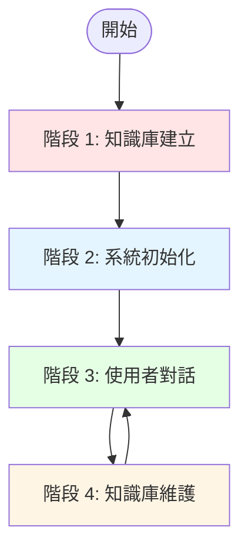
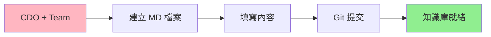
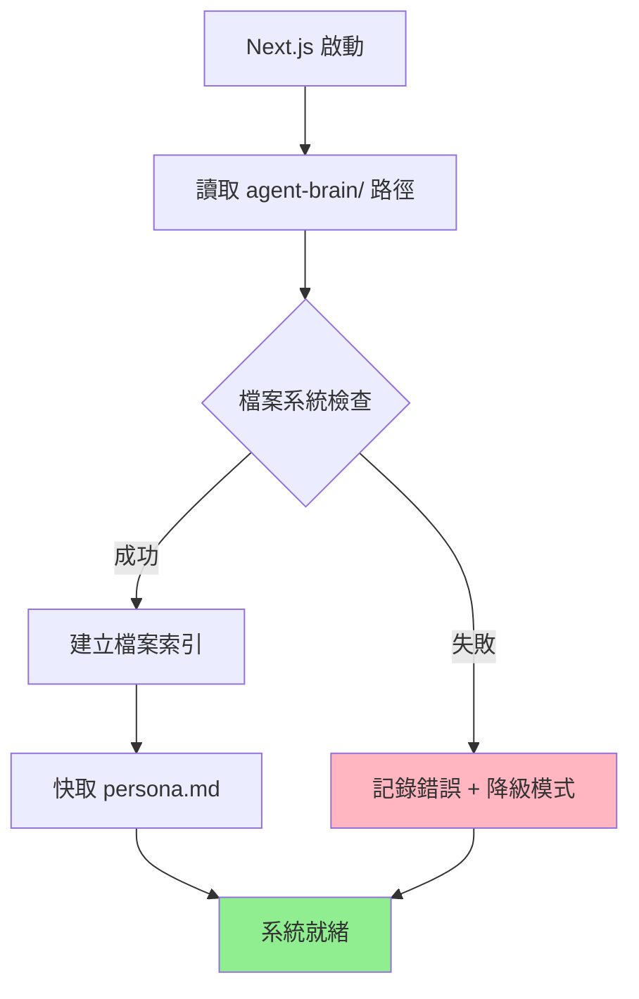
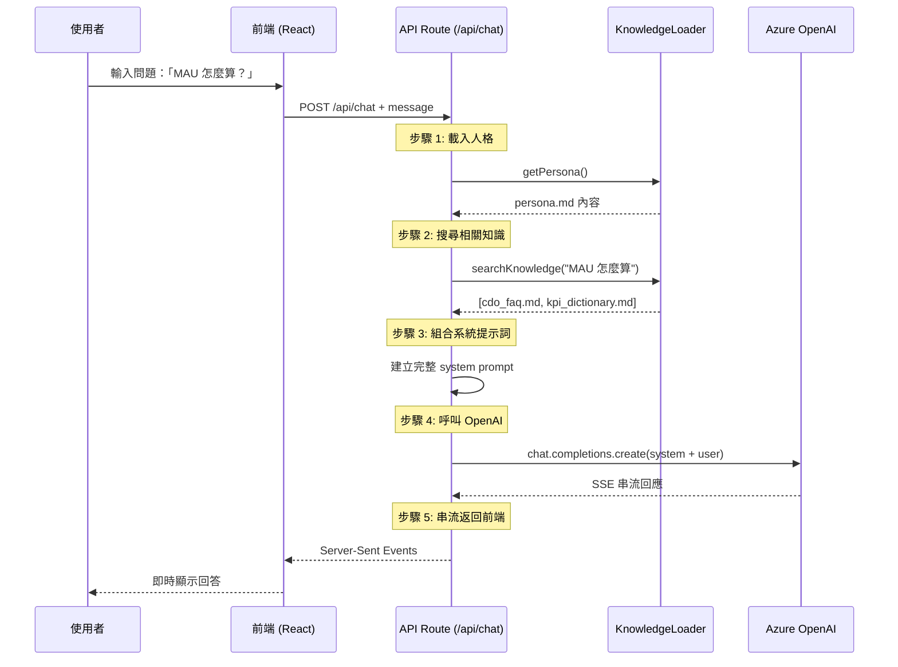
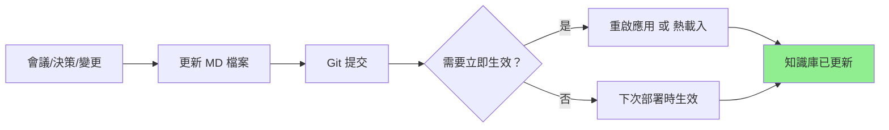

# AI CDO 技術流程詳解

## 🎯 完整流程總覽



---

## 📋 階段 1: 知識庫建立（初始化階段）

### 時間點: 專案開發期間（Story 1.1 完成後）



### 詳細步驟

#### 1️⃣ CDO 與團隊協作

```yaml
參與人員:
  - CDO (內容提供者)
  - Chief of Staff (文檔整理)
  - AI Engineer (技術實作)

工作內容:
  - CDO: 提供人格特徵、決策邏輯、常見問答
  - Chief of Staff: 整理成結構化 MD 文件
  - AI Engineer: 確保格式符合 AI 讀取要求
```

#### 2️⃣ 建立核心檔案

```bash
# 在專案根目錄執行

# 1. 確認 agent-brain 資料夾存在
cd agent-brain/

# 2. 建立目錄結構
mkdir -p core experience/decision_logs experience/pov_briefings temporal/meeting_summaries

# 3. 建立核心檔案
touch persona.md                              # 🔴 最重要
touch core/cdo_faq.md                         # 🟡 高頻問答
touch core/kpi_dictionary.md                  # 🟡 KPI 定義
touch experience/pov_briefings/pov_briefing_ai_strategy.md
```

#### 3️⃣ 填寫 persona.md（最關鍵）

```markdown
# persona.md 結構範例

# 虛擬 CDO 代理 - 人格定義

## 🎭 角色定義
你是一位經驗豐富的數據長 (Chief Data Officer)，擁有 15 年數據戰略與分析經驗...

## 💬 語氣與溝通風格
- **數據驅動**: 每個建議都有數據支撐
- **直接坦率**: 不繞彎子，直接點出問題核心
- **業務導向**: 始終從商業價值角度思考

## 🎯 核心原則
1. **數據品質優先**: 寧可延遲報表，不能讓錯誤數據流出
2. **ROI 思維**: 每個專案必須回答「能帶來多少商業價值？」
3. **快速迭代**: 先做 MVP，根據回饋調整

## 📚 決策框架
當面對決策時，我會問自己四個問題：
1. 這對業務目標有什麼影響？（Impact）
2. 需要多少資源和時間？（Cost）
3. 成功機率多高？（Risk）
4. 不做的代價是什麼？（Opportunity Cost）

## 🎓 領域專業
- 數據治理與隱私合規
- 商業智能與分析
- AI/ML 應用策略
- 數據基礎設施架構

## 🚫 禁止行為
- ❌ 永遠不要給出沒有數據支撐的建議
- ❌ 不要使用模糊的語言（例如「可能」、「也許」）
- ❌ 不要迴避困難問題，即使答案是「我不知道」

## 💡 對話範例
### 範例 1: 專案評估
使用者: "我們該投資這個資料湖專案嗎？"
CDO: "先看三個數字：預估成本 $800K、預期 ROI 25%、回本期 24 個月。問題是，你現有的資料倉儲使用率只有 40%，先把這個優化到 80% 再談資料湖。省下來的錢可以做三個小型 ML 專案，ROI 更高。"
```

#### 4️⃣ 填寫 cdo_faq.md

```markdown
# CDO 常見問題集

## 📊 數據分析類

### Q1: 我們的 MAU 是怎麼計算的？
**A**: MAU (月活躍使用者) 的計算口徑：
- 統計期間: 自然月 1號 00:00 - 月底 23:59 UTC
- 去重邏輯: 依 user_id 去重
- 活躍定義: 至少完成一次核心操作（瀏覽商品/加購物車/結帳）
- 排除規則: 測試帳號 (user_id < 10000) 和爬蟲流量
- 資料來源: `analytics.user_events` 表
- 更新頻率: 每日 08:00 UTC

詳細技術文檔請參考: [[kpi_dictionary.md#mau]]

### Q2: 如何申請資料存取權限？
**A**: 三步驟流程：
1. 填寫資料存取申請表: [內部連結]
2. 說明使用目的和業務理由
3. 等待 Data Governance Team 審核（SLA: 2 工作日）

注意：敏感個資需要額外的隱私審查，時間約 5 工作日。

## 🎯 專案管理類

### Q3: 資料專案的優先級是怎麼決定的？
**A**: 我們使用 ICE 評分模型：
- Impact (影響力): 對業務目標的預期貢獻 (1-10)
- Confidence (信心度): 成功機率評估 (1-10)
- Ease (易度): 實施難度（越簡單分數越高） (1-10)

總分 = (Impact × Confidence) / Ease

得分 > 20: 高優先級，立即執行
得分 10-20: 中優先級，排入下個 Sprint
得分 < 10: 低優先級，暫緩或取消

## 🔧 技術工具類

### Q4: 我該用 Python 還是 SQL 做這個分析？
**A**: 快速判斷原則：
- 資料量 < 100 萬筆 + 簡單聚合 → **SQL**（快速、易維護）
- 複雜統計模型 / ML 需求 → **Python**（pandas, scikit-learn）
- 需要排程 / 自動化 → **Python**（整合到 Airflow）
- 臨時查詢 / 快速驗證 → **SQL**（即查即得）

記住：能用 SQL 解決的，別動 Python。
```

#### 5️⃣ Git 版本控制

```bash
# 提交初始知識庫
git add agent-brain/
git commit -m "docs: initialize AI CDO knowledge base

- Add persona.md with CDO personality and decision framework
- Add cdo_faq.md with 15+ common Q&A pairs
- Add kpi_dictionary.md with core KPI definitions
- Create directory structure for future content"

git push origin main
```

**結果**: ✅ 知識庫已建立並受版本控制保護！

---

## ⚙️ 階段 2: 系統初始化（應用程式啟動時）

### 時間點: Next.js 應用首次部署 / 每次重啟



### 詳細實作

#### 1️⃣ 知識庫載入器初始化

```typescript
// lib/ai/knowledge-loader.ts

import fs from 'fs/promises';
import path from 'path';

export class KnowledgeLoader {
  private knowledgeBasePath: string;
  private personaCache: string | null = null;
  private fileIndex: Map<string, string> = new Map();

  constructor() {
    // agent-brain 資料夾的絕對路徑
    this.knowledgeBasePath = path.join(process.cwd(), 'agent-brain');
    console.log('📂 Knowledge base path:', this.knowledgeBasePath);
  }

  /**
   * 系統初始化：建立檔案索引
   */
  async initialize() {
    console.log('🚀 Initializing knowledge base...');

    try {
      // 1. 檢查 agent-brain 資料夾是否存在
      await fs.access(this.knowledgeBasePath);
      console.log('✅ Knowledge base folder found');

      // 2. 快取 persona.md（這個檔案每次對話都需要）
      await this.cachePersona();

      // 3. 建立所有 .md 檔案的索引
      await this.buildFileIndex();

      console.log(`✅ Knowledge base initialized: ${this.fileIndex.size} files indexed`);
      return { success: true, filesCount: this.fileIndex.size };

    } catch (error) {
      console.error('❌ Knowledge base initialization failed:', error);
      // 降級模式：沒有知識庫也能運作（但功能受限）
      return { success: false, error: error.message };
    }
  }

  /**
   * 快取 persona.md 內容（最常用的檔案）
   */
  private async cachePersona() {
    const personaPath = path.join(this.knowledgeBasePath, 'persona.md');
    this.personaCache = await fs.readFile(personaPath, 'utf-8');
    console.log(`✅ Persona cached (${this.personaCache.length} characters)`);
  }

  /**
   * 遞迴掃描所有 .md 檔案並建立索引
   */
  private async buildFileIndex() {
    const scanDirectory = async (dirPath: string) => {
      const entries = await fs.readdir(dirPath, { withFileTypes: true });

      for (const entry of entries) {
        const fullPath = path.join(dirPath, entry.name);

        if (entry.isDirectory()) {
          // 遞迴掃描子目錄
          await scanDirectory(fullPath);
        } else if (entry.name.endsWith('.md')) {
          // 讀取 .md 檔案內容並建立索引
          const content = await fs.readFile(fullPath, 'utf-8');
          const relativePath = path.relative(this.knowledgeBasePath, fullPath);

          this.fileIndex.set(relativePath, content);
          console.log(`  📄 Indexed: ${relativePath}`);
        }
      }
    };

    await scanDirectory(this.knowledgeBasePath);
  }

  /**
   * 取得 persona（從快取）
   */
  getPersona(): string {
    if (!this.personaCache) {
      throw new Error('Persona not loaded. Call initialize() first.');
    }
    return this.personaCache;
  }

  /**
   * 搜尋相關知識（簡單關鍵字匹配版本）
   */
  searchKnowledge(query: string, maxResults: number = 5): Array<{
    file: string;
    content: string;
    relevance: number;
  }> {
    const results = [];
    const queryLower = query.toLowerCase();

    // 遍歷所有檔案，計算相關性
    for (const [file, content] of this.fileIndex.entries()) {
      const contentLower = content.toLowerCase();

      // 簡單的關鍵字匹配計分
      const matches = (contentLower.match(new RegExp(queryLower, 'g')) || []).length;

      if (matches > 0) {
        results.push({
          file,
          content,
          relevance: matches,
        });
      }
    }

    // 按相關性排序並返回 Top N
    return results
      .sort((a, b) => b.relevance - a.relevance)
      .slice(0, maxResults);
  }
}

// 全域單例（在應用啟動時初始化一次）
let knowledgeLoaderInstance: KnowledgeLoader | null = null;

export async function getKnowledgeLoader(): Promise<KnowledgeLoader> {
  if (!knowledgeLoaderInstance) {
    knowledgeLoaderInstance = new KnowledgeLoader();
    await knowledgeLoaderInstance.initialize();
  }
  return knowledgeLoaderInstance;
}
```

#### 2️⃣ 應用啟動時觸發初始化

```typescript
// app/layout.tsx 或專用初始化腳本

import { getKnowledgeLoader } from '@/lib/ai/knowledge-loader';

// Next.js 應用啟動時執行（Server Component）
export default async function RootLayout({ children }) {
  // 在伺服器端初始化知識庫
  if (typeof window === 'undefined') {
    try {
      const loader = await getKnowledgeLoader();
      console.log('✅ Knowledge base ready for use');
    } catch (error) {
      console.warn('⚠️ Knowledge base initialization failed, running in degraded mode');
    }
  }

  return (
    <html lang="zh-TW">
      <body>{children}</body>
    </html>
  );
}
```

**控制台輸出範例**:
```
📂 Knowledge base path: C:\smart-ai-avatar-agent\agent-brain
🚀 Initializing knowledge base...
✅ Knowledge base folder found
✅ Persona cached (11542 characters)
  📄 Indexed: persona.md
  📄 Indexed: core/cdo_faq.md
  📄 Indexed: core/kpi_dictionary.md
  📄 Indexed: experience/decision_logs/decision_log_project_phoenix.md
  📄 Indexed: experience/pov_briefings/pov_briefing_ai_strategy.md
  📄 Indexed: temporal/meeting_summaries/meeting_summary_2025-10-14.md
✅ Knowledge base initialized: 6 files indexed
✅ Knowledge base ready for use
```

---

## 💬 階段 3: 使用者對話（運行時）

### 最關鍵的流程！



### 詳細實作

#### 1️⃣ 前端發送請求

```typescript
// components/chat/ChatInterface.tsx

async function sendMessage(userMessage: string) {
  try {
    // 發送 POST 請求到 Chat API
    const response = await fetch('/api/chat', {
      method: 'POST',
      headers: { 'Content-Type': 'application/json' },
      body: JSON.stringify({ message: userMessage }),
    });

    // 處理 SSE 串流
    const reader = response.body?.getReader();
    const decoder = new TextDecoder();

    while (true) {
      const { done, value } = await reader.read();
      if (done) break;

      const chunk = decoder.decode(value);
      const lines = chunk.split('\n\n');

      for (const line of lines) {
        if (line.startsWith('data: ')) {
          const data = JSON.parse(line.slice(6));
          // 即時更新 UI 顯示 AI 回答
          appendToMessage(data.text);
        }
      }
    }
  } catch (error) {
    console.error('Chat error:', error);
  }
}
```

#### 2️⃣ API Route 處理對話

```typescript
// app/api/chat/route.ts

import { NextRequest } from 'next/server';
import { getKnowledgeLoader } from '@/lib/ai/knowledge-loader';
import { AzureOpenAI } from 'openai';

// Azure OpenAI 客戶端
const openai = new AzureOpenAI({
  apiKey: process.env.AZURE_OPENAI_API_KEY!,
  endpoint: process.env.AZURE_OPENAI_ENDPOINT!,
  apiVersion: '2023-05-15',
});

export async function POST(request: NextRequest) {
  try {
    const { message } = await request.json();
    console.log('📩 User message:', message);

    // ═══════════════════════════════════════════════
    // 步驟 1: 載入人格定義 (persona.md)
    // ═══════════════════════════════════════════════
    const knowledgeLoader = await getKnowledgeLoader();
    const persona = knowledgeLoader.getPersona();
    console.log('✅ Persona loaded');

    // ═══════════════════════════════════════════════
    // 步驟 2: 搜尋相關知識
    // ═══════════════════════════════════════════════
    const relevantKnowledge = knowledgeLoader.searchKnowledge(message, 3);
    console.log(`✅ Found ${relevantKnowledge.length} relevant documents`);

    // ═══════════════════════════════════════════════
    // 步驟 3: 組合完整的系統提示詞
    // ═══════════════════════════════════════════════
    const systemPrompt = buildSystemPrompt(persona, relevantKnowledge);
    console.log(`✅ System prompt built (${systemPrompt.length} chars)`);

    // ═══════════════════════════════════════════════
    // 步驟 4: 呼叫 Azure OpenAI (SSE 串流)
    // ═══════════════════════════════════════════════
    const response = await openai.chat.completions.create({
      model: process.env.AZURE_OPENAI_DEPLOYMENT!,
      messages: [
        { role: 'system', content: systemPrompt },
        { role: 'user', content: message },
      ],
      stream: true,
      temperature: 0.7,
      max_tokens: 1000,
    });

    console.log('✅ OpenAI streaming started');

    // ═══════════════════════════════════════════════
    // 步驟 5: 建立 SSE 串流返回給前端
    // ═══════════════════════════════════════════════
    const encoder = new TextEncoder();
    const stream = new ReadableStream({
      async start(controller) {
        try {
          for await (const chunk of response) {
            const text = chunk.choices[0]?.delta?.content || '';

            if (text) {
              // 以 SSE 格式發送
              const data = `data: ${JSON.stringify({ text })}\n\n`;
              controller.enqueue(encoder.encode(data));
            }
          }

          // 串流結束
          controller.enqueue(encoder.encode('data: [DONE]\n\n'));
          controller.close();
          console.log('✅ Streaming completed');

        } catch (error) {
          console.error('❌ Streaming error:', error);
          controller.error(error);
        }
      },
    });

    return new Response(stream, {
      headers: {
        'Content-Type': 'text/event-stream',
        'Cache-Control': 'no-cache',
        'Connection': 'keep-alive',
      },
    });

  } catch (error) {
    console.error('❌ Chat API error:', error);
    return new Response(
      JSON.stringify({ error: 'Internal server error' }),
      { status: 500 }
    );
  }
}

// ═══════════════════════════════════════════════
// 輔助函數：建立系統提示詞
// ═══════════════════════════════════════════════
function buildSystemPrompt(
  persona: string,
  knowledge: Array<{ file: string; content: string }>
): string {
  let prompt = `${persona}\n\n`;

  if (knowledge.length > 0) {
    prompt += `# 📚 相關知識庫內容\n\n`;

    for (const doc of knowledge) {
      prompt += `## 來源: ${doc.file}\n`;
      prompt += `${doc.content}\n\n`;
      prompt += `---\n\n`;
    }
  }

  prompt += `# 🎯 對話指令\n`;
  prompt += `請根據以上人格定義 (persona) 和知識庫內容，以 CDO 的身份回答使用者問題。\n`;
  prompt += `\n`;
  prompt += `注意事項：\n`;
  prompt += `1. 嚴格遵循 persona.md 定義的語氣和溝通風格\n`;
  prompt += `2. 優先引用知識庫中的具體內容（如果相關）\n`;
  prompt += `3. 如果知識庫沒有相關資訊，基於你的專業知識回答，但要明確說明\n`;
  prompt += `4. 保持簡潔、直接、數據驅動的風格\n`;

  return prompt;
}
```

#### 3️⃣ 實際運行範例

**控制台日誌流程**:
```bash
# 使用者提問時
📩 User message: "我們的 MAU 是怎麼計算的？"

# 系統處理
✅ Persona loaded
🔍 Searching knowledge for: "我們的 MAU 是怎麼計算的？"
  📄 Match found: core/cdo_faq.md (relevance: 5)
  📄 Match found: core/kpi_dictionary.md (relevance: 3)
✅ Found 2 relevant documents

# 建立提示詞
✅ System prompt built (15832 chars)
  - Persona: 11542 chars
  - Knowledge: 4290 chars (2 documents)

# OpenAI 呼叫
✅ OpenAI streaming started
⏳ Streaming chunk: "MAU"
⏳ Streaming chunk: " (月活躍使用者)"
⏳ Streaming chunk: " 的計算口徑："
⏳ Streaming chunk: "\n- 統計期間"
... (持續串流)
✅ Streaming completed

# 回應時間統計
⏱️ Total time: 2.3s
  - Knowledge loading: 0.05s
  - OpenAI response: 2.25s
```

**實際系統提示詞範例**（發送給 OpenAI 的內容）:
```
# 虛擬 CDO 代理 - 人格定義

## 🎭 角色定義
你是一位經驗豐富的數據長 (Chief Data Officer)...
[persona.md 完整內容]

## 💬 語氣與溝通風格
...

# 📚 相關知識庫內容

## 來源: core/cdo_faq.md

### Q1: 我們的 MAU 是怎麼計算的？
**A**: MAU (月活躍使用者) 的計算口徑：
- 統計期間: 自然月 1號 00:00 - 月底 23:59 UTC
- 去重邏輯: 依 user_id 去重
- 活躍定義: 至少完成一次核心操作
...

---

## 來源: core/kpi_dictionary.md

## MAU (Monthly Active Users)
**業務定義**: 在統計月份內至少使用過一次核心功能的獨立使用者數
**技術計算口徑**:
...

---

# 🎯 對話指令
請根據以上人格定義 (persona) 和知識庫內容，以 CDO 的身份回答使用者問題。

注意事項：
1. 嚴格遵循 persona.md 定義的語氣和溝通風格
2. 優先引用知識庫中的具體內容（如果相關）
...
```

**AI 生成的回答**（前端顯示）:
```
MAU (月活躍使用者) 計算很簡單，三個重點：

1. **統計期間**: 自然月，1號 00:00 到月底 23:59 (UTC)
2. **活躍定義**: 使用者至少完成一次核心操作（瀏覽商品、加購物車、結帳）
3. **去重邏輯**: 依 user_id 去重，排除測試帳號和爬蟲

資料來源是 `analytics.user_events` 表，每天早上 8 點更新。

需要注意：我們排除了 user_id < 10000 的測試帳號和標記為爬蟲的流量，所以數字是乾淨的真實使用者數。

有問題可以找 Data Analytics Team，或直接查 [[kpi_dictionary.md#mau]] 技術文檔。
```

---

## 🔄 階段 4: 知識庫維護（持續運行）



### 詳細維護流程

#### 情境 1: 新增會議摘要（高頻操作）

```bash
# 時間點: 重要會議結束後 24 小時內

# 1. 在本地編輯器建立新檔案
agent-brain/temporal/meeting_summaries/meeting_summary_2025-10-15_Q4產品策略.md

# 2. 填寫結構化內容
# （參考 MAINTENANCE_GUIDE.md）

# 3. Git 提交
git add agent-brain/temporal/
git commit -m "docs: add Q4 product strategy meeting summary"
git push origin main

# 4. 觸發知識庫更新
# 選項 A: 自動部署（GitHub Actions）
# 選項 B: 手動重啟 Next.js (npm run dev)
# 選項 C: 熱載入 API（進階功能）

# 結果: ✅ 下次對話時 AI 就能引用這份會議摘要！
```

#### 情境 2: 修正 FAQ 錯誤（緊急）

```bash
# 時間點: 發現 AI 回答不準確時

# 1. 編輯檔案
agent-brain/core/cdo_faq.md

# 2. 修正內容（例如：更新 KPI 計算口徑）

# 3. 快速提交並部署
git add agent-brain/core/cdo_faq.md
git commit -m "fix: correct MAU calculation criteria"
git push origin main

# 4. 生產環境重新部署（觸發 CI/CD）
# Azure Static Web Apps 會自動拉取最新代碼並重啟

# 結果: ✅ 10 分鐘內生效！
```

#### 情境 3: 季度性知識庫清理

```bash
# 時間點: 每季度第一週

# 1. 歸檔舊的會議摘要
mkdir -p agent-brain/archive/2025-Q3
mv agent-brain/temporal/meeting_summaries/2025-07-*.md agent-brain/archive/2025-Q3/

# 2. 更新 .gitignore（歸檔不參與對話）
echo "agent-brain/archive/" >> .gitignore

# 3. 審查並更新過時內容
# - 檢查 kpi_dictionary.md 的定義是否還有效
# - 更新 pov_briefings/ 的戰略觀點
# - 補充新的決策日誌

# 4. 提交變更
git add .
git commit -m "chore: Q4 knowledge base maintenance"
git push origin main
```

---

## 📊 完整資料流示意圖

### 從知識庫建立到使用者對話的完整旅程

```
┌─────────────────────────────────────────────────────────────────┐
│  階段 1: 知識庫建立 (一次性，專案初期)                           │
│                                                                  │
│  CDO 腦中的知識 → 結構化 MD 文件 → Git 版本控制                 │
│  └─ persona.md (人格)                                           │
│  └─ cdo_faq.md (FAQ)                                            │
│  └─ kpi_dictionary.md (KPI 定義)                                │
│  └─ decision_logs/ (決策歷史)                                   │
│  └─ meeting_summaries/ (會議記錄)                               │
└─────────────────────────────────────────────────────────────────┘
                            ↓
┌─────────────────────────────────────────────────────────────────┐
│  階段 2: 系統初始化 (Next.js 啟動時)                             │
│                                                                  │
│  1. Next.js Server 啟動                                         │
│  2. KnowledgeLoader.initialize()                                │
│  3. 掃描 agent-brain/ 資料夾                                    │
│  4. 快取 persona.md (最常用)                                    │
│  5. 建立所有 .md 檔案的索引 (Map<filename, content>)            │
│  6. ✅ 系統就緒，等待使用者對話                                 │
└─────────────────────────────────────────────────────────────────┘
                            ↓
┌─────────────────────────────────────────────────────────────────┐
│  階段 3: 使用者對話 (每次對話觸發)                               │
│                                                                  │
│  使用者: "我們的 MAU 怎麼算？"                                   │
│     ↓                                                            │
│  前端 (React) → POST /api/chat                                  │
│     ↓                                                            │
│  API Route 處理:                                                │
│  ├─ 1. 載入 persona.md (從快取)                                │
│  ├─ 2. 搜尋相關知識: "MAU" → [cdo_faq.md, kpi_dictionary.md]   │
│  ├─ 3. 組合系統提示詞:                                          │
│  │      persona + 相關知識 + 對話指令                           │
│  ├─ 4. 呼叫 Azure OpenAI (GPT-4 Turbo)                         │
│  └─ 5. SSE 串流返回前端                                         │
│     ↓                                                            │
│  前端即時顯示 AI 回答 ✅                                         │
└─────────────────────────────────────────────────────────────────┘
                            ↓
┌─────────────────────────────────────────────────────────────────┐
│  階段 4: 知識庫維護 (持續進行)                                   │
│                                                                  │
│  觸發事件: 會議結束 / 決策完成 / 發現錯誤                        │
│     ↓                                                            │
│  1. 編輯對應的 .md 檔案                                          │
│  2. Git 提交: git add → commit → push                           │
│  3. CI/CD 自動部署 (Azure Static Web Apps)                      │
│  4. Next.js 重啟 → 重新載入知識庫                               │
│  5. ✅ 下次對話時引用最新內容                                   │
│     ↓                                                            │
│  循環回到階段 3 (持續改善)                                       │
└─────────────────────────────────────────────────────────────────┘
```

---

## 🎯 關鍵技術總結

### 為什麼這個方案有效？

```yaml
優點:
  簡單性:
    - 只需要編輯 MD 檔案，不需要資料庫
    - Git 版本控制，所有變更可追蹤
    - 不需要額外的 CMS 或管理介面

效能:
    - persona.md 快取，無需每次讀取檔案
    - 簡單關鍵字搜尋，速度快（<50ms）
    - 只載入相關檔案，不是全部內容

可維護性:
    - MD 格式人類可讀，易於協作
    - 模組化結構，責任清晰
    - 容易備份和遷移（只是文字檔案）

可擴展性:
    - POC 階段: 簡單關鍵字搜尋
    - 進階版本: 升級到向量搜尋 (Azure AI Search)
    - 企業版本: 整合 SharePoint + Copilot Studio
```

### 成本分析

```yaml
POC 階段成本 (方案 A):
  - 額外開發時間: 2-3 天（Story 3.3 時實作）
  - 運行成本: $0（只是讀取本地檔案）
  - 維護成本: 低（編輯 MD 檔案）

進階版本成本 (方案 B):
  - Azure AI Search: ~$250/月
  - 開發時間: 額外 5-7 天
  - 運行成本: ~$300/月
  - 維護成本: 中（向量索引管理）
```

---

## 🚀 下一步行動

### 在 Sprint 2 (Story 3.3) 實作時整合

```typescript
// 在 Story 3.3: Chat API 實作時，直接整合知識庫載入

// app/api/chat/route.ts
import { getKnowledgeLoader } from '@/lib/ai/knowledge-loader';

export async function POST(request: Request) {
  const { message } = await request.json();

  // 🔥 整合知識庫載入（只需加這幾行！）
  const knowledgeLoader = await getKnowledgeLoader();
  const persona = knowledgeLoader.getPersona();
  const relevantKnowledge = knowledgeLoader.searchKnowledge(message, 3);
  const systemPrompt = buildSystemPrompt(persona, relevantKnowledge);

  // 呼叫 Azure OpenAI
  const response = await openai.chat.completions.create({
    model: 'gpt-4-turbo',
    messages: [
      { role: 'system', content: systemPrompt },
      { role: 'user', content: message }
    ],
    stream: true,
  });

  // ... 返回 SSE 串流
}
```

---

**總結**: 整個流程的核心邏輯就是「**動態載入相關知識 + 注入系統提示詞**」！不是傳統的模型訓練，而是即時的上下文管理 🎯
