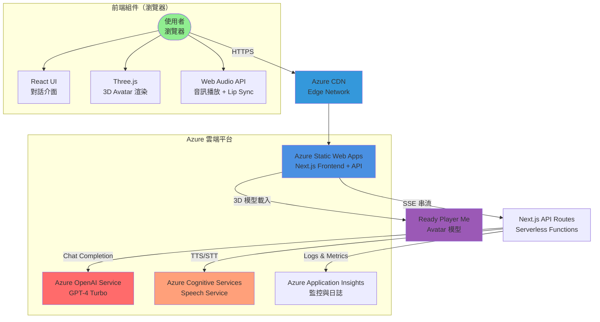
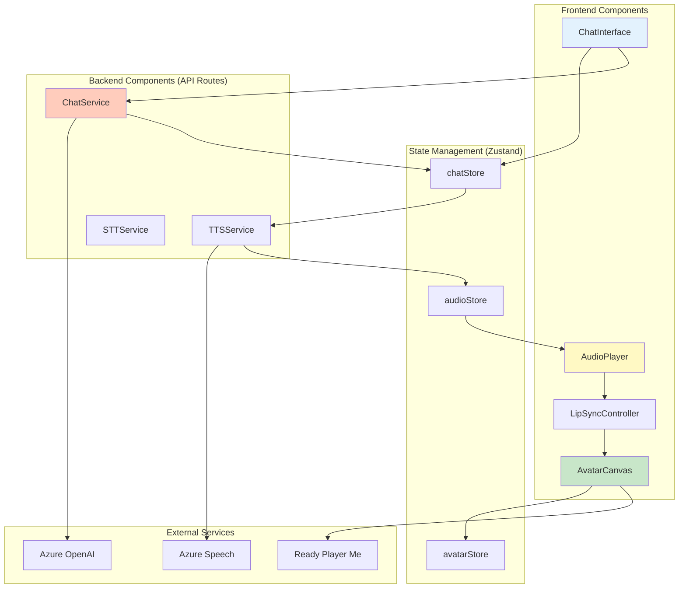
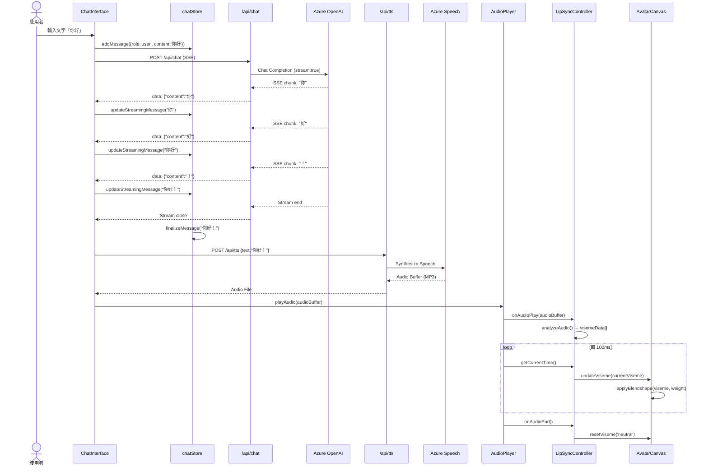
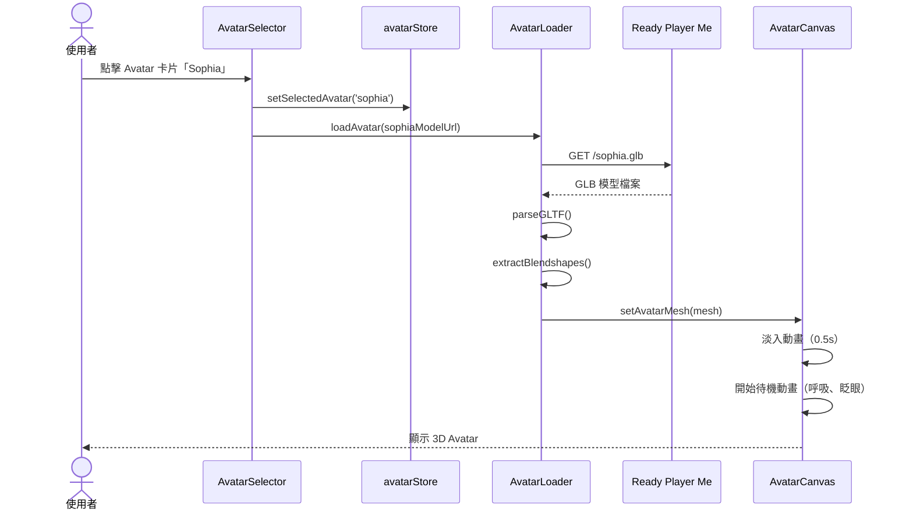
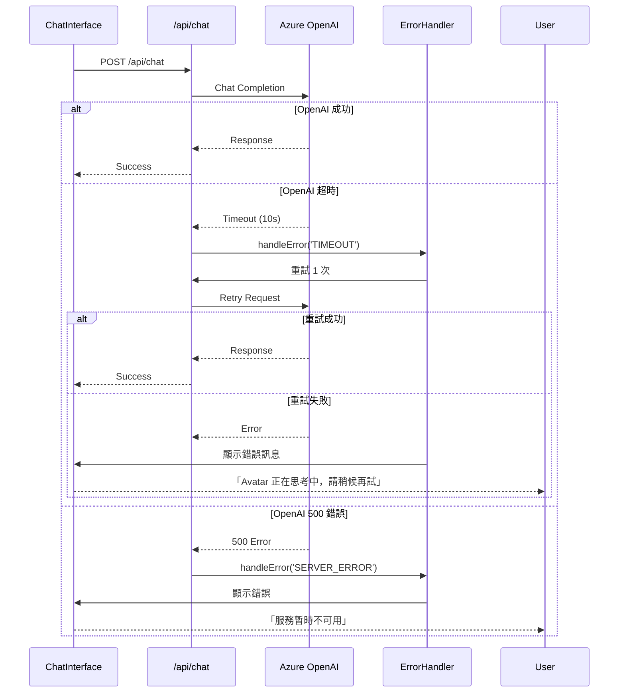
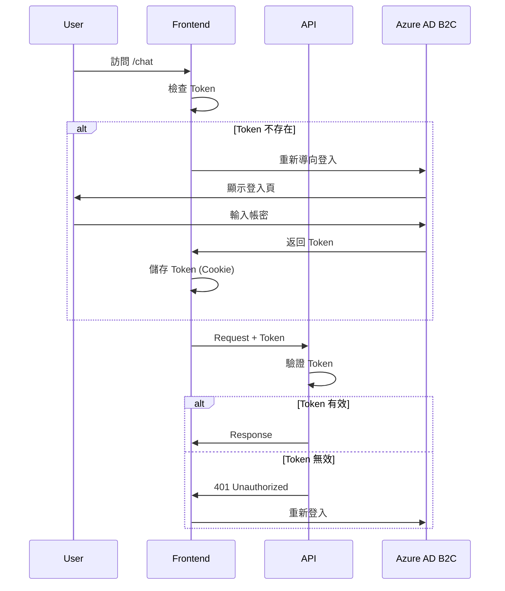
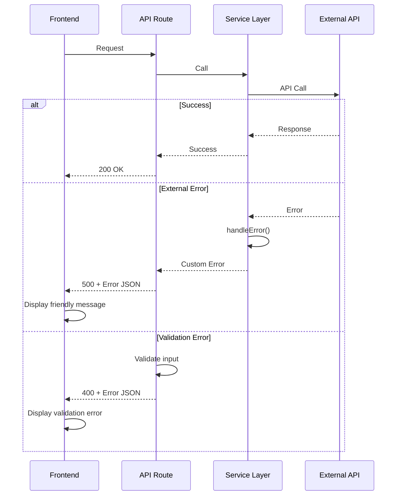

# 3D Avatar 即時對話系統 Fullstack Architecture Document

**專案名稱**: 3D Avatar 即時對話系統  
**文件版本**: v1.0  
**建立日期**: 2025-10-14  
**負責人**: System Architect (Winston)  
**文件類型**: Fullstack Architecture Document

---

## Introduction

This document outlines the complete fullstack architecture for **3D Avatar 即時對話系統**, including backend systems, frontend implementation, and their integration. It serves as the single source of truth for AI-driven development, ensuring consistency across the entire technology stack.

This unified approach combines what would traditionally be separate backend and frontend architecture documents, streamlining the development process for modern fullstack applications where these concerns are increasingly intertwined.

### Starter Template or Existing Project

**Status**: N/A - Greenfield project

本專案為全新建立的綠地專案（Greenfield），將使用 **Next.js 14 App Router** 作為基礎框架，但不基於任何預製 Starter Template。

**理由**:
- POC 專案需求明確且簡單，不需要複雜的 Starter Template
- Next.js `create-next-app` 已提供足夠的基礎設定（TypeScript, Tailwind CSS, App Router）
- 避免 Starter Template 的不必要依賴與預設配置
- 保持架構靈活性，專注於核心技術驗證

**初始化指令**:
```bash
npx create-next-app@latest avatar-chat-poc \
  --typescript \
  --tailwind \
  --app \
  --import-alias "@/*"
```

### Change Log

| Date | Version | Description | Author |
|------|---------|-------------|--------|
| 2025-10-14 | v1.0 | 初始架構文件，定義完整 Fullstack 技術架構 | Winston (Architect) |

---

## High Level Architecture

### Technical Summary

本專案採用 **Monolithic Architecture（單體架構）** 搭配 **Serverless Functions**，使用 Next.js 14 作為全端框架，前端使用 **Three.js** 進行 3D 渲染，後端透過 **Next.js API Routes** 實現 Serverless Functions，整合 **Azure OpenAI Service** 與 **Azure Speech Services** 提供 LLM 對話與 TTS/STT 功能。前後端透過 **Server-Sent Events (SSE)** 實現即時串流通訊，狀態管理使用 **Zustand**，部署於 **Azure Static Web Apps**。此架構確保快速開發、成本可控，並滿足 POC 階段的技術驗證目標：3D Avatar 渲染 ≥ 30 FPS、對話延遲 < 2.5 秒、Lip Sync 匹配度 ≥ 70%。

### Platform and Infrastructure Choice

**Platform**: **Azure (Microsoft Azure)**

**Key Services**:
- **Azure Static Web Apps**: 前端託管 + Serverless API Routes
- **Azure OpenAI Service**: LLM 對話（GPT-4 Turbo）
- **Azure Cognitive Services (Speech)**: TTS/STT 語音處理
- **Azure CDN**: 靜態資源加速（自動啟用）
- **Azure Application Insights**: 監控與日誌（生產環境）

**Deployment Host and Regions**:
- **Frontend**: Azure Static Web Apps（Global CDN，主要區域：East Asia）
- **Azure OpenAI**: East US（GPT-4 Turbo 可用區域）
- **Azure Speech**: East Asia（繁中語音品質最佳）

**理由選擇 Azure**:
1. ✅ PRD 明確要求部署於 Azure
2. ✅ Azure OpenAI Service 提供企業級 GPT-4 Turbo
3. ✅ Azure Speech 支援高品質繁中 Neural Voice（zh-TW-HsiaoChenNeural）
4. ✅ Azure Static Web Apps 原生支援 Next.js，零配置部署
5. ✅ 統一平台簡化成本管理與監控

### Repository Structure

**Structure**: **Monorepo（單一倉庫）**

**Monorepo Tool**: **npm workspaces**（內建，無需額外工具）

**Package Organization**:
```
avatar-chat-poc/          # 專案根目錄（Monorepo）
├── apps/                 # 應用程式（實際上僅一個 Next.js App）
│   └── web/              # Next.js 全端應用（前端 + API Routes）
├── packages/             # 共享套件
│   ├── shared/           # 共享型別、常數、工具
│   └── config/           # ESLint, TypeScript 共享配置
└── docs/                 # 專案文件
```

**理由**:
- POC 階段僅一個 Next.js App，不需要複雜的 Monorepo 工具（Turborepo, Nx）
- npm workspaces 足夠管理少量共享套件
- 保持架構簡單，便於快速開發
- 未來可升級為 Turborepo（如需要）

### High Level Architecture Diagram



### Architectural Patterns

- **Jamstack Architecture（Serverless）**: Next.js 靜態生成 + Serverless API - _Rationale:_ POC 無需傳統伺服器，Serverless 降低成本且自動擴展

- **Component-Based UI (React)**: 可重用組件化設計 - _Rationale:_ 提升開發效率與程式碼可維護性

- **Server-Sent Events (SSE)**: 單向伺服器推送 - _Rationale:_ LLM 串流回應比 WebSocket 更簡單，POC 階段足夠

- **Repository Pattern（資料存取）**: 抽象化資料來源 - _Rationale:_ POC 無資料庫，但設計 Mock Repository 便於未來擴展

- **Service Layer Pattern**: 業務邏輯封裝於 Services - _Rationale:_ 分離 API Routes 與業務邏輯，提升可測試性

- **BFF (Backend for Frontend)**: Next.js API Routes 作為前端的後端 - _Rationale:_ 隱藏 Azure API Key，處理認證與資料轉換

---

## Tech Stack

### Technology Stack Table

| Category | Technology | Version | Purpose | Rationale |
|----------|-----------|---------|---------|-----------|
| **Frontend Language** | TypeScript | 5.3+ | 前端開發語言 | 強型別檢查，減少執行時錯誤，提升開發效率 |
| **Frontend Framework** | Next.js (App Router) | 14.2+ | React 全端框架 | SSG/SSR 支援，內建 API Routes，Azure 原生支援 |
| **UI Component Library** | Headless UI + 自訂組件 | 2.0+ | 無樣式基礎組件 | 搭配 Tailwind CSS，完全客製化，輕量級 |
| **State Management** | Zustand | 4.5+ | 全域狀態管理 | 比 Redux 更簡單，效能佳，適合中小型專案 |
| **3D 渲染引擎** | Three.js | r160+ | 3D 圖形渲染 | 業界標準 WebGL 框架，成熟且文件完善 |
| **3D React 整合** | React Three Fiber | 8.15+ | Three.js React 封裝 | 宣告式 3D 開發，與 React 生態系無縫整合 |
| **3D 輔助工具** | @react-three/drei | 9.95+ | Three.js 常用工具 | 提供 OrbitControls, Loader 等常用組件 |
| **Backend Language** | TypeScript (Node.js) | 5.3+ | 後端開發語言 | 與前端共用型別，全端 TypeScript 提升一致性 |
| **Backend Framework** | Next.js API Routes | 14.2+ | Serverless API | 與前端同框架，簡化部署，支援 SSE 串流 |
| **API Style** | REST + SSE | - | API 通訊協定 | REST 處理一般請求，SSE 處理 LLM 串流 |
| **Database** | N/A（POC 無資料庫） | - | - | POC 無需持久化資料，使用記憶體/Local Storage |
| **Cache** | Browser Cache + CDN | - | 快取策略 | 靜態資源 CDN 快取，API 回應瀏覽器快取 |
| **File Storage** | Azure Blob Storage (選做) | - | Avatar 模型儲存 | 未來儲存自訂 Avatar，POC 使用 Ready Player Me CDN |
| **Authentication** | N/A（POC 無認證） | - | - | POC 公開存取，MVP 加入 Azure AD B2C |
| **Frontend Testing** | Vitest | 1.2+ | 前端單元測試 | 比 Jest 更快，Vite 原生支援 |
| **Backend Testing** | Vitest | 1.2+ | 後端單元測試 | 統一測試框架，前後端一致性 |
| **E2E Testing** | Playwright | 1.40+ | 端到端測試 | 跨瀏覽器測試，支援視覺比對 |
| **Build Tool** | Next.js (內建) | 14.2+ | 建置工具 | 無需額外配置，自動最佳化 |
| **Bundler** | Turbopack (Next.js) | 14.2+ | 程式碼打包 | Next.js 14 預設，比 Webpack 更快 |
| **Package Manager** | pnpm | 8.15+ | 套件管理 | 比 npm 更快，節省磁碟空間 |
| **IaC Tool** | N/A（Azure Portal 手動配置） | - | 基礎設施即程式碼 | POC 手動配置，MVP 使用 Bicep/Terraform |
| **CI/CD** | GitHub Actions | - | 持續整合/部署 | Azure Static Web Apps 原生整合 |
| **Monitoring** | Azure Application Insights | - | 應用監控 | Azure 原生監控，追蹤效能與錯誤 |
| **Logging** | Console + Application Insights | - | 日誌記錄 | 開發用 Console，生產用 App Insights |
| **CSS Framework** | Tailwind CSS | 3.4+ | CSS 工具框架 | Utility-first，快速開發，高度客製化 |
| **Icon Library** | Heroicons | 2.1+ | 圖示庫 | Tailwind 官方，一致性佳 |
| **Font** | Noto Sans TC + Inter | - | 字體 | Google Fonts，繁中支援佳 |
| **Linter** | ESLint | 8.56+ | 程式碼檢查 | 統一程式碼風格，減少錯誤 |
| **Formatter** | Prettier | 3.2+ | 程式碼格式化 | 自動格式化，保持一致性 |

**關鍵技術決策說明**:

1. **為何選擇 Next.js 14 而非 Vite/Create React App？**
   - ✅ App Router 提供 Server Components，減少客戶端 JavaScript
   - ✅ 內建 API Routes，前後端統一部署
   - ✅ Azure Static Web Apps 原生支援，零配置
   - ✅ SSE 串流支援完善

2. **為何選擇 Zustand 而非 Redux？**
   - ✅ POC 狀態管理需求簡單（對話、音訊、Avatar 狀態）
   - ✅ Zustand 體積小（~1KB），效能佳
   - ✅ API 簡單，學習曲線低

3. **為何選擇 Vitest 而非 Jest？**
   - ✅ Vitest 與 Vite 整合佳（Next.js 14 使用 Turbopack，相容性佳）
   - ✅ 執行速度比 Jest 快 10-20 倍
   - ✅ API 與 Jest 相容，易於遷移

4. **為何不使用資料庫？**
   - ✅ POC 無需持久化資料（無用戶系統、角色庫）
   - ✅ 對話歷史使用前端 Local Storage
   - ✅ 降低架構複雜度與成本

---

## Data Models

### Message（對話訊息）

**Purpose**: 表示使用者與 Avatar 之間的單則對話訊息

**Key Attributes**:
- `id`: string - 訊息唯一識別碼（UUID）
- `role`: 'user' | 'assistant' - 訊息角色（使用者或 Avatar）
- `content`: string - 訊息內容文字
- `timestamp`: Date - 訊息時間戳記
- `audioUrl`: string | null - TTS 音訊 URL（僅 assistant 訊息）
- `isStreaming`: boolean - 是否正在串流中（SSE）

#### TypeScript Interface

```typescript
interface Message {
  id: string;
  role: 'user' | 'assistant';
  content: string;
  timestamp: Date;
  audioUrl?: string | null;
  isStreaming?: boolean;
}
```

#### Relationships
- 屬於 `Conversation`（對話）的一部分
- 觸發 `AudioPlayback`（音訊播放）

---

### Conversation（對話）

**Purpose**: 表示完整的對話上下文（多則訊息的集合）

**Key Attributes**:
- `id`: string - 對話唯一識別碼
- `messages`: Message[] - 訊息陣列
- `avatarId`: string - 當前選定的 Avatar ID
- `createdAt`: Date - 對話建立時間
- `updatedAt`: Date - 最後更新時間

#### TypeScript Interface

```typescript
interface Conversation {
  id: string;
  messages: Message[];
  avatarId: string;
  createdAt: Date;
  updatedAt: Date;
}
```

#### Relationships
- 包含多個 `Message`
- 關聯到一個 `Avatar`

---

### Avatar（虛擬角色）

**Purpose**: 表示 3D Avatar 的基本資訊與狀態

**Key Attributes**:
- `id`: string - Avatar 唯一識別碼
- `name`: string - Avatar 名稱（如「Sophia」）
- `modelUrl`: string - Ready Player Me GLB 模型 URL
- `thumbnailUrl`: string - 預覽圖 URL
- `gender`: 'male' | 'female' | 'neutral' - 性別
- `voiceId`: string - Azure Speech 語音 ID（如 zh-TW-HsiaoChenNeural）

#### TypeScript Interface

```typescript
interface Avatar {
  id: string;
  name: string;
  modelUrl: string;
  thumbnailUrl: string;
  gender: 'male' | 'female' | 'neutral';
  voiceId: string;
}
```

#### Relationships
- 被 `Conversation` 引用
- 觸發 `AvatarAnimation`

---

### VisemeData（音素數據）

**Purpose**: 表示 Lip Sync 的視覺音素（嘴型）數據

**Key Attributes**:
- `time`: number - 時間戳記（秒）
- `viseme`: string - 音素類型（如 'aa', 'E', 'I', 'O', 'U', 'neutral'）
- `weight`: number - 權重（0-1），控制 Blendshape 強度

#### TypeScript Interface

```typescript
interface VisemeData {
  time: number;
  viseme: 'aa' | 'E' | 'I' | 'O' | 'U' | 'neutral' | string;
  weight: number;
}
```

#### Relationships
- 由 `AudioAnalyzer` 產生
- 驅動 `AvatarMesh` 的 Blendshapes

---

### AudioPlayback（音訊播放）

**Purpose**: 表示音訊播放狀態

**Key Attributes**:
- `audioBuffer`: AudioBuffer - Web Audio API 音訊緩衝
- `isPlaying`: boolean - 是否正在播放
- `currentTime`: number - 當前播放時間（秒）
- `duration`: number - 總時長（秒）

#### TypeScript Interface

```typescript
interface AudioPlayback {
  audioBuffer: AudioBuffer | null;
  isPlaying: boolean;
  currentTime: number;
  duration: number;
}
```

#### Relationships
- 觸發 `VisemeData` 分析
- 同步 `AvatarAnimation`

---

## API Specification

### REST API Specification

```yaml
openapi: 3.0.0
info:
  title: 3D Avatar Chat API
  version: 1.0.0
  description: API for 3D Avatar real-time conversation system

servers:
  - url: https://avatar-chat.azurestaticapps.net/api
    description: Production server
  - url: http://localhost:3000/api
    description: Development server

paths:
  /health:
    get:
      summary: Health check
      description: 檢查 API 服務健康狀態
      responses:
        '200':
          description: Service is healthy
          content:
            application/json:
              schema:
                type: object
                properties:
                  status:
                    type: string
                    example: "ok"
                  timestamp:
                    type: string
                    format: date-time
                  version:
                    type: string
                    example: "1.0.0"

  /chat:
    post:
      summary: Send chat message (SSE Stream)
      description: 發送訊息到 LLM，透過 SSE 串流返回回應
      requestBody:
        required: true
        content:
          application/json:
            schema:
              type: object
              properties:
                messages:
                  type: array
                  items:
                    $ref: '#/components/schemas/Message'
                  example:
                    - role: "user"
                      content: "你好"
                    - role: "assistant"
                      content: "你好！我是你的 AI 助手"
      responses:
        '200':
          description: SSE stream of chat response
          content:
            text/event-stream:
              schema:
                type: string
                example: |
                  data: {"content": "你"}
                  
                  data: {"content": "好"}
                  
                  data: {"content": "！"}
                  
        '400':
          description: Invalid request
        '500':
          description: LLM service error

  /tts:
    post:
      summary: Text-to-Speech conversion
      description: 將文字轉換為語音（Azure Speech TTS）
      requestBody:
        required: true
        content:
          application/json:
            schema:
              type: object
              properties:
                text:
                  type: string
                  example: "你好，我是你的 AI 助手"
                voiceId:
                  type: string
                  example: "zh-TW-HsiaoChenNeural"
                  default: "zh-TW-HsiaoChenNeural"
      responses:
        '200':
          description: Audio file (MP3)
          content:
            audio/mpeg:
              schema:
                type: string
                format: binary
        '400':
          description: Invalid text input
        '500':
          description: TTS service error

  /stt:
    post:
      summary: Speech-to-Text conversion (Optional)
      description: 將語音轉換為文字（Azure Speech STT）
      requestBody:
        required: true
        content:
          multipart/form-data:
            schema:
              type: object
              properties:
                audio:
                  type: string
                  format: binary
                  description: Audio file (WAV/MP3)
      responses:
        '200':
          description: Transcribed text
          content:
            application/json:
              schema:
                type: object
                properties:
                  text:
                    type: string
                    example: "你好"
        '400':
          description: Invalid audio file
        '500':
          description: STT service error

components:
  schemas:
    Message:
      type: object
      properties:
        role:
          type: string
          enum: [user, assistant]
        content:
          type: string
      required:
        - role
        - content

    ApiError:
      type: object
      properties:
        error:
          type: object
          properties:
            code:
              type: string
              example: "LLM_TIMEOUT"
            message:
              type: string
              example: "Azure OpenAI service timeout"
            details:
              type: object
            timestamp:
              type: string
              format: date-time
            requestId:
              type: string
              format: uuid
```

---

## Components

### Frontend Components

#### 1. AvatarCanvas（3D 渲染核心）

**Responsibility**: 負責 Three.js 場景設定、3D Avatar 渲染、動畫控制

**Key Interfaces**:
- `loadAvatar(modelUrl: string): Promise<void>` - 載入 Ready Player Me 模型
- `playAnimation(animationType: string): void` - 播放動畫（待機、點頭等）
- `updateViseme(visemeData: VisemeData): void` - 更新嘴型 Blendshape

**Dependencies**: 
- Three.js, React Three Fiber
- `avatarStore` (Zustand) - Avatar 狀態
- Ready Player Me GLTFLoader

**Technology Stack**: React + Three.js + React Three Fiber + @react-three/drei

---

#### 2. ChatInterface（對話介面）

**Responsibility**: 提供使用者輸入介面、顯示對話歷史

**Key Interfaces**:
- `sendMessage(content: string): void` - 發送訊息
- `clearChat(): void` - 清除對話記錄

**Dependencies**: 
- `chatStore` (Zustand) - 對話狀態
- `/api/chat` - Chat API

**Technology Stack**: React + Tailwind CSS + Headless UI

---

#### 3. AudioPlayer（音訊播放器）

**Responsibility**: 播放 TTS 音訊、控制播放狀態

**Key Interfaces**:
- `playAudio(audioBuffer: AudioBuffer): void` - 播放音訊
- `pauseAudio(): void` - 暫停播放
- `stopAudio(): void` - 停止播放

**Dependencies**: 
- Web Audio API
- `audioStore` (Zustand) - 音訊狀態

**Technology Stack**: Web Audio API + React

---

#### 4. LipSyncController（Lip Sync 控制器）

**Responsibility**: 分析音訊產生 Viseme 數據、驅動 Avatar 嘴型

**Key Interfaces**:
- `analyzeAudio(audioBuffer: AudioBuffer): VisemeData[]` - 分析音訊
- `syncViseme(visemes: VisemeData[], currentTime: number): void` - 同步嘴型

**Dependencies**: 
- Web Audio API AnalyserNode
- `AvatarCanvas` - 更新 Blendshape
- `audioStore` - 監聽播放狀態

**Technology Stack**: Web Audio API + Three.js Blendshapes

---

### Backend Components

#### 5. ChatService（對話服務）

**Responsibility**: 處理 LLM 對話邏輯、整合 Azure OpenAI

**Key Interfaces**:
- `streamChatCompletion(messages: Message[]): AsyncIterableIterator<string>` - SSE 串流

**Dependencies**: 
- Azure OpenAI SDK (`@azure/openai`)
- 環境變數（API Key, Endpoint）

**Technology Stack**: Node.js + Azure OpenAI SDK

---

#### 6. TTSService（TTS 服務）

**Responsibility**: 文字轉語音、整合 Azure Speech

**Key Interfaces**:
- `synthesizeSpeech(text: string, voiceId: string): Promise<Buffer>` - 生成語音

**Dependencies**: 
- Azure Speech SDK (`microsoft-cognitiveservices-speech-sdk`)

**Technology Stack**: Node.js + Azure Speech SDK

---

#### 7. STTService（STT 服務，選做）

**Responsibility**: 語音轉文字

**Key Interfaces**:
- `recognizeSpeech(audioBuffer: Buffer): Promise<string>` - 辨識語音

**Dependencies**: 
- Azure Speech SDK

**Technology Stack**: Node.js + Azure Speech SDK

---

### Component Diagrams



---

## External APIs

### Azure OpenAI API

- **Purpose**: 提供 LLM 對話能力（GPT-4 Turbo）
- **Documentation**: https://learn.microsoft.com/azure/ai-services/openai/
- **Base URL(s)**: `https://<resource-name>.openai.azure.com/`
- **Authentication**: API Key（Header: `api-key`）
- **Rate Limits**: 
  - 10,000 tokens/min（預設，可調整）
  - 60 requests/min

**Key Endpoints Used**:
- `POST /openai/deployments/{deployment-id}/chat/completions` - Chat Completions（支援 Stream）

**Integration Notes**:
- 使用 `stream: true` 啟用 SSE 串流
- 保留對話歷史（最多 10 輪）控制 Token 用量
- 實作重試機制（最多 1 次）

---

### Azure Cognitive Services Speech API

- **Purpose**: 提供 TTS（文字轉語音）與 STT（語音轉文字）
- **Documentation**: https://learn.microsoft.com/azure/ai-services/speech-service/
- **Base URL(s)**: `https://<region>.tts.speech.microsoft.com/` (TTS), `https://<region>.stt.speech.microsoft.com/` (STT)
- **Authentication**: Subscription Key（Header: `Ocp-Apim-Subscription-Key`）
- **Rate Limits**: 
  - 20 transactions/sec（TTS）
  - 免費層：5 audio hours/month

**Key Endpoints Used**:
- `POST /cognitiveservices/v1` - TTS 語音合成
- `POST /speech/recognition/conversation/cognitiveservices/v1` - STT 語音辨識（選做）

**Integration Notes**:
- TTS 使用 Neural Voice：`zh-TW-HsiaoChenNeural`（繁中女聲）
- 輸出格式：MP3, 16kbps（語音品質與檔案大小平衡）
- SDK 封裝簡化 API 呼叫

---

### Ready Player Me API

- **Purpose**: 提供預製 3D Avatar 模型（GLB 格式）
- **Documentation**: https://docs.readyplayer.me/
- **Base URL(s)**: `https://models.readyplayer.me/` (模型 CDN)
- **Authentication**: 無需認證（公開 CDN）
- **Rate Limits**: 無限制（CDN）

**Key Endpoints Used**:
- `GET /{avatar-id}.glb` - 下載 Avatar GLB 模型

**Integration Notes**:
- POC 使用 3 個預設 Avatar（免費）
- 模型大小：約 5-10 MB（需優化載入）
- 支援 Blendshapes（用於 Lip Sync）

---

## Core Workflows

### Workflow 1: 完整對話流程（端到端）



**關鍵時序**:
- 使用者輸入 → LLM 首字: < 2 秒
- LLM 完成 → TTS 音訊: < 1.5 秒
- 音訊播放 → Lip Sync: < 100ms
- **總延遲**: < 2.5 秒

---

### Workflow 2: Avatar 選擇流程



---

### Workflow 3: 錯誤處理流程



---

## Database Schema

**Status**: N/A - POC 階段無資料庫

**理由**:
- POC 無需持久化資料（無用戶系統、角色庫、聊天記錄儲存）
- 對話歷史使用前端 `localStorage`（Session Storage）
- Avatar 資訊硬編碼於前端（3 個預設 Avatar）

**未來（MVP 階段）資料庫設計**:

```sql
-- Azure Cosmos DB (NoSQL) 文件結構

// users collection
{
  "id": "user-uuid",
  "email": "user@example.com",
  "name": "User Name",
  "createdAt": "2025-10-14T00:00:00Z"
}

// conversations collection
{
  "id": "conv-uuid",
  "userId": "user-uuid",
  "avatarId": "sophia",
  "messages": [
    {
      "role": "user",
      "content": "你好",
      "timestamp": "2025-10-14T10:00:00Z"
    },
    {
      "role": "assistant",
      "content": "你好！",
      "audioUrl": "https://...",
      "timestamp": "2025-10-14T10:00:02Z"
    }
  ],
  "createdAt": "2025-10-14T10:00:00Z",
  "updatedAt": "2025-10-14T10:05:00Z"
}

// avatars collection
{
  "id": "sophia",
  "name": "Sophia",
  "modelUrl": "https://models.readyplayer.me/...",
  "voiceId": "zh-TW-HsiaoChenNeural",
  "isDefault": true
}
```

---

## Frontend Architecture

### Component Architecture

#### Component Organization

```
app/
├── page.tsx                      # 主頁（Avatar 選擇 + 對話頁）
├── layout.tsx                    # 根佈局
├── globals.css                   # 全域樣式
│
components/
├── ui/                           # 基礎 UI 組件
│   ├── Button.tsx
│   ├── Input.tsx
│   ├── LoadingSpinner.tsx
│   └── ErrorCard.tsx
│
├── chat/                         # 對話相關組件
│   ├── ChatInterface.tsx         # 對話介面
│   ├── MessageBubble.tsx         # 訊息氣泡
│   └── MessageList.tsx           # 訊息列表
│
├── avatar/                       # Avatar 相關組件
│   ├── AvatarCanvas.tsx          # 3D Canvas
│   ├── AvatarModel.tsx           # 3D 模型組件
│   ├── AvatarSelector.tsx        # Avatar 選擇器
│   └── AvatarCard.tsx            # Avatar 卡片
│
├── audio/                        # 音訊相關組件
│   ├── AudioPlayer.tsx           # 音訊播放器
│   └── LipSyncController.tsx     # Lip Sync 控制器
│
└── layout/                       # 佈局組件
    ├── LoadingScreen.tsx         # 載入頁
    └── ErrorBoundary.tsx         # 錯誤邊界
```

#### Component Template（範例：AvatarCanvas）

```typescript
'use client';

import { Canvas } from '@react-three/fiber';
import { OrbitControls } from '@react-three/drei';
import AvatarModel from './AvatarModel';
import { useAvatarStore } from '@/store/avatarStore';

export default function AvatarCanvas() {
  const { selectedAvatar } = useAvatarStore();

  return (
    <div className="h-[70vh] w-full bg-gradient-to-b from-blue-900 to-black">
      <Canvas camera={{ position: [0, 1.5, 2], fov: 50 }}>
        <ambientLight intensity={0.5} />
        <directionalLight position={[5, 5, 5]} intensity={0.8} />
        
        {selectedAvatar && <AvatarModel avatarId={selectedAvatar} />}
        
        <OrbitControls 
          enableZoom={false} 
          minPolarAngle={Math.PI / 2.5} 
          maxPolarAngle={Math.PI / 1.8}
        />
      </Canvas>
    </div>
  );
}
```

### State Management Architecture

#### State Structure（Zustand Stores）

```typescript
// store/chatStore.ts
import { create } from 'zustand';

interface ChatState {
  messages: Message[];
  isLoading: boolean;
  addMessage: (message: Message) => void;
  updateStreamingMessage: (content: string) => void;
  clearMessages: () => void;
  setLoading: (loading: boolean) => void;
}

export const useChatStore = create<ChatState>((set) => ({
  messages: [],
  isLoading: false,
  
  addMessage: (message) => 
    set((state) => ({ messages: [...state.messages, message] })),
  
  updateStreamingMessage: (content) =>
    set((state) => {
      const lastMessage = state.messages[state.messages.length - 1];
      if (lastMessage?.isStreaming) {
        return {
          messages: [
            ...state.messages.slice(0, -1),
            { ...lastMessage, content }
          ]
        };
      }
      return state;
    }),
  
  clearMessages: () => set({ messages: [] }),
  setLoading: (loading) => set({ isLoading: loading }),
}));
```

```typescript
// store/audioStore.ts
interface AudioState {
  currentAudio: AudioBuffer | null;
  isPlaying: boolean;
  currentTime: number;
  playAudio: (buffer: AudioBuffer) => void;
  stopAudio: () => void;
}

export const useAudioStore = create<AudioState>((set) => ({
  currentAudio: null,
  isPlaying: false,
  currentTime: 0,
  
  playAudio: (buffer) => set({ currentAudio: buffer, isPlaying: true }),
  stopAudio: () => set({ isPlaying: false, currentTime: 0 }),
}));
```

#### State Management Patterns

- **單一資料來源**: 每個 domain 使用單一 store（chatStore, audioStore, avatarStore）
- **選擇器優化**: 使用 Zustand selector 避免不必要的重新渲染
- **持久化**: 使用 `zustand/middleware` persist 儲存至 localStorage（對話歷史）
- **非同步操作**: Store 內不處理非同步，交由 Service Layer

### Routing Architecture

#### Route Organization

```
app/
├── page.tsx                     # 主頁 (/)
├── layout.tsx                   # 根佈局
│
└── api/                        # API Routes
    ├── health/
    │   └── route.ts            # GET /api/health
    ├── chat/
    │   └── route.ts            # POST /api/chat
    ├── tts/
    │   └── route.ts            # POST /api/tts
    └── stt/
        └── route.ts            # POST /api/stt (選做)
```

**POC 階段無需複雜路由**（僅單頁應用）

#### Protected Route Pattern（未來 MVP）

```typescript
// middleware.ts (未來使用)
import { NextResponse } from 'next/server';
import type { NextRequest } from 'next/server';

export function middleware(request: NextRequest) {
  const token = request.cookies.get('auth-token');
  
  if (!token && !request.nextUrl.pathname.startsWith('/login')) {
    return NextResponse.redirect(new URL('/login', request.url));
  }
  
  return NextResponse.next();
}

export const config = {
  matcher: ['/chat/:path*', '/profile/:path*'],
};
```

### Frontend Services Layer

#### API Client Setup

```typescript
// lib/api/client.ts
const API_BASE_URL = process.env.NEXT_PUBLIC_API_URL || '/api';

export async function fetchSSE(
  endpoint: string,
  options: RequestInit,
  onMessage: (data: string) => void
): Promise<void> {
  const response = await fetch(`${API_BASE_URL}${endpoint}`, {
    ...options,
    headers: {
      'Content-Type': 'application/json',
      ...options.headers,
    },
  });

  if (!response.ok) {
    throw new Error(`API Error: ${response.statusText}`);
  }

  const reader = response.body?.getReader();
  const decoder = new TextDecoder();

  while (true) {
    const { done, value } = await reader!.read();
    if (done) break;

    const chunk = decoder.decode(value);
    const lines = chunk.split('\n');
    
    for (const line of lines) {
      if (line.startsWith('data: ')) {
        const data = line.slice(6);
        onMessage(data);
      }
    }
  }
}
```

#### Service Example

```typescript
// lib/api/chatService.ts
import { fetchSSE } from './client';
import { useChatStore } from '@/store/chatStore';

export async function sendMessage(content: string): Promise<void> {
  const { messages, addMessage, updateStreamingMessage, setLoading } = useChatStore.getState();
  
  // 加入使用者訊息
  addMessage({ role: 'user', content, timestamp: new Date() });
  
  // 加入 streaming 佔位訊息
  const streamingMessage = {
    id: crypto.randomUUID(),
    role: 'assistant',
    content: '',
    isStreaming: true,
    timestamp: new Date(),
  };
  addMessage(streamingMessage);
  
  setLoading(true);
  
  try {
    await fetchSSE(
      '/chat',
      {
        method: 'POST',
        body: JSON.stringify({ messages }),
      },
      (data) => {
        try {
          const parsed = JSON.parse(data);
          updateStreamingMessage(parsed.content);
        } catch (e) {
          console.error('Parse error:', e);
        }
      }
    );
  } catch (error) {
    console.error('Chat error:', error);
    throw error;
  } finally {
    setLoading(false);
  }
}
```

---

## Backend Architecture

### Service Architecture (Serverless Functions)

#### Function Organization

```
app/api/
├── health/
│   └── route.ts                # Health check
├── chat/
│   └── route.ts                # LLM chat (SSE)
├── tts/
│   └── route.ts                # Text-to-Speech
└── stt/
    └── route.ts                # Speech-to-Text (選做)

lib/
├── services/
│   ├── chatService.ts          # LLM 業務邏輯
│   ├── ttsService.ts           # TTS 業務邏輯
│   └── sttService.ts           # STT 業務邏輯
├── azure/
│   ├── openai.ts               # Azure OpenAI 客戶端
│   └── speech.ts               # Azure Speech 客戶端
└── utils/
    ├── errorHandler.ts         # 錯誤處理
    └── logger.ts               # 日誌工具
```

#### Function Template（範例：Chat API Route）

```typescript
// app/api/chat/route.ts
import { NextRequest } from 'next/server';
import { streamChatCompletion } from '@/lib/services/chatService';

export const runtime = 'edge'; // 使用 Edge Runtime（更快）

export async function POST(request: NextRequest) {
  try {
    const { messages } = await request.json();
    
    if (!messages || !Array.isArray(messages)) {
      return new Response(
        JSON.stringify({ error: 'Invalid messages format' }),
        { status: 400 }
      );
    }

    const encoder = new TextEncoder();
    const stream = new ReadableStream({
      async start(controller) {
        try {
          for await (const chunk of streamChatCompletion(messages)) {
            controller.enqueue(
              encoder.encode(`data: ${JSON.stringify({ content: chunk })}\n\n`)
            );
          }
          controller.close();
        } catch (error) {
          controller.error(error);
        }
      },
    });

    return new Response(stream, {
      headers: {
        'Content-Type': 'text/event-stream',
        'Cache-Control': 'no-cache',
        'Connection': 'keep-alive',
      },
    });
  } catch (error) {
    return new Response(
      JSON.stringify({ error: 'Internal server error' }),
      { status: 500 }
    );
  }
}
```

### Database Architecture

**POC 階段**: N/A（無資料庫）

**未來 Data Access Layer（MVP）**:

```typescript
// lib/db/repository.ts (未來使用)
import { CosmosClient } from '@azure/cosmos';

const client = new CosmosClient({
  endpoint: process.env.COSMOS_ENDPOINT!,
  key: process.env.COSMOS_KEY!,
});

export class ConversationRepository {
  private container = client.database('avatarDB').container('conversations');

  async create(conversation: Conversation): Promise<Conversation> {
    const { resource } = await this.container.items.create(conversation);
    return resource!;
  }

  async findById(id: string): Promise<Conversation | null> {
    try {
      const { resource } = await this.container.item(id, id).read();
      return resource || null;
    } catch {
      return null;
    }
  }
}
```

### Authentication and Authorization

**POC 階段**: 無認證（公開存取）

**未來 Auth Flow（MVP）**:



#### Auth Middleware（未來）

```typescript
// lib/middleware/auth.ts (未來使用)
import { NextRequest, NextResponse } from 'next/server';
import { verify } from 'jsonwebtoken';

export async function authMiddleware(request: NextRequest) {
  const token = request.cookies.get('auth-token')?.value;
  
  if (!token) {
    return NextResponse.json({ error: 'Unauthorized' }, { status: 401 });
  }

  try {
    const payload = verify(token, process.env.JWT_SECRET!);
    // 將 user info 附加到 request
    request.headers.set('x-user-id', payload.sub as string);
    return NextResponse.next();
  } catch (error) {
    return NextResponse.json({ error: 'Invalid token' }, { status: 401 });
  }
}
```

---

## Unified Project Structure

```plaintext
avatar-chat-poc/
├── .github/                          # CI/CD workflows
│   └── workflows/
│       └── azure-static-web-apps.yml # 自動部署 workflow
│
├── app/                              # Next.js App Router
│   ├── api/                          # API Routes (Serverless Functions)
│   │   ├── health/route.ts
│   │   ├── chat/route.ts
│   │   ├── tts/route.ts
│   │   └── stt/route.ts
│   ├── layout.tsx                    # 根佈局
│   ├── page.tsx                      # 主頁
│   └── globals.css                   # 全域樣式
│
├── components/                       # React 組件
│   ├── ui/                           # 基礎 UI 組件
│   │   ├── Button.tsx
│   │   ├── Input.tsx
│   │   ├── LoadingSpinner.tsx
│   │   └── ErrorCard.tsx
│   ├── chat/                         # 對話組件
│   │   ├── ChatInterface.tsx
│   │   ├── MessageBubble.tsx
│   │   └── MessageList.tsx
│   ├── avatar/                       # Avatar 組件
│   │   ├── AvatarCanvas.tsx
│   │   ├── AvatarModel.tsx
│   │   ├── AvatarSelector.tsx
│   │   └── AvatarCard.tsx
│   ├── audio/                        # 音訊組件
│   │   ├── AudioPlayer.tsx
│   │   └── LipSyncController.tsx
│   └── layout/
│       ├── LoadingScreen.tsx
│       └── ErrorBoundary.tsx
│
├── lib/                              # 工具庫與服務
│   ├── api/                          # API 客戶端
│   │   ├── client.ts
│   │   ├── chatService.ts
│   │   └── ttsService.ts
│   ├── azure/                        # Azure SDK 封裝
│   │   ├── openai.ts
│   │   └── speech.ts
│   ├── three/                        # Three.js 工具
│   │   ├── avatarLoader.ts
│   │   ├── animator.ts
│   │   └── lipsync.ts
│   ├── utils/                        # 通用工具
│   │   ├── audio.ts
│   │   ├── errorHandler.ts
│   │   └── logger.ts
│   └── services/                     # 業務邏輯（後端）
│       ├── chatService.ts
│       ├── ttsService.ts
│       └── sttService.ts
│
├── store/                            # Zustand 狀態管理
│   ├── chatStore.ts
│   ├── audioStore.ts
│   └── avatarStore.ts
│
├── types/                            # TypeScript 類型
│   ├── chat.ts
│   ├── avatar.ts
│   ├── audio.ts
│   └── api.ts
│
├── public/                           # 靜態資源
│   ├── avatars/                      # Avatar 預覽圖
│   │   ├── alex.png
│   │   ├── sophia.png
│   │   └── jordan.png
│   └── icons/                        # 圖示
│
├── tests/                            # 測試
│   ├── unit/                         # 單元測試
│   ├── integration/                  # 整合測試
│   └── e2e/                          # E2E 測試
│
├── docs/                             # 專案文件
│   ├── project-brief.md
│   ├── prd.md
│   ├── front-end-spec.md
│   ├── architecture.md
│   └── research/                     # 研究文件
│       ├── tech-research.md
│       ├── tech-comparison-matrix.md
│       └── cost-analysis.md
│
├── .env.local.example                # 環境變數範本
├── .env.local                        # 本地環境變數（.gitignore）
├── .eslintrc.json                    # ESLint 配置
├── .prettierrc                       # Prettier 配置
├── next.config.js                    # Next.js 配置
├── tailwind.config.ts                # Tailwind CSS 配置
├── tsconfig.json                     # TypeScript 配置
├── package.json                      # 套件定義
├── pnpm-lock.yaml                    # 套件鎖定（pnpm）
└── README.md                         # 專案說明
```

---

## Development Workflow

### Local Development Setup

#### Prerequisites

```bash
# 安裝 Node.js 18+
node --version  # 確認 ≥ 18.0.0

# 安裝 pnpm
npm install -g pnpm

# 確認 pnpm 版本
pnpm --version  # 建議 ≥ 8.15.0
```

#### Initial Setup

```bash
# Clone 專案
git clone https://github.com/your-org/avatar-chat-poc.git
cd avatar-chat-poc

# 安裝依賴
pnpm install

# 複製環境變數範本
cp .env.local.example .env.local

# 編輯 .env.local，填入 Azure API Keys
# AZURE_OPENAI_API_KEY=your_key
# AZURE_OPENAI_ENDPOINT=https://your-resource.openai.azure.com/
# AZURE_SPEECH_KEY=your_speech_key
# AZURE_SPEECH_REGION=eastasia
```

#### Development Commands

```bash
# 啟動開發伺服器（Next.js）
pnpm dev
# → http://localhost:3000

# 建置生產版本
pnpm build

# 啟動生產伺服器（測試用）
pnpm start

# 執行單元測試
pnpm test

# 執行 E2E 測試
pnpm test:e2e

# Lint 檢查
pnpm lint

# 格式化程式碼
pnpm format
```

### Environment Configuration

#### Required Environment Variables

```bash
# Frontend (.env.local)
# Next.js 會自動載入，NEXT_PUBLIC_ 開頭的變數可在瀏覽器存取

# Backend/API (.env.local)
# Azure OpenAI
AZURE_OPENAI_API_KEY=xxxxxxxxxxxxxxxxxxxxxxxxxxxxxx
AZURE_OPENAI_ENDPOINT=https://your-resource.openai.azure.com/
AZURE_OPENAI_DEPLOYMENT=gpt-4-turbo

# Azure Speech
AZURE_SPEECH_KEY=xxxxxxxxxxxxxxxxxxxxxxxxxxxxxx
AZURE_SPEECH_REGION=eastasia

# Shared
NODE_ENV=development
```

**安全注意事項**:
- ✅ `.env.local` 已加入 `.gitignore`，不會提交至 Git
- ✅ API Keys 僅在後端使用，不暴露至瀏覽器
- ✅ 生產環境使用 Azure Portal 配置環境變數

---

## Deployment Architecture

### Deployment Strategy

**Frontend Deployment**:
- **Platform**: Azure Static Web Apps
- **Build Command**: `pnpm build`
- **Output Directory**: `.next`（Next.js 輸出）
- **CDN/Edge**: Azure CDN（自動啟用，全球加速）

**Backend Deployment**:
- **Platform**: Azure Static Web Apps（Managed Functions）
- **Build Command**: 自動偵測（Next.js API Routes）
- **Deployment Method**: GitHub Actions（CI/CD）

**Deployment Flow**:
1. 推送程式碼至 GitHub `main` 分支
2. GitHub Actions 自動觸發
3. 建置 Next.js 專案（`pnpm build`）
4. 部署至 Azure Static Web Apps
5. 自動配置 CDN 與 HTTPS
6. 部署完成，通知 Slack/Email（選做）

### CI/CD Pipeline

```yaml
# .github/workflows/azure-static-web-apps.yml
name: Azure Static Web Apps CI/CD

on:
  push:
    branches:
      - main
  pull_request:
    types: [opened, synchronize, reopened, closed]
    branches:
      - main

jobs:
  build_and_deploy_job:
    if: github.event_name == 'push' || (github.event_name == 'pull_request' && github.event.action != 'closed')
    runs-on: ubuntu-latest
    name: Build and Deploy Job
    steps:
      - uses: actions/checkout@v3
        with:
          submodules: true
      
      - name: Setup pnpm
        uses: pnpm/action-setup@v2
        with:
          version: 8
      
      - name: Setup Node.js
        uses: actions/setup-node@v3
        with:
          node-version: '18'
          cache: 'pnpm'
      
      - name: Install dependencies
        run: pnpm install
      
      - name: Run tests
        run: pnpm test
      
      - name: Build And Deploy
        id: builddeploy
        uses: Azure/static-web-apps-deploy@v1
        with:
          azure_static_web_apps_api_token: ${{ secrets.AZURE_STATIC_WEB_APPS_API_TOKEN }}
          repo_token: ${{ secrets.GITHUB_TOKEN }}
          action: "upload"
          app_location: "/"
          api_location: "app/api"
          output_location: ".next"
        env:
          AZURE_OPENAI_API_KEY: ${{ secrets.AZURE_OPENAI_API_KEY }}
          AZURE_OPENAI_ENDPOINT: ${{ secrets.AZURE_OPENAI_ENDPOINT }}
          AZURE_SPEECH_KEY: ${{ secrets.AZURE_SPEECH_KEY }}
          AZURE_SPEECH_REGION: ${{ secrets.AZURE_SPEECH_REGION }}
  
  close_pull_request_job:
    if: github.event_name == 'pull_request' && github.event.action == 'closed'
    runs-on: ubuntu-latest
    name: Close Pull Request Job
    steps:
      - name: Close Pull Request
        id: closepullrequest
        uses: Azure/static-web-apps-deploy@v1
        with:
          azure_static_web_apps_api_token: ${{ secrets.AZURE_STATIC_WEB_APPS_API_TOKEN }}
          action: "close"
```

### Environments

| Environment | Frontend URL | Backend URL | Purpose |
|------------|--------------|-------------|---------|
| **Development** | http://localhost:3000 | http://localhost:3000/api | 本地開發 |
| **Staging** | https://staging.azurestaticapps.net | https://staging.azurestaticapps.net/api | 預發布測試（選做） |
| **Production** | https://avatar-chat.azurestaticapps.net | https://avatar-chat.azurestaticapps.net/api | 正式環境 |

**環境變數配置**:
- Development: `.env.local`
- Production: Azure Portal → Static Web Apps → Configuration

---

## Security and Performance

### Security Requirements

**Frontend Security**:
- **CSP Headers**: `Content-Security-Policy: default-src 'self'; script-src 'self' 'unsafe-inline' 'unsafe-eval'; style-src 'self' 'unsafe-inline';`
- **XSS Prevention**: 
  - React 自動轉義 HTML
  - 禁用 `dangerouslySetInnerHTML`（除非必要）
- **Secure Storage**: 
  - API Keys 不儲存於瀏覽器
  - 使用 `httpOnly` Cookie 儲存 Token（未來）

**Backend Security**:
- **Input Validation**: 
  - 使用 Zod 驗證 API 請求
  - 限制訊息長度（< 500 字）
- **Rate Limiting**: 
  - POC 階段：前端防抖動（debounce 1 秒）
  - MVP 階段：後端 Rate Limiting（100 requests/min/IP）
- **CORS Policy**: 
  - POC: 允許所有來源（`*`）
  - MVP: 限制特定網域

**Authentication Security**（未來 MVP）:
- **Token Storage**: `httpOnly` Cookie（防 XSS）
- **Session Management**: Azure AD B2C
- **Password Policy**: N/A（使用 OAuth，無密碼）

### Performance Optimization

**Frontend Performance**:
- **Bundle Size Target**: < 500 KB（初始載入）
- **Loading Strategy**: 
  - Code Splitting（Dynamic Import）
  - Three.js 延遲載入（Lazy Load）
  - Avatar 模型按需載入
- **Caching Strategy**: 
  - 靜態資源：CDN 快取（1 年）
  - API 回應：無快取（即時資料）
  - 3D 模型：瀏覽器快取（7 天）

**Backend Performance**:
- **Response Time Target**: 
  - LLM 首字: < 2 秒
  - TTS: < 1.5 秒
  - Health Check: < 100ms
- **Database Optimization**: N/A（POC 無資料庫）
- **Caching Strategy**: 
  - POC: 無後端快取
  - MVP: Redis 快取常見回應（減少 LLM 呼叫）

**3D 渲染優化**:
- LOD（Level of Detail）: 距離遠時降低模型精度
- Frustum Culling: 視野外物件不渲染
- 限制 FPS: 最高 60 FPS（節省 GPU）

---

## Testing Strategy

### Testing Pyramid

```
        E2E Tests (10%)
       /              \
   Integration Tests (30%)
  /                        \
Frontend Unit (30%)  Backend Unit (30%)
```

**測試分佈**:
- Unit Tests: 60%（前端 30% + 後端 30%）
- Integration Tests: 30%（API + 組件整合）
- E2E Tests: 10%（關鍵流程）

### Test Organization

#### Frontend Tests

```
tests/
├── unit/
│   ├── components/
│   │   ├── ChatInterface.test.tsx
│   │   ├── AvatarCanvas.test.tsx
│   │   └── MessageBubble.test.tsx
│   ├── stores/
│   │   ├── chatStore.test.ts
│   │   └── audioStore.test.ts
│   └── utils/
│       ├── audio.test.ts
│       └── lipsync.test.ts
```

#### Backend Tests

```
tests/
├── integration/
│   ├── api/
│   │   ├── chat.test.ts
│   │   ├── tts.test.ts
│   │   └── health.test.ts
│   └── services/
│       ├── chatService.test.ts
│       └── ttsService.test.ts
```

#### E2E Tests

```
tests/
└── e2e/
    ├── chat-flow.spec.ts
    ├── avatar-selection.spec.ts
    └── error-handling.spec.ts
```

### Test Examples

#### Frontend Component Test

```typescript
// tests/unit/components/MessageBubble.test.tsx
import { render, screen } from '@testing-library/react';
import MessageBubble from '@/components/chat/MessageBubble';

describe('MessageBubble', () => {
  it('renders user message correctly', () => {
    render(
      <MessageBubble 
        type="user" 
        content="你好" 
      />
    );
    
    expect(screen.getByText('你好')).toBeInTheDocument();
    expect(screen.getByTestId('message-bubble')).toHaveClass('bg-blue-500');
  });

  it('renders assistant message with audio icon', () => {
    render(
      <MessageBubble 
        type="assistant" 
        content="你好！" 
        isPlaying={true}
      />
    );
    
    expect(screen.getByTestId('audio-icon')).toBeInTheDocument();
  });
});
```

#### Backend API Test

```typescript
// tests/integration/api/chat.test.ts
import { POST } from '@/app/api/chat/route';
import { NextRequest } from 'next/server';

describe('POST /api/chat', () => {
  it('returns SSE stream for valid messages', async () => {
    const request = new NextRequest('http://localhost:3000/api/chat', {
      method: 'POST',
      body: JSON.stringify({
        messages: [{ role: 'user', content: '你好' }]
      }),
    });

    const response = await POST(request);
    
    expect(response.status).toBe(200);
    expect(response.headers.get('Content-Type')).toBe('text/event-stream');
    
    const reader = response.body?.getReader();
    const { value } = await reader!.read();
    const chunk = new TextDecoder().decode(value);
    
    expect(chunk).toContain('data: ');
  });

  it('returns 400 for invalid messages', async () => {
    const request = new NextRequest('http://localhost:3000/api/chat', {
      method: 'POST',
      body: JSON.stringify({ messages: 'invalid' }),
    });

    const response = await POST(request);
    expect(response.status).toBe(400);
  });
});
```

#### E2E Test

```typescript
// tests/e2e/chat-flow.spec.ts
import { test, expect } from '@playwright/test';

test('complete chat flow with avatar', async ({ page }) => {
  // 1. 載入主頁
  await page.goto('http://localhost:3000');
  
  // 2. 選擇 Avatar
  await page.click('[data-testid="avatar-card-sophia"]');
  await page.waitForSelector('[data-testid="avatar-canvas"]');
  
  // 3. 輸入訊息
  await page.fill('[data-testid="chat-input"]', '你好');
  await page.click('[data-testid="send-button"]');
  
  // 4. 等待 LLM 回應
  await page.waitForSelector('[data-testid="message-bubble-assistant"]');
  
  // 5. 驗證回應內容
  const response = await page.textContent('[data-testid="message-bubble-assistant"]');
  expect(response).toContain('你好');
  
  // 6. 驗證音訊播放
  await page.waitForSelector('[data-testid="audio-playing"]');
  
  // 7. 驗證 Lip Sync（檢查 Avatar 嘴型變化）
  const avatarMouth = await page.getAttribute('[data-testid="avatar-mouth"]', 'data-viseme');
  expect(avatarMouth).not.toBe('neutral');
});
```

---

## Coding Standards

### Critical Fullstack Rules

- **Type Safety**: 所有 API 請求/回應必須定義 TypeScript 型別於 `types/` 目錄，前後端共用
- **Error Handling**: 所有 API Routes 必須使用統一錯誤處理（`try-catch` + `errorHandler`）
- **Environment Variables**: 禁止直接使用 `process.env`，必須透過 `lib/config.ts` 存取
- **API Calls**: 前端禁止直接呼叫 `fetch`，必須使用 Service Layer（`lib/api/*Service.ts`）
- **State Mutation**: 禁止直接修改 Zustand state，必須透過 action 函式
- **Component Props**: 所有組件 Props 必須定義 TypeScript interface
- **Async Functions**: 所有非同步函式必須處理錯誤（`try-catch` 或 `.catch()`）
- **Console Logs**: 生產環境禁用 `console.log`，使用 `logger.ts`

### Naming Conventions

| Element | Frontend | Backend | Example |
|---------|----------|---------|---------|
| **Components** | PascalCase | - | `ChatInterface.tsx` |
| **Hooks** | camelCase with 'use' | - | `useAvatarStore.ts` |
| **API Routes** | - | kebab-case | `/api/chat`, `/api/tts` |
| **Functions** | camelCase | camelCase | `sendMessage()`, `playAudio()` |
| **Constants** | UPPER_SNAKE_CASE | UPPER_SNAKE_CASE | `MAX_MESSAGE_LENGTH` |
| **Types/Interfaces** | PascalCase | PascalCase | `Message`, `Avatar` |
| **Files** | kebab-case | kebab-case | `chat-interface.tsx` |

---

## Error Handling Strategy

### Error Flow



### Error Response Format

```typescript
interface ApiError {
  error: {
    code: string;
    message: string;
    details?: Record<string, any>;
    timestamp: string;
    requestId: string;
  };
}
```

### Frontend Error Handling

```typescript
// lib/utils/errorHandler.ts
export function handleApiError(error: unknown): string {
  if (error instanceof ApiError) {
    switch (error.code) {
      case 'LLM_TIMEOUT':
        return 'Avatar 正在思考中，請稍候再試...';
      case 'TTS_FAILED':
        return '語音生成失敗，僅顯示文字';
      case 'NETWORK_ERROR':
        return '網路連線不穩定，請檢查網路設定';
      default:
        return '發生未知錯誤，請稍後再試';
    }
  }
  return '系統錯誤，請聯絡支援';
}
```

### Backend Error Handling

```typescript
// lib/utils/errorHandler.ts (Backend)
export class AppError extends Error {
  constructor(
    public code: string,
    public message: string,
    public statusCode: number = 500,
    public details?: Record<string, any>
  ) {
    super(message);
  }
}

export function handleError(error: unknown): Response {
  if (error instanceof AppError) {
    return new Response(
      JSON.stringify({
        error: {
          code: error.code,
          message: error.message,
          details: error.details,
          timestamp: new Date().toISOString(),
          requestId: crypto.randomUUID(),
        },
      }),
      { status: error.statusCode }
    );
  }

  // Unexpected error
  console.error('Unexpected error:', error);
  return new Response(
    JSON.stringify({
      error: {
        code: 'INTERNAL_ERROR',
        message: 'Internal server error',
        timestamp: new Date().toISOString(),
        requestId: crypto.randomUUID(),
      },
    }),
    { status: 500 }
  );
}
```

---

## Monitoring and Observability

### Monitoring Stack

- **Frontend Monitoring**: Azure Application Insights (Web SDK)
- **Backend Monitoring**: Azure Application Insights (Node.js SDK)
- **Error Tracking**: Azure Application Insights（自動追蹤例外）
- **Performance Monitoring**: Azure Application Insights + Lighthouse CI

### Key Metrics

**Frontend Metrics**:
- **Core Web Vitals**:
  - LCP (Largest Contentful Paint): < 2.5s
  - FID (First Input Delay): < 100ms
  - CLS (Cumulative Layout Shift): < 0.1
- **JavaScript Errors**: < 1% 使用者受影響
- **API Response Times**: 
  - /api/chat 首字: < 2s
  - /api/tts: < 1.5s
- **User Interactions**: 點擊、送出訊息、Avatar 選擇

**Backend Metrics**:
- **Request Rate**: requests/min
- **Error Rate**: < 1%
- **Response Time**:
  - P50: < 1s
  - P95: < 2.5s
  - P99: < 5s
- **Azure OpenAI**: Token 用量、費用追蹤
- **Azure Speech**: TTS 請求數、費用追蹤

**Dashboard**: Azure Portal → Application Insights → Live Metrics

---

## Checklist Results Report

_（此部分將在執行 architect-checklist 後填入）_

待執行 BMad Architect Checklist 驗證架構品質，檢查項目包括：
- ✅ 技術棧完整且版本明確
- ✅ 資料模型設計合理
- ✅ API 規格清晰可實作
- ✅ 組件職責分明
- ✅ 錯誤處理完善
- ✅ 測試策略可行
- ✅ 部署流程自動化
- ✅ 監控與日誌完整

---

**文件狀態**: ✅ 完成  
**下一步**: 交付給 PO (Sarah) 驗證文件一致性，然後 Shard 文件供 Dev 使用  
**版本**: v1.0  
**最後更新**: 2025-10-14

---

## Next Steps

### Immediate Actions

1. **文件驗證**
   - PO 驗證 Project Brief、PRD、Front-End Spec、Architecture 一致性
   - 執行 po-master-checklist

2. **文件 Sharding**
   - 將 Architecture 拆分為可執行的開發 Shards
   - 每個 Epic 對應一組 Shard 文件

3. **SM 接手**
   - Scrum Master 根據 PRD Stories 創建 Sprint Backlog
   - 產出第一個 Story 的開發任務

4. **Dev 開始開發**
   - Dev Agent 讀取 Shard 文件
   - 開始 Epic 1, Story 1.1: Next.js 專案初始化

### PO Handoff Note

Dear **Product Owner (Sarah)**,

完整的 Fullstack Architecture 文件已完成。請執行以下驗證：

1. **一致性檢查**:
   - 架構是否支援 PRD 所有 Stories？
   - 技術選型是否符合 PRD Technical Assumptions？
   - 前端架構是否符合 Front-End Spec 設計？

2. **完整性檢查**:
   - 所有 API 端點已定義？
   - 所有資料模型已設計？
   - 部署流程可執行？

3. **Shard 準備**:
   - 確認文件可拆分為 Epic-level Shards
   - 每個 Shard 包含足夠的上下文供 Dev 使用

請執行 `po-master-checklist` 並產出驗證報告。

### SM Handoff Note

Dear **Scrum Master**,

架構設計完成，請根據 PRD 的 29 個 Stories 創建開發任務：

**Epic 1: Foundation & Core Infrastructure**（5 個 Stories）  
**Epic 2: 3D Avatar Rendering & Animation**（5 個 Stories）  
**Epic 3: LLM Conversation & TTS Integration**（7 個 Stories）  
**Epic 4: Lip Sync & Audio-Visual Synchronization**（5 個 Stories）  
**Epic 5: Polish, Testing & Deployment**（7 個 Stories）

請從 **Story 1.1: Next.js 專案初始化** 開始，產出第一個開發任務。


