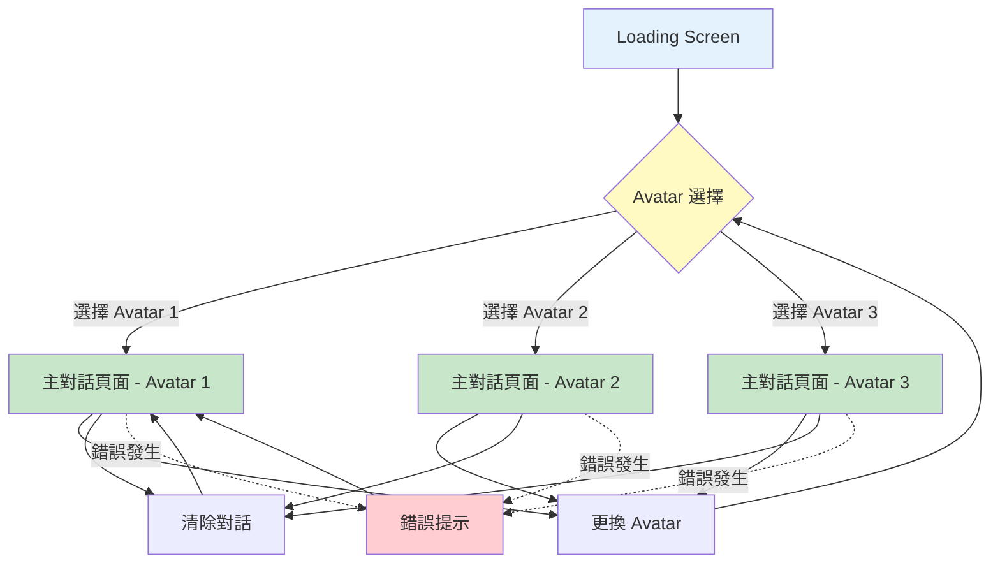
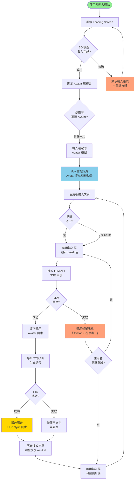
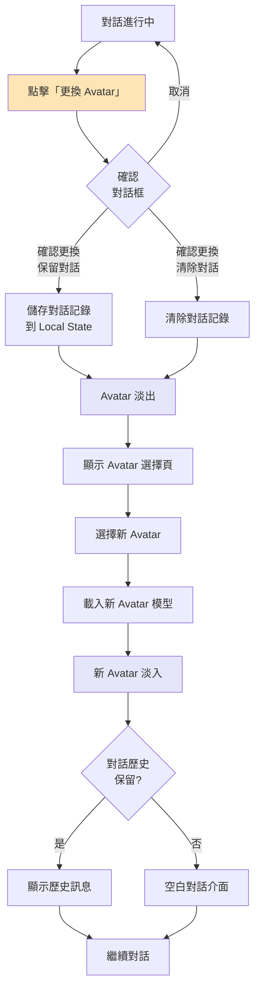
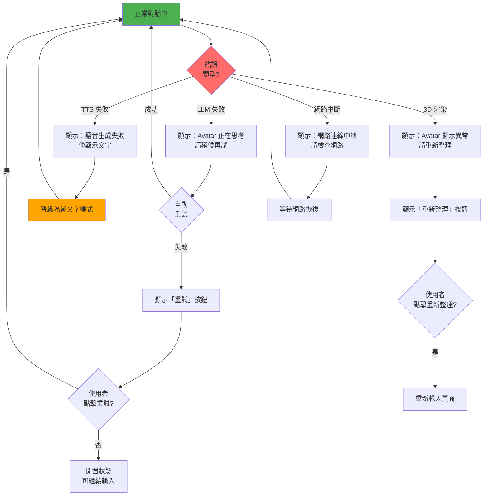

# 3D Avatar 即時對話系統 UI/UX Specification

**專案名稱**: 3D Avatar 即時對話系統  
**文件版本**: v1.0  
**建立日期**: 2025-10-14  
**負責人**: UX Expert (Sally)  
**文件類型**: Front-End UI/UX Specification

---

## Introduction

This document defines the user experience goals, information architecture, user flows, and visual design specifications for **3D Avatar 即時對話系統**'s user interface. It serves as the foundation for visual design and frontend development, ensuring a cohesive and user-centered experience.

本規格文件基於：
- ✅ Project Brief（專案基礎文件）
- ✅ PRD（產品需求文件）
- ✅ Phase 1 技術研究成果

目標是為開發團隊提供清晰、可執行的前端設計指引，實現「真人視訊通話般」的沉浸式 AI Avatar 對話體驗。

---

### Overall UX Goals & Principles

#### Target User Personas

**Persona 1: 中小企業 IT 決策者（主要使用者）**

- **背景**: 
  - 職位：CTO、IT 主管、數位轉型負責人
  - 企業規模：10-200 人
  - 產業：電商、客服、教育、醫療諮詢
  
- **使用情境**: 
  - 評估 AI Avatar 技術可行性
  - 測試是否能取代傳統 Chatbot 或降低客服成本
  - 需要快速理解產品價值，時間有限
  
- **需求與痛點**:
  - 需要「一看就懂」的介面，無複雜設定
  - 重視視覺呈現品質（代表企業形象）
  - 希望快速驗證技術效果（< 5 分鐘）
  
**Persona 2: 內容創作者 / 技術愛好者（次要使用者）**

- **背景**:
  - 年齡：25-40 歲
  - 職業：YouTuber、線上講師、獨立開發者
  - 技術能力：中等，願意探索新功能
  
- **使用情境**:
  - 探索 AI Avatar 作為內容呈現工具
  - 與粉絲互動的創新方式
  - 個人品牌差異化
  
- **需求與痛點**:
  - 希望有趣且視覺吸引力強
  - 期待個人化選項（選擇 Avatar）
  - 需要簡單易用，但也想探索進階功能

#### Usability Goals

1. **即時性（Immediacy）**: 使用者進入頁面後 5 秒內開始對話，無需註冊或複雜設定
2. **易學性（Learnability）**: 首次使用者無需教學即可完成對話，介面自解釋
3. **沉浸感（Immersion）**: 視覺設計營造「真人視訊通話」氛圍，減少 UI 干擾
4. **效率性（Efficiency）**: 核心操作（輸入、送出、切換 Avatar）< 2 次點擊
5. **可靠性（Reliability）**: 錯誤狀態清晰友善，使用者知道如何恢復

#### Design Principles

1. **Avatar 為王（Avatar-First）**  
   - 3D Avatar 是體驗核心，佔據視覺主導地位（70% 畫面）
   - 所有 UI 元素為 Avatar 服務，不搶風采

2. **極簡至上（Minimalist Interface）**  
   - 隱藏非必要元素，保持畫面清爽
   - 使用漸進式揭露（Progressive Disclosure），需要時才顯示功能

3. **即時反饋（Immediate Feedback）**  
   - 每個操作必須有視覺反饋（Loading、動畫、狀態變化）
   - Avatar 作為主要反饋媒介（表情、動作、嘴型）

4. **友善錯誤（Friendly Errors）**  
   - 錯誤訊息人性化，避免技術術語
   - 提供明確的解決方案或重試按鈕

5. **效能優先（Performance-First Design）**  
   - 設計決策考慮 3D 渲染效能
   - 避免過度動畫或複雜效果影響 FPS

### Change Log

| Date | Version | Description | Author |
|------|---------|-------------|--------|
| 2025-10-14 | v1.0 | 初始 UI/UX Specification，定義完整前端設計規格 | Sally (UX Expert) |

---

## Information Architecture (IA)

### Site Map / Screen Inventory



**Screen Inventory**:

1. **Loading Screen（載入頁）** - 初始載入，顯示品牌與進度
2. **Avatar Selection（Avatar 選擇頁）** - 選擇 3 個預設 Avatar 之一
3. **Main Chat Page（主對話頁）** - 核心體驗，Avatar + 對話介面
4. **Error State（錯誤狀態）** - 當服務失敗時的友善提示

### Navigation Structure

**Primary Navigation**:  
- **無傳統導航列**（POC 階段單一功能，無需導航）
- 主要互動透過：
  - Avatar 選擇卡片（起始頁）
  - 更換 Avatar 按鈕（對話頁右上角，次要功能）

**Secondary Navigation**:  
- 清除對話按鈕（對話頁右上角）
- 設定按鈕（未來功能，POC 不實作）

**Breadcrumb Strategy**:  
- **不使用麵包屑**（僅 2 層結構，無需麵包屑導航）
- 使用視覺狀態變化表示流程進展（選擇 → 對話）

---

## User Flows

### Flow 1: 首次使用對話流程（核心流程）

**User Goal**: 首次使用者進入系統，選擇 Avatar 並完成第一次對話

**Entry Points**: 
- 直接存取網站 URL（https://avatar-chat.azurestaticapps.net）
- 透過分享連結進入

**Success Criteria**: 
- 使用者成功選擇 Avatar
- 完成至少 1 輪對話（輸入 → 收到語音回應）
- 視覺與語音體驗流暢無卡頓

#### Flow Diagram



#### Edge Cases & Error Handling

- **Edge Case 1: 3D 模型載入失敗**
  - 顯示：「Avatar 載入失敗，請重新整理頁面」
  - 提供：「重新載入」按鈕
  - Fallback：降級為 2D Avatar 圖片（未來選項）

- **Edge Case 2: LLM API 超時（> 10 秒）**
  - 顯示：「Avatar 正在努力思考中，請稍候...」
  - 自動重試 1 次
  - 失敗後提示：「服務暫時繁忙，請稍後再試」

- **Edge Case 3: TTS 失敗但 LLM 成功**
  - 降級：僅顯示文字回應，無語音
  - 提示：「語音生成失敗，僅顯示文字」
  - Avatar 保持微笑表情（無嘴型動畫）

- **Edge Case 4: 使用者快速連續送出訊息**
  - 防抖動：禁用送出按鈕直到前一則處理完畢
  - 提示：「Avatar 正在回應中...」

- **Edge Case 5: 網路連線中斷**
  - 偵測：監聽 `navigator.onLine` 事件
  - 顯示：「網路連線中斷，請檢查網路設定」
  - 自動重連機制

**Notes**:  
- 整個流程設計目標：端到端 < 2.5 秒（輸入到語音開始播放）
- Loading 狀態必須清晰，使用者知道系統在處理中
- 錯誤訊息避免技術術語，使用友善語言

---

### Flow 2: 更換 Avatar 流程

**User Goal**: 使用者在對話中途想更換 Avatar

**Entry Points**: 
- 主對話頁右上角「更換 Avatar」按鈕

**Success Criteria**: 
- 成功切換到不同 Avatar
- 對話歷史保留（選項：保留或清除）
- 切換過程流暢無卡頓

#### Flow Diagram



#### Edge Cases & Error Handling

- **Edge Case 1: 正在播放語音時點擊更換**
  - 停止當前語音播放
  - 顯示確認對話框：「確定要中斷當前對話並更換 Avatar？」

- **Edge Case 2: 新 Avatar 載入失敗**
  - 返回原 Avatar
  - 提示：「新 Avatar 載入失敗，已恢復原 Avatar」

**Notes**: 
- 切換動畫時間：1 秒（淡出 0.5s + 淡入 0.5s）
- POC 階段預設清除對話，MVP 階段加入「保留對話」選項

---

### Flow 3: 錯誤恢復流程

**User Goal**: 當系統錯誤發生時，使用者能理解問題並恢復使用

**Entry Points**: 
- LLM API 失敗
- TTS API 失敗
- 3D 渲染錯誤
- 網路中斷

**Success Criteria**: 
- 錯誤訊息清晰易懂
- 使用者知道如何解決或重試
- 系統狀態正確恢復

#### Flow Diagram



#### Edge Cases & Error Handling

- **Edge Case 1: 連續錯誤（> 3 次）**
  - 顯示：「服務目前不穩定，請稍後再試或聯絡支援」
  - 提供：支援 Email 或 Discord 連結

- **Edge Case 2: 部分功能降級**
  - 範例：Lip Sync 失敗，但對話正常
  - 行為：靜默降級，僅 console 記錄，不打擾使用者

**Notes**: 
- 錯誤訊息使用友善語言，避免「500 Error」「API Timeout」等術語
- 所有錯誤提供明確的下一步行動（重試、重新整理、聯絡支援）

---

## Wireframes & Mockups

### Primary Design Files

**Design Tool**: Figma（未來建立）  
**POC 階段**: 使用 Wireframe 描述，無高保真設計稿  
**Figma Link**: _（待建立）_

### Key Screen Layouts

#### Screen 1: Avatar 選擇頁（起始頁）

**Purpose**: 讓使用者選擇喜歡的 Avatar，建立個人化連結

**Key Elements**:

- **頁面標題區（上方）**:
  - 專案 Logo（左上角）
  - 標題：「選擇你的 AI 助手」
  - 副標題：「開始與 3D Avatar 對話」

- **Avatar 卡片區（中央）**:
  - 3 張 Avatar 預覽卡片（橫向排列）
  - 每張卡片包含：
    - Avatar 3D 縮圖或靜態圖片（300x400px）
    - Avatar 名稱（如「Alex」「Sophia」「Jordan」）
    - 選擇按鈕（「選擇此 Avatar」）
  - 卡片 hover 效果：放大 1.05x + 陰影加深

- **底部說明區**:
  - 簡短說明：「選擇後即可開始對話，隨時可更換」

**Interaction Notes**:
- 點擊卡片任何區域 = 點擊「選擇」按鈕
- 選擇後淡出（0.3s）→ 載入 Avatar → 淡入主對話頁（0.5s）
- Loading 狀態：卡片顯示 Spinner

**Layout (Wireframe)**:
```
┌─────────────────────────────────────────────────────┐
│  [Logo]              選擇你的 AI 助手                │
│                  開始與 3D Avatar 對話               │
│                                                     │
│  ┌────────┐      ┌────────┐      ┌────────┐       │
│  │ Avatar │      │ Avatar │      │ Avatar │       │
│  │  圖片  │      │  圖片  │      │  圖片  │       │
│  │        │      │        │      │        │       │
│  │ "Alex" │      │"Sophia"│      │"Jordan"│       │
│  │ [選擇] │      │ [選擇] │      │ [選擇] │       │
│  └────────┘      └────────┘      └────────┘       │
│                                                     │
│          選擇後即可開始對話，隨時可更換             │
└─────────────────────────────────────────────────────┘
```

---

#### Screen 2: 主對話頁（核心頁面）

**Purpose**: 提供沉浸式的 Avatar 對話體驗

**Key Elements**:

- **Avatar 渲染區（上方，70% 高度）**:
  - 3D Avatar 全螢幕渲染
  - 深色漸層背景（上深下淺，#1E3A8A → #0F172A）
  - Avatar 居中，正面朝向使用者
  - 待機動畫：呼吸、眨眼、隨機微笑

- **控制按鈕區（右上角，懸浮）**:
  - 更換 Avatar 按鈕（圖示：雙箭頭循環）
  - 清除對話按鈕（圖示：垃圾桶）
  - 按鈕半透明背景（backdrop-blur）

- **對話介面區（下方，30% 高度）**:
  - 對話歷史區域（最多顯示 5 則，可滾動）
    - 使用者訊息：右側，藍色氣泡（#06B6D4）
    - Avatar 訊息：左側，灰色氣泡（#E5E7EB）
  - 輸入區域（固定底部）:
    - 文字輸入框（Textarea，自動高度，最多 3 行）
    - 送出按鈕（箭頭圖示）
    - Loading 狀態：按鈕顯示 Spinner

**Interaction Notes**:
- 輸入框 focus 時，Avatar 微微點頭（「聆聽」狀態）
- 送出後，Avatar 眼睛往上看（「思考」狀態）
- LLM 回應時，文字逐字顯示（打字機效果）
- TTS 播放時，Avatar 嘴型同步（Lip Sync）
- 播放完畢，Avatar 恢復微笑表情

**Layout (Wireframe)**:
```
┌─────────────────────────────────────────────────────┐
│                                         [🔄] [🗑️]  │ ← 控制按鈕
│                                                     │
│                   ╔═══════════╗                    │
│                   ║           ║                    │
│                   ║  3D       ║                    │ ← Avatar 區
│                   ║  Avatar   ║                    │   (70% 高度)
│                   ║           ║                    │
│                   ╚═══════════╝                    │
│─────────────────────────────────────────────────────│
│  [使用者] 你好                                      │
│          Avatar: 你好！我是你的 AI 助手 [語音播放]  │ ← 對話歷史
│                                                     │   (最多 5 則)
│─────────────────────────────────────────────────────│
│  [輸入訊息...                          ] [↑]       │ ← 輸入區
└─────────────────────────────────────────────────────┘
```

---

#### Screen 3: Loading Screen（載入頁）

**Purpose**: 初次載入時顯示品牌與進度

**Key Elements**:

- **中央品牌區**:
  - 專案 Logo（大尺寸）
  - 專案名稱：「3D Avatar 對話系統」
  - 載入動畫（Spinner 或進度條）
  - 載入提示文字：「正在載入 Avatar...」

- **背景**:
  - 深色漸層背景（與主對話頁一致）

**Interaction Notes**:
- 載入完成後自動進入 Avatar 選擇頁
- 載入時間 > 5 秒，顯示提示：「網路較慢，請稍候...」

**Layout (Wireframe)**:
```
┌─────────────────────────────────────────────────────┐
│                                                     │
│                                                     │
│                   ┌─────────┐                      │
│                   │  Logo   │                      │
│                   └─────────┘                      │
│                                                     │
│              3D Avatar 對話系統                     │
│                                                     │
│                   ⟳ Loading...                     │
│               正在載入 Avatar...                    │
│                                                     │
│                                                     │
└─────────────────────────────────────────────────────┘
```

---

#### Screen 4: 錯誤狀態頁（Overlay）

**Purpose**: 當錯誤發生時，提供友善提示與解決方案

**Key Elements**:

- **錯誤訊息卡片（中央懸浮）**:
  - 錯誤圖示（❌ 或 ⚠️）
  - 友善錯誤標題（如「哎呀，出了點問題」）
  - 具體錯誤說明（如「Avatar 正在思考中，請稍候再試...」）
  - 操作按鈕（「重試」或「重新整理」）

- **背景**:
  - 原頁面半透明遮罩（backdrop-blur）

**Interaction Notes**:
- 點擊「重試」→ 關閉錯誤卡片 → 重新執行操作
- 點擊「重新整理」→ 重新載入整個頁面
- 可點擊遮罩關閉（部分錯誤）

**Layout (Wireframe)**:
```
┌─────────────────────────────────────────────────────┐
│                   [原頁面模糊遮罩]                   │
│                                                     │
│         ┌────────────────────────────┐             │
│         │    ⚠️  哎呀，出了點問題     │             │
│         │                            │             │
│         │  Avatar 正在思考中，        │             │
│         │  請稍候再試...             │             │
│         │                            │             │
│         │    [重試]      [取消]      │             │
│         └────────────────────────────┘             │
│                                                     │
└─────────────────────────────────────────────────────┘
```

---

## Component Library / Design System

### Design System Approach

**策略**: 建立輕量級自訂 Design System（基於 Tailwind CSS）

**理由**:
- POC 階段無需完整 Design System（如 Material UI, Ant Design）
- Tailwind CSS 提供足夠的工具類別
- 自訂少量核心組件即可滿足需求
- 未來可升級為完整 Design System

**元件來源**:
- 基礎元件：Tailwind CSS + Headless UI
- 3D 元件：React Three Fiber + Drei
- 自訂元件：5-8 個核心組件

### Core Components

#### Component 1: Button（按鈕）

**Purpose**: 統一的互動按鈕組件

**Variants**:
- `primary`: 主要操作（藍色，#06B6D4）
- `secondary`: 次要操作（灰色，#6B7280）
- `danger`: 危險操作（紅色，#EF4444）
- `ghost`: 透明按鈕（僅邊框）

**States**:
- `default`: 預設狀態
- `hover`: Hover 時放大 1.02x，陰影加深
- `loading`: 顯示 Spinner，禁用點擊
- `disabled`: 半透明，禁用點擊

**Usage Guidelines**:
- 主要操作用 `primary`（如「送出」「選擇」）
- 次要操作用 `secondary`（如「取消」）
- 刪除/清除用 `danger`（如「清除對話」）
- 圖示按鈕用 `ghost`（如右上角控制按鈕）

**Code Example**:
```tsx
<Button variant="primary" loading={isLoading}>
  送出訊息
</Button>
```

---

#### Component 2: Input（文字輸入框）

**Purpose**: 統一的文字輸入組件

**Variants**:
- `text`: 單行文字
- `textarea`: 多行文字（對話輸入）

**States**:
- `default`: 預設狀態，灰色邊框
- `focus`: Focus 時藍色邊框，發光效果
- `error`: 錯誤時紅色邊框
- `disabled`: 禁用時半透明

**Usage Guidelines**:
- 對話輸入使用 `textarea`，自動高度（最多 3 行）
- 支援 Enter 送出（Shift+Enter 換行）
- Placeholder 使用淡灰色文字

**Code Example**:
```tsx
<Input 
  type="textarea" 
  placeholder="輸入訊息..."
  onEnter={handleSend}
/>
```

---

#### Component 3: MessageBubble（訊息氣泡）

**Purpose**: 顯示對話訊息

**Variants**:
- `user`: 使用者訊息（右側，藍色）
- `avatar`: Avatar 訊息（左側，灰色）

**States**:
- `default`: 靜態顯示
- `typing`: 打字機效果（僅 Avatar 訊息）
- `playing`: 語音播放中（顯示音訊波形動畫）

**Usage Guidelines**:
- 使用者訊息靠右對齊
- Avatar 訊息靠左對齊，可包含語音圖示
- 訊息時間戳記（選做，灰色小字）

**Code Example**:
```tsx
<MessageBubble 
  type="avatar" 
  content="你好！我是你的 AI 助手"
  isPlaying={true}
/>
```

---

#### Component 4: AvatarCard（Avatar 選擇卡片）

**Purpose**: Avatar 選擇頁的卡片組件

**Variants**:
- `default`: 預設狀態
- `selected`: 被選中（藍色邊框）

**States**:
- `default`: 正常顯示
- `hover`: 放大 1.05x，陰影加深
- `loading`: 顯示 Skeleton 或 Spinner

**Usage Guidelines**:
- 卡片包含：Avatar 圖片、名稱、選擇按鈕
- 點擊卡片任何區域 = 選擇
- 圖片使用 `aspect-ratio: 3/4`

**Code Example**:
```tsx
<AvatarCard 
  name="Sophia"
  image="/avatars/sophia.png"
  onSelect={handleSelect}
/>
```

---

#### Component 5: LoadingSpinner（載入動畫）

**Purpose**: 統一的載入指示器

**Variants**:
- `small`: 小尺寸（按鈕內）
- `medium`: 中尺寸（卡片內）
- `large`: 大尺寸（全頁載入）

**States**:
- `spinning`: 旋轉動畫

**Usage Guidelines**:
- 按鈕 Loading 用 `small`
- 卡片/區域 Loading 用 `medium`
- 全頁 Loading 用 `large`
- 顏色跟隨父元素或使用品牌色

**Code Example**:
```tsx
<LoadingSpinner size="medium" color="primary" />
```

---

#### Component 6: ErrorCard（錯誤提示卡片）

**Purpose**: 顯示友善錯誤訊息

**Variants**:
- `error`: 錯誤（紅色）
- `warning`: 警告（橘色）
- `info`: 資訊（藍色）

**States**:
- `visible`: 顯示
- `hidden`: 隱藏

**Usage Guidelines**:
- 錯誤訊息使用友善語言
- 必須包含操作按鈕（重試、關閉）
- 可自動消失（info 類型，3 秒）

**Code Example**:
```tsx
<ErrorCard 
  type="error"
  title="哎呀，出了點問題"
  message="Avatar 正在思考中，請稍候再試..."
  onRetry={handleRetry}
/>
```

---

## Branding & Style Guide

### Visual Identity

**Brand Guidelines**: _（待建立完整品牌指南）_

**核心品牌定位**:
- **專業科技感**: 使用深藍色系，傳達 AI 技術專業性
- **友善親和力**: 圓角設計、柔和陰影，避免冰冷感
- **現代簡約**: 極簡介面，減少視覺干擾

### Color Palette

| Color Type | Hex Code | Usage |
|-----------|----------|-------|
| **Primary** | `#1E3A8A` | 主要品牌色，背景漸層、標題 |
| **Secondary** | `#06B6D4` | 強調色，按鈕、連結、使用者訊息氣泡 |
| **Accent** | `#8B5CF6` | 輔助強調，Hover 效果、特殊提示 |
| **Success** | `#10B981` | 成功訊息、正面反饋 |
| **Warning** | `#F59E0B` | 警告訊息、注意事項 |
| **Error** | `#EF4444` | 錯誤訊息、危險操作 |
| **Neutral** | `#F3F4F6` (淡灰)<br>`#6B7280` (中灰)<br>`#1F2937` (深灰) | 文字、邊框、背景 |

**背景漸層（Avatar 區）**:
- 起始色：`#1E3A8A`（深藍）
- 結束色：`#0F172A`（更深藍）
- 方向：上到下（`to bottom`）

### Typography

#### Font Families

- **Primary（繁中）**: Noto Sans TC（Google Fonts）
  - 用途：所有繁體中文文字
  - 權重：400（Regular）、500（Medium）、700（Bold）

- **Secondary（英數）**: Inter（Google Fonts）
  - 用途：英文、數字、符號
  - 權重：400、500、600、700

- **Monospace**: JetBrains Mono（程式碼、技術資訊）
  - 用途：錯誤訊息中的技術細節（開發模式）
  - 權重：400

#### Type Scale

| Element | Size | Weight | Line Height | 用途 |
|---------|------|--------|-------------|------|
| **H1** | 32px (2rem) | 700 (Bold) | 1.2 | 主標題（如「選擇你的 AI 助手」） |
| **H2** | 24px (1.5rem) | 600 (SemiBold) | 1.3 | 次標題（如 Avatar 名稱） |
| **H3** | 20px (1.25rem) | 600 | 1.4 | 小標題（如錯誤卡片標題） |
| **Body** | 16px (1rem) | 400 (Regular) | 1.6 | 正文（對話訊息、說明文字） |
| **Small** | 14px (0.875rem) | 400 | 1.5 | 輔助文字（時間戳記、提示） |
| **Button** | 16px (1rem) | 500 (Medium) | 1 | 按鈕文字 |

### Iconography

**Icon Library**: Heroicons v2（Tailwind 官方）

**Icon Style**: Outline（線條）為主，Solid（實心）用於強調

**Icon Size**:
- Small: 16px（內聯文字）
- Medium: 24px（按鈕、卡片）
- Large: 32px（主要功能）

**Usage Guidelines**:
- 所有圖示使用 Heroicons 保持一致性
- 圖示顏色跟隨文字顏色或使用品牌色
- 互動圖示（按鈕）使用 24px
- 裝飾圖示可縮小至 16px

**常用圖示**:
- `ArrowUpIcon`: 送出按鈕
- `ArrowPathIcon`: 更換 Avatar
- `TrashIcon`: 清除對話
- `ExclamationTriangleIcon`: 警告
- `XCircleIcon`: 錯誤

### Spacing & Layout

**Grid System**: 
- 使用 Tailwind 預設 12 欄 Grid
- Container 最大寬度：1280px（桌機）
- 內距（Padding）：16px（手機）、24px（平板）、32px（桌機）

**Spacing Scale**（基於 Tailwind）:
- `xs`: 4px（元素內微調）
- `sm`: 8px（小間距）
- `md`: 16px（標準間距）
- `lg`: 24px（大間距）
- `xl`: 32px（區塊間距）
- `2xl`: 48px（大區塊間距）

**常用間距規則**:
- 按鈕內距：`px-4 py-2`（16px 水平，8px 垂直）
- 卡片內距：`p-6`（24px）
- 對話氣泡內距：`px-4 py-3`
- 區塊間距：`mb-6`（24px）

---

## Accessibility Requirements

### Compliance Target

**Standard**: **None**（POC 階段）

**未來目標**: WCAG 2.1 Level AA（MVP 階段）

**POC 階段基本措施**:
- 鍵盤導航支援（Tab 鍵可操作所有互動元素）
- 色彩對比達基本標準（4.5:1 文字，3:1 大元素）
- Focus 指示器清晰可見

### Key Requirements

**Visual（視覺）**:
- **Color contrast ratios**: 
  - 正文文字：≥ 4.5:1（白色文字 #FFFFFF on 深藍背景 #1E3A8A = 8.2:1 ✅）
  - 大型文字（≥18px）：≥ 3:1
  - UI 元素（按鈕、邊框）：≥ 3:1

- **Focus indicators**: 
  - 所有互動元素 Focus 時顯示 2px 藍色外框（`ring-2 ring-blue-500`）
  - Focus 外框與元素間距 2px（`ring-offset-2`）

- **Text sizing**: 
  - 最小文字：14px（Small）
  - 可縮放：支援瀏覽器縮放 100%-200%

**Interaction（互動）**:
- **Keyboard navigation**: 
  - Tab 鍵依邏輯順序遍歷所有互動元素
  - Enter 鍵觸發按鈕（送出、選擇）
  - Escape 鍵關閉對話框、錯誤卡片

- **Screen reader support**: 
  - ⚠️ POC 階段**不完整支援**
  - 所有按鈕包含 `aria-label`（如「送出訊息」「更換 Avatar」）
  - 錯誤訊息使用 `role="alert"` 自動朗讀

- **Touch targets**: 
  - 最小觸控面積：44x44px（遵循 iOS HIG）
  - 按鈮內距確保達標（`px-4 py-3` = 48px 高度 ✅）

**Content（內容）**:
- **Alternative text**: 
  - Avatar 圖片包含 `alt` 描述（如「Avatar Sophia」）
  - 裝飾性圖示使用 `aria-hidden="true"`

- **Heading structure**: 
  - 頁面標題使用 `<h1>`（如「選擇你的 AI 助手」）
  - 次要標題使用 `<h2>`（如 Avatar 名稱）
  - 避免跳級（h1 → h3）

- **Form labels**: 
  - 文字輸入框包含 `<label>`（可視覺隱藏）
  - Placeholder 不作為唯一標籤

### Testing Strategy

**POC 階段測試**:
1. **鍵盤測試**: 手動測試 Tab、Enter、Escape 功能正常
2. **色彩對比**: 使用 Chrome DevTools 檢查對比度
3. **縮放測試**: 瀏覽器縮放至 150% 檢查佈局

**MVP 階段測試**（未來）:
1. 使用 axe DevTools 自動化測試
2. 螢幕閱讀器測試（NVDA, VoiceOver）
3. 完整 WCAG 2.1 AA 檢查

---

## Responsiveness Strategy

### Breakpoints

| Breakpoint | Min Width | Max Width | Target Devices |
|-----------|-----------|-----------|----------------|
| **Mobile** | 320px | 767px | iPhone, Android 手機 |
| **Tablet** | 768px | 1023px | iPad, Android 平板 |
| **Desktop** | 1024px | 1919px | 筆電、桌機（主要支援） |
| **Wide** | 1920px | - | 大螢幕、4K 顯示器 |

**POC 優先支援**: Desktop（1024px+）  
**次要支援**: Tablet（768px-1023px）  
**不支援**: Mobile（< 768px，3D 渲染效能考量）

### Adaptation Patterns

**Layout Changes**:

- **Desktop（≥ 1024px）**:
  - Avatar 區 70% 高度，對話區 30% 高度
  - 對話氣泡最大寬度 60%
  - 輸入框寬度 100%，最大 800px

- **Tablet（768px-1023px）**:
  - Avatar 區 60% 高度，對話區 40% 高度（增加對話空間）
  - 對話氣泡最大寬度 70%
  - Avatar 選擇卡片改為直向排列（2 列）

- **Mobile（< 768px）- 不支援**:
  - 顯示提示：「請使用桌機或平板訪問以獲得最佳體驗」
  - 提供 Email 訂閱，未來行動版推出時通知

**Navigation Changes**:

- **Desktop**: 控制按鈕位於右上角（懸浮）
- **Tablet**: 控制按鈕縮小至圖示（無文字）
- **Mobile**: N/A（不支援）

**Content Priority**:

- **Desktop**: 顯示完整對話歷史（5 則）
- **Tablet**: 顯示完整對話歷史（5 則），但字體稍小
- **Mobile**: N/A

**Interaction Changes**:

- **Desktop**: 
  - Enter 送出，Shift+Enter 換行
  - Hover 效果完整（按鈕放大、卡片陰影）

- **Tablet**: 
  - Touch 互動優先
  - 取消 Hover 效果（觸控裝置無 Hover）
  - 增大觸控面積（按鈕 padding 加大）

---

## Animation & Micro-interactions

### Motion Principles

1. **有目的性（Purposeful）**: 動畫必須有功能性，引導使用者注意力或提供反饋
2. **快速流暢（Snappy & Smooth）**: 動畫時間 < 300ms，避免拖慢操作
3. **自然物理（Natural Physics）**: 使用 Easing（緩動）模擬真實物理
4. **可關閉（Respects Preferences）**: 尊重 `prefers-reduced-motion`，減少動畫

**核心 Easing**:
- `ease-out`: 進入動畫（元素出現）
- `ease-in`: 離開動畫（元素消失）
- `ease-in-out`: 狀態變化（按鈕 Hover）

### Key Animations

- **頁面切換（Page Transition）**: 淡入淡出（Fade In/Out），Duration: 300ms，Easing: ease-in-out

- **Avatar 載入（Avatar Load）**: 從下往上淡入 + 輕微放大（Scale 0.95 → 1.0），Duration: 500ms，Easing: ease-out

- **訊息出現（Message Appear）**: 從底部滑入 + 淡入（TranslateY 20px → 0），Duration: 200ms，Easing: ease-out

- **打字機效果（Typing Effect）**: 文字逐字出現，每字 30ms 延遲

- **按鈕 Hover（Button Hover）**: 放大 1.02x + 陰影加深，Duration: 150ms，Easing: ease-in-out

- **Loading Spinner（Spinner）**: 360° 旋轉，Duration: 1000ms，Easing: linear，無限循環

- **錯誤卡片出現（Error Card）**: 從上往下滑入 + 淡入（TranslateY -20px → 0），Duration: 250ms，Easing: ease-out

- **Avatar 待機呼吸（Idle Breathing）**: 胸部微動（Scale 1.0 ↔ 1.02），Duration: 3000ms，Easing: ease-in-out，循環

- **眨眼動畫（Blink）**: 眼皮閉合（Blendshape 0 → 1 → 0），Duration: 200ms，Easing: ease-in-out，隨機間隔 3-5s

- **嘴型同步（Lip Sync）**: Blendshape 權重變化（0-1），Duration: 隨音素變化，Easing: linear

**無障礙考量**:
```css
@media (prefers-reduced-motion: reduce) {
  * {
    animation-duration: 0.01ms !important;
    transition-duration: 0.01ms !important;
  }
}
```

---

## Performance Considerations

### Performance Goals

- **Page Load（頁面載入）**: 首次內容繪製（FCP）< 1.5 秒，完全載入（LCP）< 3 秒
- **Interaction Response（互動回應）**: 送出訊息到 UI 回應 < 100ms，LLM 首字回應 < 2 秒
- **Animation FPS（動畫幀率）**: 3D Avatar 渲染 ≥ 30 FPS（桌機），UI 動畫 ≥ 60 FPS

### Design Strategies

**減少初始載入**:
- 延遲載入（Lazy Load）非關鍵資源：
  - Avatar 3D 模型在選擇後才載入（按需載入）
  - 對話歷史組件使用 `React.lazy()`
- 圖片優化：
  - Avatar 預覽圖使用 WebP 格式，壓縮至 < 100KB
  - 使用 Next.js `<Image>` 組件自動優化
- 程式碼分割：
  - Three.js 相關程式碼單獨 Bundle
  - 每個頁面獨立 Bundle（Next.js 自動處理）

**優化 3D 渲染**:
- 降低 Avatar 模型多邊形數（< 50K triangles）
- 使用 LOD（Level of Detail）: 距離遠時降低細節
- 限制燈光數量（1 Ambient + 1 Directional）
- 關閉不必要的陰影

**優化音訊**:
- TTS 音訊使用低位元率 MP3（16kbps，語音品質足夠）
- 預載入常見回應音訊（如「你好」）
- 使用 Web Audio API 的 `decodeAudioData` 非同步解碼

**減少重新渲染**:
- 使用 `React.memo()` 包裝純組件
- 對話列表使用 `key` 優化（避免全部重新渲染）
- Zustand store 使用選擇器（Selector）減少訂閱範圍

**監控與偵錯**:
- 使用 Chrome DevTools Performance 記錄 FPS
- 使用 React DevTools Profiler 偵測渲染瓶頸
- 生產環境加入 Web Vitals 監控（未來）

---

## Next Steps

### Immediate Actions

1. **與 PM 確認 UI/UX 規格**
   - 確保所有頁面流程符合 PRD 需求
   - 確認色彩、字體、動畫符合品牌定位

2. **建立 Figma 設計稿（選做）**
   - 基於此規格建立高保真 Mockup
   - 提供給開發團隊視覺參考
   - _POC 階段可省略，直接開發_

3. **準備設計資產**
   - 匯出 Avatar 預覽圖（3 張）
   - 準備專案 Logo
   - 確認 Icon 庫（Heroicons）

4. **交付給 Architect**
   - 將此規格交給系統架構師（Winston）
   - 確保前端技術選型符合 UI 需求
   - 討論 3D 渲染效能優化策略

### Design Handoff Checklist

- [x] 所有使用者流程已文件化（3 個核心流程）
- [x] 組件清單完整（6 個核心組件）
- [x] 無障礙需求已定義（基本 WCAG 考量）
- [x] 響應式策略明確（Desktop 優先，Tablet 次要）
- [x] 品牌指南已整合（色彩、字體、圖示）
- [x] 效能目標已建立（FPS、載入時間、互動延遲）

---

## Checklist Results

_（此部分將在執行 UX Checklist 後填入）_

待執行 BMad UX Checklist 驗證 Front-End Spec 品質，檢查項目包括：
- ✅ 使用者流程完整且符合使用情境
- ✅ 組件設計清晰可實作
- ✅ 無障礙需求明確
- ✅ 效能目標可衡量
- ✅ 品牌一致性
- ✅ 響應式策略合理

---

**文件狀態**: ✅ 完成  
**下一步**: 交付給 Architect (Winston) 撰寫技術架構  
**版本**: v1.0  
**最後更新**: 2025-10-14

---

## Architect Handoff Note

Dear **Architect (Winston)**,

前端 UI/UX 規格已完成，請基於此規格撰寫 **Fullstack Architecture 文件**。

**關鍵 UI 技術需求**:

1. **3D 渲染架構**:
   - Avatar 區域使用 Three.js + React Three Fiber
   - 效能目標：≥ 30 FPS（桌機）
   - 支援 LOD、Blendshape 控制（Lip Sync）

2. **前端組件架構**:
   - 6 個核心組件（Button, Input, MessageBubble, AvatarCard, LoadingSpinner, ErrorCard）
   - 使用 Tailwind CSS + Headless UI
   - 狀態管理：Zustand

3. **動畫與互動**:
   - 頁面切換、訊息出現、Avatar 待機動畫
   - 尊重 `prefers-reduced-motion`

4. **響應式設計**:
   - 主要支援：Desktop（≥ 1024px）
   - 次要支援：Tablet（768px-1023px）
   - 不支援：Mobile（< 768px）

5. **效能優化策略**:
   - 程式碼分割（Three.js 獨立 Bundle）
   - 圖片優化（WebP, Next.js Image）
   - 音訊優化（低位元率 MP3）

請在架構文件中詳細說明如何實現這些 UI 需求，並確保技術選型支援所有設計規格。

開始指令：`@architect 請使用 create-doc 模式，基於 prd.md 和 front-end-spec.md 撰寫 architecture.md`

