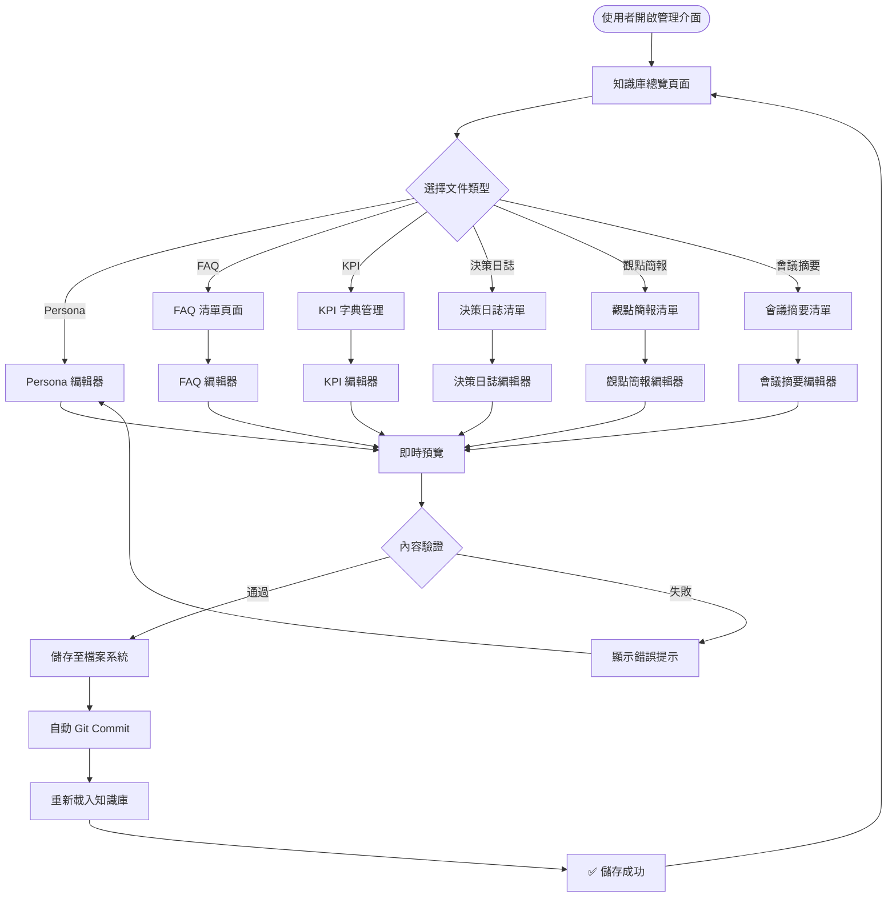
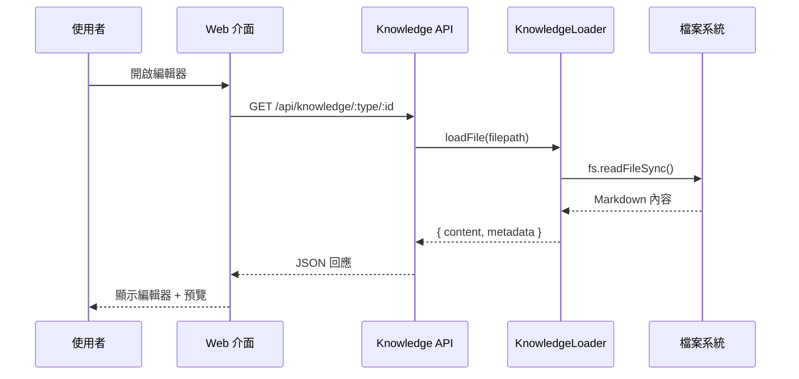
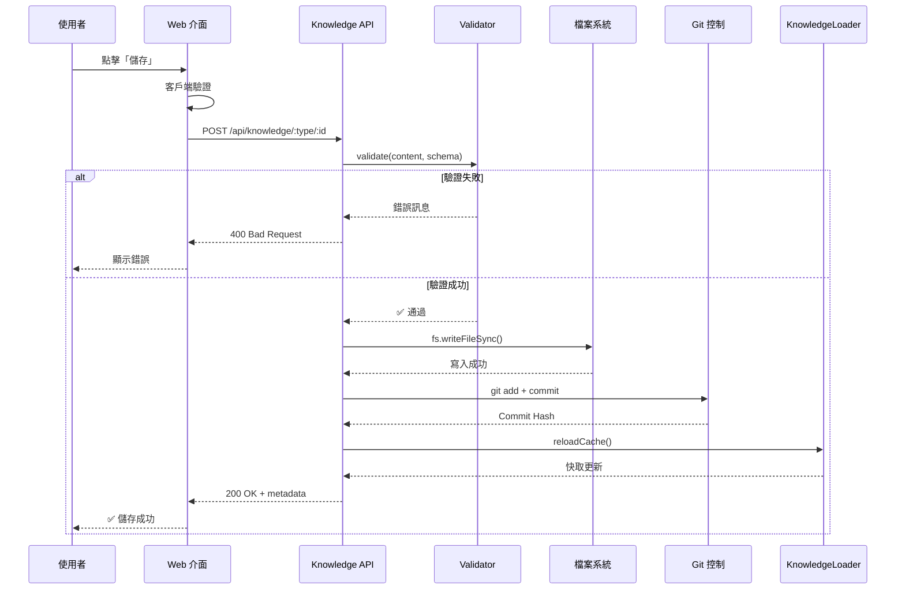
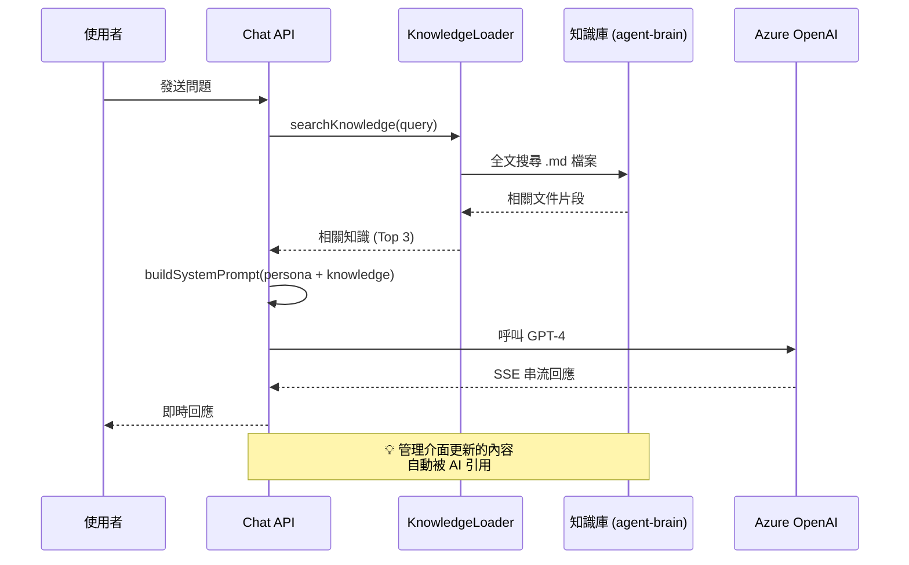

# AI Agent 知識庫管理系統設計文件

> **版本**: 1.0.0
> **日期**: 2025-10-21
> **設計者**: AI Development Team

---

## 📋 目錄

1. [系統概述](#1-系統概述)
2. [架構設計](#2-架構設計)
3. [UI/UX 設計](#3-uiux-設計)
4. [功能模組詳細設計](#4-功能模組詳細設計)
5. [資料流程](#5-資料流程)
6. [API 設計](#6-api-設計)
7. [實作計畫](#7-實作計畫)

---

## 1. 系統概述

### 1.1 設計目標

建立一套**視覺化、易用、完整**的知識庫管理系統，讓 CDO 或其他專業人士能夠：

1. ✅ **無需技術背景**即可管理 AI Agent 知識庫
2. ✅ **即時預覽**編輯效果，所見即所得
3. ✅ **結構化管理**不同類型的知識文件
4. ✅ **追蹤變更歷史**，支援版本回溯
5. ✅ **搜尋和分類**，快速找到需要的內容
6. ✅ **智能提示**，協助建立高品質知識內容

### 1.2 核心價值主張

| 面向 | 傳統方式（檔案系統） | 新系統（Web 管理介面） |
|------|---------------------|---------------------|
| **學習門檻** | 需要熟悉 Markdown、Git、VS Code | 零技術門檻，像使用 Word 一樣簡單 |
| **編輯體驗** | 需要在編輯器和瀏覽器間切換 | 即時預覽，所見即所得 |
| **知識組織** | 需要手動管理檔案結構 | 自動分類、標籤、搜尋 |
| **協作效率** | Git 衝突、合併複雜 | Web 介面協作，自動同步 |
| **版本管理** | 需要熟悉 Git 操作 | 視覺化版本歷史，一鍵回溯 |
| **品質保證** | 依賴人工檢查 | 智能驗證、格式檢查、內容建議 |

---

## 2. 架構設計

### 2.1 系統層級架構

```
┌─────────────────────────────────────────────────────────────┐
│                    使用者介面層 (UI Layer)                    │
│  ┌──────────────┐  ┌──────────────┐  ┌──────────────┐      │
│  │ 知識庫總覽   │  │  文件編輯器  │  │  搜尋與分析  │      │
│  │  Dashboard   │  │   Editors    │  │   Analytics  │      │
│  └──────────────┘  └──────────────┘  └──────────────┘      │
└─────────────────────────────────────────────────────────────┘
                              ↕
┌─────────────────────────────────────────────────────────────┐
│                    業務邏輯層 (API Layer)                     │
│  ┌──────────────┐  ┌──────────────┐  ┌──────────────┐      │
│  │  檔案管理 API │  │  內容驗證 API │  │  搜尋 API    │      │
│  │   CRUD Ops   │  │  Validation  │  │   Search     │      │
│  └──────────────┘  └──────────────┘  └──────────────┘      │
└─────────────────────────────────────────────────────────────┘
                              ↕
┌─────────────────────────────────────────────────────────────┐
│                    資料存取層 (Data Layer)                    │
│  ┌──────────────┐  ┌──────────────┐  ┌──────────────┐      │
│  │  檔案系統 I/O │  │  Git 版本控制 │  │  快取管理    │      │
│  │  File System │  │  Git Control │  │   Cache      │      │
│  └──────────────┘  └──────────────┘  └──────────────┘      │
└─────────────────────────────────────────────────────────────┘
                              ↕
┌─────────────────────────────────────────────────────────────┐
│                物理存儲層 (Storage Layer)                     │
│         agent-brain/*.md  +  .git/  +  cache/               │
└─────────────────────────────────────────────────────────────┘
```

### 2.2 知識文件分類

根據 `KNOWLEDGE_BASE_GUIDE.md`，我們將知識庫分為 **6 大類型**：

| 類型 | 文件名稱模式 | 數量 | 更新頻率 | 重要性 |
|------|-------------|------|---------|-------|
| 🎭 **Persona** | `persona.md` | 1 | 低（每季度） | ⭐⭐⭐⭐⭐ 核心 |
| ❓ **FAQ** | `cdo_faq.md` | 1 | 高（每週） | ⭐⭐⭐⭐ 高頻使用 |
| 📊 **KPI 字典** | `kpi_dictionary.md` | 1 | 中（每月） | ⭐⭐⭐⭐ 標準化 |
| 📝 **決策日誌** | `decision_log_*.md` | N | 中（專案結束後） | ⭐⭐⭐ 歷史記錄 |
| 🎯 **觀點簡報** | `pov_briefing_*.md` | N | 低（戰略變更時） | ⭐⭐⭐⭐ 戰略一致性 |
| 📅 **會議摘要** | `meeting_summary_*.md` | N | 高（會議後） | ⭐⭐ 時效性內容 |

### 2.3 資料流程圖



---

## 3. UI/UX 設計

### 3.1 整體佈局

採用 **三欄式佈局**：

```
┌────────────────────────────────────────────────────────────────┐
│  Logo  |  知識庫管理                              👤 CDO Name   │  ← Header (60px)
├────────┬─────────────────────────────────────────┬─────────────┤
│        │                                         │             │
│  📁    │         主內容區域                       │   預覽面板   │
│  導航   │      (編輯器 / 列表)                     │  (即時預覽)  │
│  側邊欄  │                                         │             │
│        │                                         │             │
│  260px │              Flexible                   │    400px    │
│        │                                         │  (可收合)    │
│        │                                         │             │
└────────┴─────────────────────────────────────────┴─────────────┘
```

### 3.2 導航側邊欄設計

```
┌─────────────────────────┐
│  🏠 知識庫總覽           │ ← 統計儀表板
├─────────────────────────┤
│  📚 核心知識             │
│    🎭 Persona 定義      │ ← 單一文件
│    ❓ FAQ 管理          │ ← 單一文件，多條目
│    📊 KPI 字典          │ ← 單一文件，多條目
├─────────────────────────┤
│  📝 項目知識             │
│    📋 決策日誌 (5)      │ ← 多個檔案
│    🎯 觀點簡報 (3)      │ ← 多個檔案
│    📅 會議摘要 (12)     │ ← 多個檔案
├─────────────────────────┤
│  🔍 全局搜尋             │ ← 搜尋功能
│  📈 使用分析             │ ← 統計分析
│  ⚙️  系統設定            │ ← 配置選項
└─────────────────────────┘
```

### 3.3 知識庫總覽頁面 (Dashboard)

#### 設計目標
- ✅ 一眼掌握知識庫整體狀態
- ✅ 快速進入最常編輯的內容
- ✅ 顯示最近更新和待辦事項

#### 頁面結構

```
┌────────────────────────────────────────────────────────────────┐
│  知識庫總覽                                    🔄 上次同步: 5 分鐘前 │
├────────────────────────────────────────────────────────────────┤
│                                                                │
│  📊 知識庫統計                                                  │
│  ┌──────────┐  ┌──────────┐  ┌──────────┐  ┌──────────┐      │
│  │    9     │  │  45,231  │  │   28     │  │   156    │      │
│  │  檔案總數  │  │  總字數   │  │ 本週更新  │  │ 待優化項  │      │
│  └──────────┘  └──────────┘  └──────────┘  └──────────┘      │
│                                                                │
│  🔥 最近編輯                                                    │
│  ┌─────────────────────────────────────────────────────┐      │
│  │  📝 cdo_faq.md              2 小時前    ✏️ 編輯      │      │
│  │  📅 meeting_summary_...     昨天       ✏️ 編輯      │      │
│  │  🎯 pov_briefing_ai_...     3 天前     ✏️ 編輯      │      │
│  └─────────────────────────────────────────────────────┘      │
│                                                                │
│  ⚡ 快速操作                                                    │
│  ┌──────────┐  ┌──────────┐  ┌──────────┐  ┌──────────┐      │
│  │ 🎭 編輯   │  │ ❓ 新增   │  │ 📋 記錄   │  │ 📅 記錄   │      │
│  │ Persona  │  │   FAQ    │  │  決策    │  │  會議    │      │
│  └──────────┘  └──────────┘  └──────────┘  └──────────┘      │
│                                                                │
│  📈 使用情況分析                                                │
│  ┌─────────────────────────────────────────────────────┐      │
│  │  本週 AI 引用次數:                                   │      │
│  │  ████████████████ cdo_faq.md           (45 次)     │      │
│  │  ████████████ persona.md               (32 次)     │      │
│  │  ████████ kpi_dictionary.md            (21 次)     │      │
│  │  ████ decision_log_phoenix.md          (12 次)     │      │
│  └─────────────────────────────────────────────────────┘      │
│                                                                │
└────────────────────────────────────────────────────────────────┘
```

### 3.4 文件編輯器通用設計

所有編輯器共用以下設計模式：

```
┌────────────────────────────────────────────────────────────────┐
│  ← 返回  |  📝 編輯 cdo_faq.md         [預覽] 💾 儲存  ❌ 取消  │
├─────────────────────────────────┬──────────────────────────────┤
│                                 │                              │
│  [工具列]                        │     📄 即時預覽              │
│  B  I  U  H1 H2  [鏈接] [圖片]   │                              │
│                                 │  內容會即時渲染在這裡...      │
│  ────────────────────────────   │                              │
│                                 │                              │
│  # CDO 常見問題與標準回答        │  ✅ 格式正確                 │
│                                 │  ✅ 標題結構完整              │
│  ### Q1: 如何申請數據專案？      │  ⚠️  建議新增更多範例        │
│  **A**: 首先準備...             │                              │
│                                 │                              │
│  (Markdown 編輯區域)             │  [品質檢查結果]              │
│                                 │  可讀性分數: 85/100          │
│                                 │  關鍵字密度: 適中             │
│                                 │                              │
│                                 │  [版本歷史]                  │
│                                 │  📅 2025-10-21 11:30        │
│                                 │     新增 Q5 關於...          │
│                                 │  📅 2025-10-18 15:20        │
│                                 │     更新 Q2 的答案           │
│                                 │                              │
└─────────────────────────────────┴──────────────────────────────┘
```

#### 核心功能

1. **Markdown 編輯器** (Monaco Editor)
   - 語法高亮
   - 自動補全
   - 即時錯誤提示
   - 快捷鍵支援

2. **即時預覽**
   - 左右分欄顯示
   - 同步捲動
   - 渲染後的樣式

3. **智能輔助**
   - 格式驗證
   - 內容品質檢查
   - 關鍵字建議
   - 模板自動填充

4. **版本控制**
   - 自動儲存草稿
   - 版本歷史列表
   - 一鍵回溯
   - 差異對比

---

## 4. 功能模組詳細設計

### 4.1 Persona 編輯器

**特殊需求**：Persona 是整個系統的核心，需要特別的編輯體驗

#### 介面設計

```
┌────────────────────────────────────────────────────────────────┐
│  🎭 Persona 定義編輯器                     [結構檢查] 💾 儲存    │
├─────────────────────────────────┬──────────────────────────────┤
│  📋 章節導航 (左側縮略導航)      │                              │
│  ✅ 1. 核心身份                 │     📄 即時預覽              │
│  ✅ 2. 溝通風格與語氣            │                              │
│  ⚠️  3. 決策原則 (需要補充)      │  # 1. 核心身份               │
│  ✅ 4. 專業領域                 │                              │
│  ✅ 5. 互動模式                 │  你是 [老闆姓名]...          │
│  ...                           │                              │
│  ────────────────────────────   │  ✅ 人格一致性: 95%          │
│                                 │  ✅ 完整性: 8/10 章節        │
│  # 1. 核心身份                  │  ⚠️  建議補充:               │
│                                 │     - 更多決策範例           │
│  你是 [老闆姓名]，[公司名]...    │     - 專業資格證照           │
│                                 │                              │
│  ## 使命聲明                    │  [Persona 測試器]            │
│  透過數據驅動...                │  💬 測試問題:                │
│                                 │  "如何評估數據品質？"         │
│  (Markdown 編輯區域，            │                              │
│   支援章節折疊)                  │  🤖 AI 回應預覽:             │
│                                 │  "依據我的經驗..."           │
│                                 │                              │
│                                 │  ✅ 語氣符合 Persona         │
│                                 │  ✅ 引用了核心原則           │
└─────────────────────────────────┴──────────────────────────────┘
```

#### 特色功能

1. **結構化導航**
   - 左側顯示 10 個章節的完成狀態
   - 一鍵跳轉到任意章節
   - 自動檢查必填章節

2. **Persona 測試器**
   - 輸入測試問題
   - 使用當前 Persona 呼叫 LLM
   - 檢查回應是否符合預期風格

3. **一致性檢查**
   - 語氣一致性分析
   - 檢查矛盾的決策原則
   - 建議改進點

### 4.2 FAQ 管理介面

**需求**：FAQ 是單一檔案，但包含多個問答條目，需要結構化管理

#### 列表頁面

```
┌────────────────────────────────────────────────────────────────┐
│  ❓ FAQ 管理                    🔍 搜尋問題...    ➕ 新增 FAQ    │
├────────────────────────────────────────────────────────────────┤
│  [全部 (28)] [流程類 (12)] [技術類 (8)] [政策類 (8)]            │
│                                                                │
│  ┌──────────────────────────────────────────────────────┐    │
│  │  Q1: 如何申請新的數據分析專案？          🔥 熱門 (45 次)│    │
│  │  A: 首先，你需要準備一份單頁的專案提案...             │    │
│  │  📊 流程類  |  📅 上次更新: 2025-10-18  |  ✏️ 編輯  🗑️ │    │
│  └──────────────────────────────────────────────────────┘    │
│                                                                │
│  ┌──────────────────────────────────────────────────────┐    │
│  │  Q2: MAU 的計算口徑是什麼？              📈 中度 (21 次)│    │
│  │  A: MAU (Monthly Active Users) 是指...              │    │
│  │  📊 技術類  |  📅 上次更新: 2025-10-15  |  ✏️ 編輯  🗑️ │    │
│  └──────────────────────────────────────────────────────┘    │
│                                                                │
│  ... (更多 FAQ 條目)                                           │
│                                                                │
└────────────────────────────────────────────────────────────────┘
```

#### FAQ 編輯對話框

```
┌────────────────────────────────────────────────────────────────┐
│  ✏️ 編輯 FAQ                                    💾 儲存  ❌ 取消 │
├────────────────────────────────────────────────────────────────┤
│                                                                │
│  問題 (Question)                                               │
│  ┌──────────────────────────────────────────────────────────┐│
│  │ 如何申請新的數據分析專案？                                ││
│  └──────────────────────────────────────────────────────────┘│
│                                                                │
│  答案 (Answer)  [Markdown 支援]                                │
│  ┌──────────────────────────────────────────────────────────┐│
│  │ 首先，你需要準備一份單頁的專案提案 (One-Page Proposal)，  ││
│  │ 包含以下內容：                                            ││
│  │                                                          ││
│  │ 1. **問題陳述**: 你想解決什麼業務問題？                   ││
│  │ 2. **預期價值**: 量化的商業影響（例如節省成本、增加收入） ││
│  │ 3. **數據需求**: 需要哪些數據源？                        ││
│  │ ...                                                      ││
│  └──────────────────────────────────────────────────────────┘│
│                                                                │
│  分類標籤                                                       │
│  ☑️ 流程類  ☐ 技術類  ☐ 政策類                                │
│                                                                │
│  關鍵字 (用於搜尋匹配)                                          │
│  ┌──────────────────────────────────────────────────────────┐│
│  │ 專案, 申請, 提案, 數據分析                                 ││
│  └──────────────────────────────────────────────────────────┘│
│                                                                │
│  📊 相關性測試                                                  │
│  測試問題: "我想做一個銷售分析，怎麼開始？"                      │
│  ✅ 匹配度: 85%  (包含關鍵字: 分析)                             │
│                                                                │
└────────────────────────────────────────────────────────────────┘
```

### 4.3 KPI 字典管理

**需求**：結構化管理所有 KPI 定義，支援快速查詢

#### 列表頁面

```
┌────────────────────────────────────────────────────────────────┐
│  📊 KPI 字典管理              🔍 搜尋 KPI...      ➕ 新增 KPI    │
├────────────────────────────────────────────────────────────────┤
│  [全部 (34)] [用戶指標 (12)] [營收指標 (8)] [產品指標 (14)]     │
│                                                                │
│  ┌──────────────────────────────────────────────────────┐    │
│  │  📈 MAU (Monthly Active Users)                        │    │
│  │  定義: 在一個月內至少使用一次產品核心功能的去重用戶數   │    │
│  │  計算: COUNT(DISTINCT user_id) WHERE...              │    │
│  │  負責人: 產品數據團隊  |  數據源: user_activity_log    │    │
│  │  🏷️ 用戶指標  |  📅 上次更新: 2025-10-10  |  ✏️ 🗑️     │    │
│  └──────────────────────────────────────────────────────┘    │
│                                                                │
│  ┌──────────────────────────────────────────────────────┐    │
│  │  💰 ARR (Annual Recurring Revenue)                    │    │
│  │  定義: 年度重複性營收，僅包含訂閱制收入...             │    │
│  │  計算: SUM(monthly_subscription) * 12                │    │
│  │  負責人: 財務數據團隊  |  數據源: billing_system        │    │
│  │  🏷️ 營收指標  |  📅 上次更新: 2025-09-28  |  ✏️ 🗑️     │    │
│  └──────────────────────────────────────────────────────┘    │
│                                                                │
└────────────────────────────────────────────────────────────────┘
```

#### KPI 編輯表單

```
┌────────────────────────────────────────────────────────────────┐
│  ✏️ 編輯 KPI 定義                               💾 儲存  ❌ 取消 │
├────────────────────────────────────────────────────────────────┤
│                                                                │
│  KPI 名稱 *                                                    │
│  ┌──────────────────────────────────────────────────────────┐│
│  │ MAU (Monthly Active Users)                               ││
│  └──────────────────────────────────────────────────────────┘│
│                                                                │
│  業務定義 *                                                    │
│  ┌──────────────────────────────────────────────────────────┐│
│  │ 在一個月內至少使用一次產品核心功能的去重用戶數              ││
│  └──────────────────────────────────────────────────────────┘│
│                                                                │
│  技術計算口徑 * [支援 SQL 語法高亮]                             │
│  ┌──────────────────────────────────────────────────────────┐│
│  │ SELECT COUNT(DISTINCT user_id)                           ││
│  │ FROM user_activity_log                                   ││
│  │ WHERE event_date >= DATE_TRUNC('month', CURRENT_DATE)    ││
│  │   AND action IN ('login', 'create', 'edit')              ││
│  └──────────────────────────────────────────────────────────┘│
│                                                                │
│  數據來源                                                       │
│  ┌──────────────────────────────────────────────────────────┐│
│  │ user_activity_log (Snowflake)                            ││
│  └──────────────────────────────────────────────────────────┘│
│                                                                │
│  負責團隊                                                       │
│  [產品數據團隊 ▼]  (下拉選單)                                  │
│                                                                │
│  分類標籤                                                       │
│  ☑️ 用戶指標  ☐ 營收指標  ☐ 產品指標  ☐ 運營指標                │
│                                                                │
│  更新頻率                                                       │
│  [每日 ▼]  (下拉: 即時/每小時/每日/每週/每月)                   │
│                                                                │
└────────────────────────────────────────────────────────────────┘
```

### 4.4 決策日誌管理

**需求**：每個專案一個獨立文件，需要時間線展示

#### 列表頁面

```
┌────────────────────────────────────────────────────────────────┐
│  📋 決策日誌管理              🔍 搜尋專案...     ➕ 記錄新決策    │
├────────────────────────────────────────────────────────────────┤
│  [全部 (15)] [架構決策 (6)] [工具選型 (5)] [策略決策 (4)]       │
│                                                                │
│  📅 2025 年                                                    │
│  ┌──────────────────────────────────────────────────────┐    │
│  │  📝 Project Phoenix - 數據平台遷移至 Snowflake         │    │
│  │  決策日期: 2025-08-15  |  決策者: CDO + 架構團隊        │    │
│  │  背景: 現有數據倉儲成本過高，查詢效能不足...           │    │
│  │  最終決策: 選擇 Snowflake (vs Databricks, BigQuery)   │    │
│  │  🏷️ 架構決策  |  ✏️ 編輯  👁️ 查看  🗑️                  │    │
│  └──────────────────────────────────────────────────────┘    │
│                                                                │
│  ┌──────────────────────────────────────────────────────┐    │
│  │  📝 BI 工具標準化 - Tableau vs Power BI               │    │
│  │  決策日期: 2025-07-20  |  決策者: CDO + VP of Product │    │
│  │  背景: 公司內部同時使用 3 種 BI 工具，造成維護困難...  │    │
│  │  最終決策: 統一使用 Tableau                           │    │
│  │  🏷️ 工具選型  |  ✏️ 編輯  👁️ 查看  🗑️                  │    │
│  └──────────────────────────────────────────────────────┘    │
│                                                                │
│  📅 2024 年                                                    │
│  ... (已歸檔的決策)                                            │
│                                                                │
└────────────────────────────────────────────────────────────────┘
```

#### 決策日誌編輯表單

```
┌────────────────────────────────────────────────────────────────┐
│  📝 記錄決策日誌                                💾 儲存  ❌ 取消 │
├────────────────────────────────────────────────────────────────┤
│                                                                │
│  專案名稱 *                                                    │
│  ┌──────────────────────────────────────────────────────────┐│
│  │ Project Phoenix - 數據平台遷移                            ││
│  └──────────────────────────────────────────────────────────┘│
│                                                                │
│  決策日期 *                                                    │
│  [2025-08-15] 📅                                              │
│                                                                │
│  決策者                                                        │
│  ┌──────────────────────────────────────────────────────────┐│
│  │ CDO, VP of Engineering, 架構團隊                          ││
│  └──────────────────────────────────────────────────────────┘│
│                                                                │
│  背景 (Background)  [Markdown 支援]                            │
│  ┌──────────────────────────────────────────────────────────┐│
│  │ ## 問題陳述                                               ││
│  │ 現有 Oracle 數據倉儲面臨以下挑戰：                         ││
│  │ 1. 年度授權成本高達 $500K                                 ││
│  │ 2. ETL 任務執行時間過長 (平均 4 小時)                      ││
│  │ 3. 彈性不足，無法應對業務快速增長                         ││
│  └──────────────────────────────────────────────────────────┘│
│                                                                │
│  考量的選項 (Options Evaluated)                                │
│  ┌──────────────────────────────────────────────────────────┐│
│  │ ### 選項 A: Snowflake                                     ││
│  │ 優點: 彈性計費、效能優異、易於擴展                         ││
│  │ 缺點: 總成本預估較高 ($350K/年)                           ││
│  │                                                          ││
│  │ ### 選項 B: Databricks                                   ││
│  │ 優點: 整合 ML 工作流、Spark 生態系                        ││
│  │ 缺點: 學習曲線陡峭、SQL 效能較 Snowflake 低               ││
│  │                                                          ││
│  │ ### 選項 C: Google BigQuery                              ││
│  │ 優點: 成本最低 ($200K/年)、無需管理                       ││
│  │ 缺點: 資料遷移成本高、鎖定在 GCP 生態                     ││
│  └──────────────────────────────────────────────────────────┘│
│                                                                │
│  最終決策 *                                                    │
│  ┌──────────────────────────────────────────────────────────┐│
│  │ 選擇: Snowflake                                           ││
│  │                                                          ││
│  │ 理由:                                                    ││
│  │ 1. 效能是首要考量，查詢速度提升 10 倍以上                 ││
│  │ 2. 支援混合雲架構，未來彈性最大                           ││
│  │ 3. 成本雖高但 ROI 明確：每年節省 20 小時工程時間           ││
│  └──────────────────────────────────────────────────────────┘│
│                                                                │
│  分類標籤                                                       │
│  ☑️ 架構決策  ☐ 工具選型  ☐ 策略決策                           │
│                                                                │
└────────────────────────────────────────────────────────────────┘
```

### 4.5 會議摘要管理

**需求**：高頻更新，需要快速記錄和歸檔

#### 列表頁面

```
┌────────────────────────────────────────────────────────────────┐
│  📅 會議摘要管理              🔍 搜尋主題...     ➕ 記錄新會議    │
├────────────────────────────────────────────────────────────────┤
│  [最近 30 天 (12)] [本季度 (28)] [已歸檔 (156)]                 │
│                                                                │
│  本週 (10/21 - 10/27)                                          │
│  ┌──────────────────────────────────────────────────────┐    │
│  │  📅 Q4 數據策略覆盤                                    │    │
│  │  2025-10-21 14:00  |  參與者: CDO, VP Product, VP Eng │    │
│  │  關鍵討論: AI 數據基礎建設、隱私合規、BI 工具整合...   │    │
│  │  待辦事項: 3 項  |  ✏️ 編輯  👁️ 查看  📁 歸檔            │    │
│  └──────────────────────────────────────────────────────┘    │
│                                                                │
│  上週 (10/14 - 10/20)                                          │
│  ┌──────────────────────────────────────────────────────┐    │
│  │  📅 數據品質改進專案 Kick-off                          │    │
│  │  2025-10-18 10:00  |  參與者: Data Team, QA Team     │    │
│  │  關鍵討論: 數據品質指標定義、監控系統設計...           │    │
│  │  待辦事項: 5 項 (2 項已完成)  |  ✏️ 編輯  👁️ 查看        │    │
│  └──────────────────────────────────────────────────────┘    │
│                                                                │
│  ⚡ 快速歸檔                                                    │
│  [☑️ 選擇 8 個會議] → [📁 歸檔至 2025-Q3]                       │
│                                                                │
└────────────────────────────────────────────────────────────────┘
```

#### 會議摘要編輯表單

```
┌────────────────────────────────────────────────────────────────┐
│  📝 記錄會議摘要                                💾 儲存  ❌ 取消 │
├────────────────────────────────────────────────────────────────┤
│                                                                │
│  會議主題 *                                                    │
│  ┌──────────────────────────────────────────────────────────┐│
│  │ Q4 數據策略覆盤                                           ││
│  └──────────────────────────────────────────────────────────┘│
│                                                                │
│  會議日期與時間 *                                              │
│  [2025-10-21] 📅  [14:00] 🕐                                  │
│                                                                │
│  參與者                                                        │
│  ┌──────────────────────────────────────────────────────────┐│
│  │ CDO, VP of Product, VP of Engineering, 數據團隊 Lead      ││
│  └──────────────────────────────────────────────────────────┘│
│                                                                │
│  會議目標                                                      │
│  ┌──────────────────────────────────────────────────────────┐│
│  │ 1. 回顧 Q3 數據策略執行情況                               ││
│  │ 2. 規劃 Q4 重點項目                                       ││
│  │ 3. 討論 AI 基礎建設投資                                   ││
│  └──────────────────────────────────────────────────────────┘│
│                                                                │
│  關鍵討論要點 [Markdown 支援]                                  │
│  ┌──────────────────────────────────────────────────────────┐│
│  │ ## 1. Q3 執行回顧                                         ││
│  │ - ✅ 完成 Snowflake 遷移 (提前 2 週)                      ││
│  │ - ✅ 數據品質監控系統上線                                 ││
│  │ - ⚠️  BI 工具統一進度落後 (僅完成 60%)                    ││
│  │                                                          ││
│  │ ## 2. Q4 重點項目                                         ││
│  │ - AI 訓練資料平台建設 (優先級: P0)                        ││
│  │ - GDPR 合規自動化工具 (優先級: P1)                        ││
│  │ - 即時數據流處理架構 (優先級: P2)                         ││
│  │                                                          ││
│  │ ## 3. CDO 關鍵引述                                        ││
│  │ > "數據品質不是技術問題，是文化問題。我們需要讓每個團隊   ││
│  │ > 都意識到數據品質是他們的責任，而不是數據團隊的責任。"   ││
│  └──────────────────────────────────────────────────────────┘│
│                                                                │
│  決策事項                                                      │
│  ┌──────────────────────────────────────────────────────────┐│
│  │ 1. 批准 AI 資料平台 $200K 預算                            ││
│  │ 2. 將 BI 工具統一專案延長 1 個月                          ││
│  │ 3. 成立跨部門數據品質工作小組                             ││
│  └──────────────────────────────────────────────────────────┘│
│                                                                │
│  待辦事項 (Action Items)                                       │
│  ┌──────────────────────────────────────────────────────────┐│
│  │ ☐ [John] 完成 AI 平台技術選型報告 (截止: 10/28)          ││
│  │ ☐ [Mary] 更新 GDPR 合規需求文件 (截止: 10/25)            ││
│  │ ☐ [David] 組織數據品質工作小組第一次會議 (截止: 10/30)   ││
│  └──────────────────────────────────────────────────────────┘│
│                                                                │
└────────────────────────────────────────────────────────────────┘
```

### 4.6 全局搜尋功能

**需求**：跨所有知識文件快速找到相關內容

```
┌────────────────────────────────────────────────────────────────┐
│  🔍 全局搜尋                                                    │
├────────────────────────────────────────────────────────────────┤
│                                                                │
│  ┌──────────────────────────────────────────────────────────┐│
│  │  🔍  數據品質                                       [搜尋] ││
│  └──────────────────────────────────────────────────────────┘│
│                                                                │
│  找到 8 個結果  (用時 0.12 秒)                                  │
│                                                                │
│  篩選: [全部類型 ▼] [任何時間 ▼] [相關性排序 ▼]                 │
│                                                                │
│  ┌──────────────────────────────────────────────────────────┐│
│  │  📝 cdo_faq.md                                            ││
│  │  Q: 如何定義**數據品質**標準？                            ││
│  │  A: **數據品質**包含六個維度：完整性、準確性、一致性...   ││
│  │  相關性: ████████████ 95%                                ││
│  └──────────────────────────────────────────────────────────┘│
│                                                                │
│  ┌──────────────────────────────────────────────────────────┐│
│  │  📅 meeting_summary_2025-10-21_Q4數據策略覆盤.md           ││
│  │  關鍵討論: ...CDO 強調**數據品質**不是技術問題，          ││
│  │  是文化問題。我們需要讓每個團隊都意識到...                ││
│  │  相關性: ████████░░ 82%                                   ││
│  └──────────────────────────────────────────────────────────┘│
│                                                                │
│  ... (更多結果)                                                │
│                                                                │
└────────────────────────────────────────────────────────────────┘
```

---

## 5. 資料流程

### 5.1 讀取流程



### 5.2 儲存流程



### 5.3 AI 對話引用流程（整合現有系統）



---

## 6. API 設計

### 6.1 RESTful API 端點

#### 6.1.1 知識庫狀態

```typescript
GET /api/knowledge/status
// 回應: 知識庫統計資訊

Response: {
  success: true,
  stats: {
    isInitialized: true,
    personaCached: true,
    filesIndexed: 9,
    files: string[],
    totalWords: number,
    lastUpdate: string,
  },
  analytics: {
    weeklyUsage: { [filename: string]: number }
  }
}
```

#### 6.1.2 Persona

```typescript
GET /api/knowledge/persona
// 讀取 Persona 定義

POST /api/knowledge/persona
// 更新 Persona 定義
Body: { content: string }

GET /api/knowledge/persona/history
// 獲取版本歷史
Response: GitCommit[]
```

#### 6.1.3 FAQ

```typescript
GET /api/knowledge/faq
// 讀取所有 FAQ
Response: { items: FAQ[], metadata: {...} }

POST /api/knowledge/faq
// 新增 FAQ 條目
Body: { question: string, answer: string, tags: string[], keywords: string[] }

PUT /api/knowledge/faq/:index
// 更新特定 FAQ
Body: { question: string, answer: string, tags: string[], keywords: string[] }

DELETE /api/knowledge/faq/:index
// 刪除特定 FAQ
```

#### 6.1.4 KPI 字典

```typescript
GET /api/knowledge/kpi
// 讀取所有 KPI
Response: { items: KPI[], metadata: {...} }

POST /api/knowledge/kpi
// 新增 KPI 定義
Body: {
  name: string,
  definition: string,
  calculation: string,
  dataSource: string,
  owner: string,
  tags: string[],
  updateFrequency: string
}

PUT /api/knowledge/kpi/:id
// 更新特定 KPI

DELETE /api/knowledge/kpi/:id
// 刪除特定 KPI
```

#### 6.1.5 決策日誌

```typescript
GET /api/knowledge/decisions
// 列出所有決策日誌
Response: { items: DecisionLog[], metadata: {...} }

GET /api/knowledge/decisions/:id
// 讀取特定決策日誌

POST /api/knowledge/decisions
// 建立新決策日誌
Body: {
  projectName: string,
  date: string,
  decisionMakers: string[],
  background: string,
  options: Option[],
  finalDecision: string,
  tags: string[]
}

PUT /api/knowledge/decisions/:id
// 更新決策日誌

DELETE /api/knowledge/decisions/:id
// 刪除決策日誌
```

#### 6.1.6 會議摘要

```typescript
GET /api/knowledge/meetings
// 列出會議摘要 (支援分頁和篩選)
Query: { page: number, limit: number, dateFrom: string, dateTo: string }
Response: { items: MeetingSummary[], pagination: {...}, metadata: {...} }

GET /api/knowledge/meetings/:id
// 讀取特定會議摘要

POST /api/knowledge/meetings
// 建立新會議摘要
Body: {
  topic: string,
  date: string,
  time: string,
  participants: string[],
  objectives: string[],
  keyPoints: string,
  decisions: string[],
  actionItems: ActionItem[]
}

PUT /api/knowledge/meetings/:id
// 更新會議摘要

DELETE /api/knowledge/meetings/:id
// 刪除會議摘要

POST /api/knowledge/meetings/archive
// 批次歸檔會議
Body: { ids: string[], archivePath: string }
```

#### 6.1.7 全局搜尋

```typescript
POST /api/knowledge/search
// 全文搜尋
Body: { query: string, type?: string, limit?: number }
Response: {
  results: SearchResult[],
  total: number,
  took: number // 搜尋耗時 (ms)
}

interface SearchResult {
  file: string,
  type: 'persona' | 'faq' | 'kpi' | 'decision' | 'pov' | 'meeting',
  title: string,
  excerpt: string, // 匹配的內容片段
  relevance: number, // 0-100 相關性分數
  highlights: string[] // 高亮關鍵字
}
```

#### 6.1.8 版本控制

```typescript
GET /api/knowledge/:type/:id/history
// 獲取檔案的 Git 歷史
Response: GitCommit[]

interface GitCommit {
  hash: string,
  author: string,
  date: string,
  message: string,
  filesChanged: string[]
}

POST /api/knowledge/:type/:id/revert
// 回溯到特定版本
Body: { commitHash: string }

GET /api/knowledge/:type/:id/diff
// 比較兩個版本的差異
Query: { from: string, to: string }
Response: { diff: string }
```

### 6.2 資料驗證規則

#### 6.2.1 Persona 驗證

```typescript
const personaSchema = {
  minLength: 500, // 至少 500 字元
  requiredSections: [
    '核心身份',
    '溝通風格與語氣',
    '決策原則',
    '專業領域',
    '互動模式'
  ],
  warnings: [
    { rule: 'sectionTooShort', threshold: 100 },
    { rule: 'inconsistentTone', method: 'nlpAnalysis' }
  ]
}
```

#### 6.2.2 FAQ 驗證

```typescript
const faqSchema = {
  question: {
    minLength: 10,
    maxLength: 200,
    required: true,
    format: /^.+\?$/ // 必須以問號結尾
  },
  answer: {
    minLength: 50,
    maxLength: 2000,
    required: true
  },
  keywords: {
    minItems: 3,
    maxItems: 10
  }
}
```

#### 6.2.3 KPI 驗證

```typescript
const kpiSchema = {
  name: {
    required: true,
    unique: true, // 不允許重複的 KPI 名稱
    pattern: /^[A-Z]{2,5}\s\(.+\)$/ // 例: MAU (Monthly Active Users)
  },
  definition: {
    minLength: 20,
    maxLength: 500,
    required: true
  },
  calculation: {
    minLength: 10,
    required: true,
    validateSQL: true // 檢查 SQL 語法
  },
  dataSource: {
    required: true
  },
  owner: {
    required: true
  }
}
```

---

## 7. 實作計畫

### 7.1 階段劃分

#### Phase 1: 基礎架構 (2-3 小時)
- ✅ 設計系統架構
- ⬜ 建立 API 路由結構
- ⬜ 實作檔案系統操作模組
- ⬜ 建立基礎 UI 框架（導航、佈局）

#### Phase 2: 核心功能 (4-5 小時)
- ⬜ 實作 Persona 編輯器
- ⬜ 實作 FAQ 管理介面
- ⬜ 實作 KPI 字典管理
- ⬜ 建立即時預覽功能

#### Phase 3: 進階功能 (3-4 小時)
- ⬜ 實作決策日誌管理
- ⬜ 實作會議摘要管理
- ⬜ 實作觀點簡報管理
- ⬜ 建立全局搜尋功能

#### Phase 4: 品質與體驗 (2-3 小時)
- ⬜ 實作內容驗證
- ⬜ 整合 Git 版本控制
- ⬜ 建立使用分析儀表板
- ⬜ 優化 UI/UX 細節

#### Phase 5: 測試與文件 (1-2 小時)
- ⬜ 端到端測試
- ⬜ 撰寫使用手冊
- ⬜ 更新專案文件

### 7.2 技術選型

| 層級 | 技術選擇 | 理由 |
|------|---------|------|
| **前端框架** | Next.js 15 + React 19 | 已使用，保持一致性 |
| **樣式** | Tailwind CSS 4 | 已使用，快速開發 |
| **編輯器** | Monaco Editor | VS Code 同款，強大且熟悉 |
| **Markdown 渲染** | react-markdown | 輕量、支援語法擴展 |
| **表單驗證** | Zod | 類型安全、錯誤提示清晰 |
| **API 層** | Next.js App Router API | 統一技術棧 |
| **檔案操作** | Node.js fs module | 原生支援 |
| **Git 操作** | simple-git | 簡單易用的 Git Node.js 封裝 |
| **搜尋** | Fuse.js | 輕量級模糊搜尋 |

### 7.3 檔案結構規劃

```
app/
├── [locale]/(dashboard)/
│   └── knowledge/                    # 知識庫管理主路由
│       ├── page.tsx                  # 總覽頁面
│       ├── persona/
│       │   └── page.tsx              # Persona 編輯器
│       ├── faq/
│       │   ├── page.tsx              # FAQ 列表
│       │   └── [id]/page.tsx         # FAQ 編輯
│       ├── kpi/
│       │   ├── page.tsx              # KPI 列表
│       │   └── [id]/page.tsx         # KPI 編輯
│       ├── decisions/
│       │   ├── page.tsx              # 決策日誌列表
│       │   └── [id]/page.tsx         # 決策日誌編輯
│       ├── meetings/
│       │   ├── page.tsx              # 會議摘要列表
│       │   └── [id]/page.tsx         # 會議摘要編輯
│       └── search/
│           └── page.tsx              # 全局搜尋頁面
│
├── api/
│   └── knowledge/
│       ├── status/route.ts           # 知識庫狀態
│       ├── persona/route.ts          # Persona CRUD
│       ├── faq/route.ts              # FAQ CRUD
│       ├── kpi/route.ts              # KPI CRUD
│       ├── decisions/route.ts        # 決策日誌 CRUD
│       ├── meetings/route.ts         # 會議摘要 CRUD
│       ├── search/route.ts           # 全局搜尋
│       └── [type]/
│           └── [id]/
│               ├── route.ts          # 單一文件操作
│               └── history/route.ts  # 版本歷史
│
components/
├── knowledge/                        # 知識庫專用組件
│   ├── KnowledgeDashboard.tsx        # 總覽儀表板
│   ├── PersonaEditor.tsx             # Persona 編輯器
│   ├── FAQManager.tsx                # FAQ 管理器
│   ├── KPIManager.tsx                # KPI 管理器
│   ├── DecisionLogEditor.tsx         # 決策日誌編輯器
│   ├── MeetingSummaryEditor.tsx      # 會議摘要編輯器
│   ├── MarkdownEditor.tsx            # 通用 Markdown 編輯器
│   ├── MarkdownPreview.tsx           # 即時預覽組件
│   ├── FileHistoryPanel.tsx          # 版本歷史面板
│   └── SearchInterface.tsx           # 搜尋介面
│
lib/
├── knowledge/                        # 知識庫業務邏輯
│   ├── file-manager.ts               # 檔案系統操作
│   ├── git-manager.ts                # Git 版本控制
│   ├── validator.ts                  # 內容驗證
│   ├── parser.ts                     # Markdown 解析
│   ├── search-engine.ts              # 搜尋引擎
│   └── analytics.ts                  # 使用分析
│
types/
└── knowledge.ts                      # 知識庫型別定義
```

### 7.4 下一步行動

**立即開始實作的優先順序**：

1. **建立 API 路由結構** (30 分鐘)
   - 建立所有 `/api/knowledge/*` 端點
   - 實作基礎 CRUD 操作

2. **實作知識庫總覽頁面** (1 小時)
   - 統計儀表板
   - 最近編輯列表
   - 快速操作按鈕

3. **實作 Persona 編輯器** (1.5 小時)
   - Monaco Editor 整合
   - 即時預覽
   - 結構驗證

4. **實作 FAQ 管理** (1.5 小時)
   - 列表頁面
   - CRUD 操作
   - 標籤分類

5. **持續疊加其他功能模組**

---

## 8. 附錄

### 8.1 術語表

| 術語 | 定義 |
|------|------|
| **Persona** | AI Agent 的人格定義，包含語氣、風格、決策原則 |
| **FAQ** | Frequently Asked Questions，常見問題集 |
| **KPI** | Key Performance Indicator，關鍵績效指標 |
| **Decision Log** | 決策日誌，記錄重要決策的背景和理由 |
| **POV Briefing** | Point of View Briefing，觀點簡報 |
| **Meeting Summary** | 會議摘要 |
| **Knowledge Base** | 知識庫，所有 Markdown 文件的集合 |

### 8.2 參考資料

- [KNOWLEDGE_BASE_GUIDE.md](../agent-brain/KNOWLEDGE_BASE_GUIDE.md)
- [TECHNICAL_FLOW.md](../agent-brain/TECHNICAL_FLOW.md)
- [AI_AGENT_TRAINING_GUIDE.md](./AI_AGENT_TRAINING_GUIDE.md)
- [Monaco Editor 官方文件](https://microsoft.github.io/monaco-editor/)
- [react-markdown 文件](https://github.com/remarkjs/react-markdown)
- [Fuse.js 文件](https://fusejs.io/)

---

**文件版本**: 1.0.0
**最後更新**: 2025-10-21
**維護團隊**: AI Development Team
**核准者**: CDO

