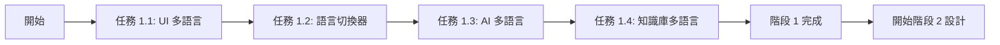

# 多語言與多 AI Agent 系統實作計劃

**日期**: 2025-10-21
**版本**: v1.0.0
**狀態**: 📋 規劃階段

---

## 📊 **階段 1: 多語言修復與完善** (優先執行)

### 🎯 **目標**

1. 修復 Dashboard 等頁面的語言切換問題
2. 在 Top Bar 新增語言切換器
3. 實作 AI 回應多語言化
4. 實作知識庫多語言版本

---

### 📋 **任務 1.1: 修復 UI 多語言支援**

**問題分析**:
- ❌ `app/[locale]/(dashboard)/dashboard/page.tsx` - 所有文字硬編碼中文
- ❌ `components/layout/Navigation.tsx` - 搜尋框 placeholder 硬編碼
- ❌ `components/layout/Sidebar.tsx` - 選單項目硬編碼
- ❌ `components/layout/DashboardLayout.tsx` - 載入中文字硬編碼

**修復清單**:

#### **1.1.1: 更新翻譯檔案**

```json
// locales/zh-TW/common.json
{
  "dashboard": {
    "title": "控制台",
    "welcome": "歡迎回來",
    "welcomeMessage": "準備好與您的 AI Avatar 開始對話了嗎？",
    "loadingUser": "載入使用者資訊中...",
    "emailVerified": "Email 已驗證",
    "stats": {
      "conversations": "對話次數",
      "totalTime": "總對話時長",
      "monthlyUsage": "本月使用次數",
      "activeAvatars": "活躍 Avatar"
    },
    "quickStart": {
      "title": "快速開始",
      "description": "開始與您的 AI Avatar 進行對話",
      "startButton": "開始對話"
    },
    "recentActivity": {
      "title": "最近活動",
      "noActivity": "目前沒有最近的對話記錄",
      "viewAll": "查看全部記錄"
    },
    "recentConversations": {
      "title": "最近對話",
      "noConversations": "還沒有對話記錄",
      "firstConversation": "開始您的第一次 AI Avatar 對話吧！",
      "messageCount": "{count} 則訊息",
      "loading": "載入中..."
    }
  },
  "nav": {
    "search": "搜尋...",
    "dashboard": "控制台",
    "conversations": "對話記錄",
    "knowledge": "知識庫管理",
    "knowledgeOverview": "知識庫總覽",
    "personaDefinition": "Persona 定義",
    "faqManagement": "FAQ 管理",
    "kpiDictionary": "KPI 字典",
    "decisionLogs": "決策日誌",
    "meetingSummaries": "會議摘要",
    "prompts": "對話主題",
    "settings": "設定",
    "loading": "載入中..."
  }
}
```

```json
// locales/en/common.json
{
  "dashboard": {
    "title": "Dashboard",
    "welcome": "Welcome back",
    "welcomeMessage": "Ready to chat with your AI Avatar?",
    "loadingUser": "Loading user info...",
    "emailVerified": "Email verified",
    "stats": {
      "conversations": "Conversations",
      "totalTime": "Total Time",
      "monthlyUsage": "Monthly Usage",
      "activeAvatars": "Active Avatars"
    },
    "quickStart": {
      "title": "Quick Start",
      "description": "Start chatting with your AI Avatar",
      "startButton": "Start Conversation"
    },
    "recentActivity": {
      "title": "Recent Activity",
      "noActivity": "No recent conversations",
      "viewAll": "View All"
    },
    "recentConversations": {
      "title": "Recent Conversations",
      "noConversations": "No conversations yet",
      "firstConversation": "Start your first AI Avatar conversation!",
      "messageCount": "{count} messages",
      "loading": "Loading..."
    }
  },
  "nav": {
    "search": "Search...",
    "dashboard": "Dashboard",
    "conversations": "Conversations",
    "knowledge": "Knowledge Management",
    "knowledgeOverview": "Knowledge Overview",
    "personaDefinition": "Persona Definition",
    "faqManagement": "FAQ Management",
    "kpiDictionary": "KPI Dictionary",
    "decisionLogs": "Decision Logs",
    "meetingSummaries": "Meeting Summaries",
    "prompts": "Conversation Topics",
    "settings": "Settings",
    "loading": "Loading..."
  }
}
```

#### **1.1.2: 修改元件使用 useTranslations**

**檔案清單**:
- [ ] `app/[locale]/(dashboard)/dashboard/page.tsx`
- [ ] `components/layout/Navigation.tsx`
- [ ] `components/layout/Sidebar.tsx`
- [ ] `components/layout/DashboardLayout.tsx`
- [ ] `components/layout/UserMenu.tsx`

**預估時間**: 2-3 小時

---

### 📋 **任務 1.2: 在 Top Bar 新增語言切換器**

**設計**:

```tsx
// components/layout/Navigation.tsx (更新)
'use client'

import { Bell, Search, Globe } from 'lucide-react'
import UserMenu from './UserMenu'
import LanguageSwitcher from '@/components/LanguageSwitcher'  // ✅ 新增
import { useTranslations } from 'next-intl'  // ✅ 新增

export default function Navigation() {
  const t = useTranslations('nav')

  return (
    <header className="flex h-16 items-center justify-between border-b border-gray-200 bg-white px-6">
      {/* Search Bar */}
      <div className="flex flex-1 items-center gap-4">
        <div className="relative w-full max-w-md">
          <Search className="absolute left-3 top-1/2 h-4 w-4 -translate-y-1/2 text-gray-400" />
          <input
            type="text"
            placeholder={t('search')}  // ✅ 使用翻譯
            className="w-full rounded-lg border border-gray-300 bg-gray-50 py-2 pl-10 pr-4 text-sm focus:border-blue-500 focus:bg-white focus:outline-none focus:ring-2 focus:ring-blue-500/20 transition-colors"
          />
        </div>
      </div>

      {/* Right Section */}
      <div className="flex items-center gap-4">
        {/* Language Switcher - ✅ 新增 */}
        <LanguageSwitcher />

        {/* Notifications */}
        <button className="relative rounded-full p-2 hover:bg-gray-100 transition-colors">
          <Bell className="h-5 w-5 text-gray-600" />
          <span className="absolute right-1.5 top-1.5 flex h-2 w-2">
            <span className="absolute inline-flex h-full w-full animate-ping rounded-full bg-red-400 opacity-75"></span>
            <span className="relative inline-flex h-2 w-2 rounded-full bg-red-500"></span>
          </span>
        </button>

        {/* User Menu */}
        <UserMenu />
      </div>
    </header>
  )
}
```

**LanguageSwitcher 元件** (已存在，需確認):

```tsx
// components/LanguageSwitcher.tsx
'use client'

import { useLocale } from 'next-intl'
import { useRouter, usePathname } from 'next/navigation'
import { Globe } from 'lucide-react'
import { useState } from 'react'

const languages = [
  { code: 'zh-TW', label: '繁體中文', flag: '🇹🇼' },
  { code: 'en', label: 'English', flag: '🇺🇸' },
  { code: 'ja', label: '日本語', flag: '🇯🇵' },
]

export default function LanguageSwitcher() {
  const locale = useLocale()
  const router = useRouter()
  const pathname = usePathname()
  const [isOpen, setIsOpen] = useState(false)

  const currentLanguage = languages.find(lang => lang.code === locale) || languages[0]

  const switchLanguage = (newLocale: string) => {
    // 替換 URL 中的語言前綴
    const newPathname = pathname.replace(/^\/(zh-TW|en|ja)/, `/${newLocale}`)
    router.push(newPathname)
    setIsOpen(false)
  }

  return (
    <div className="relative">
      <button
        onClick={() => setIsOpen(!isOpen)}
        className="flex items-center gap-2 rounded-lg px-3 py-2 hover:bg-gray-100 transition-colors"
      >
        <Globe className="h-5 w-5 text-gray-600" />
        <span className="text-sm font-medium text-gray-700">
          {currentLanguage.flag} {currentLanguage.label}
        </span>
      </button>

      {isOpen && (
        <>
          {/* 背景遮罩 */}
          <div
            className="fixed inset-0 z-10"
            onClick={() => setIsOpen(false)}
          />

          {/* 下拉選單 */}
          <div className="absolute right-0 mt-2 w-48 rounded-lg bg-white shadow-lg border border-gray-200 py-1 z-20">
            {languages.map((lang) => (
              <button
                key={lang.code}
                onClick={() => switchLanguage(lang.code)}
                className={`w-full px-4 py-2 text-left text-sm hover:bg-gray-50 flex items-center gap-2 ${
                  lang.code === locale ? 'bg-blue-50 text-blue-600 font-medium' : 'text-gray-700'
                }`}
              >
                <span className="text-lg">{lang.flag}</span>
                <span>{lang.label}</span>
                {lang.code === locale && (
                  <span className="ml-auto text-blue-600">✓</span>
                )}
              </button>
            ))}
          </div>
        </>
      )}
    </div>
  )
}
```

**預估時間**: 1 小時

---

### 📋 **任務 1.3: 實作 AI 回應多語言化**

**目標**: AI 根據使用者選擇的語言進行回應

**實作步驟**:

#### **1.3.1: 更新 Chat API**

```typescript
// app/api/chat/route.ts (修改)

export async function POST(request: NextRequest) {
  const body: ChatRequest = await request.json()

  // ✅ 取得使用者語言偏好
  const userLanguage = body.language || 'zh-TW'  // 從請求中取得

  // 載入知識庫
  const knowledgeLoader = await getKnowledgeLoader()
  const persona = knowledgeLoader.getPersona()
  const relevantKnowledge = knowledgeLoader.searchKnowledge(lastUserMessage, 3)

  // ✅ 根據語言建立 System Prompt
  const systemPrompt = buildMultilingualSystemPrompt(
    persona,
    relevantKnowledge,
    userLanguage  // 傳入語言參數
  )

  // ... 其餘邏輯
}
```

#### **1.3.2: 多語言 System Prompt 建立器**

```typescript
// lib/ai/knowledge-loader.ts (新增函數)

export function buildMultilingualSystemPrompt(
  persona: string,
  relevantKnowledge: KnowledgeDoc[],
  language: string
): string {
  // 語言指示
  const languageInstructions = {
    'zh-TW': '請使用繁體中文回應。',
    'en': 'Please respond in English.',
    'ja': '日本語で返信してください。',
  }

  const languageInstruction = languageInstructions[language as keyof typeof languageInstructions] || languageInstructions['zh-TW']

  return `
${persona}

## 🌍 語言設定
${languageInstruction}

## 📚 相關知識文件
${relevantKnowledge.map((doc, index) => `
### 文件 ${index + 1}: ${doc.title}
${doc.content}
`).join('\n')}

## 📝 回應指引
1. 使用指定語言回應
2. 根據提供的知識文件回答問題
3. 保持友善和專業的語氣
4. 如果知識文件中沒有相關資訊，誠實告知
`.trim()
}
```

#### **1.3.3: 更新前端 Chat 請求**

```typescript
// stores/chatStore.ts (修改)

import { useLocale } from 'next-intl'  // ✅ 新增

export const useChatStore = create<ChatStore>((set, get) => ({
  // ... 現有狀態 ...

  sendMessage: async (content: string) => {
    // ... 現有邏輯 ...

    // ✅ 取得當前語言
    const currentLanguage = useLocale() || 'zh-TW'

    const response = await fetch('/api/chat', {
      method: 'POST',
      headers: { 'Content-Type': 'application/json' },
      body: JSON.stringify({
        messages: get().messages,
        language: currentLanguage,  // ✅ 傳送語言參數
      }),
    })

    // ... 處理回應 ...
  },
}))
```

**注意**: Zustand store 無法直接使用 `useLocale` hook，需要改用其他方法傳遞語言參數。

**解決方案**: 在元件層級傳遞語言參數

```tsx
// components/chat/ChatInterface.tsx (修改)
'use client'

import { useLocale } from 'next-intl'
import { useChatStore } from '@/stores/chatStore'

export default function ChatInterface() {
  const locale = useLocale()
  const { sendMessage } = useChatStore()

  const handleSendMessage = async (content: string) => {
    await sendMessage(content, locale)  // ✅ 傳遞語言
  }

  // ... 其餘邏輯
}
```

```typescript
// stores/chatStore.ts (修改)
export const useChatStore = create<ChatStore>((set, get) => ({
  sendMessage: async (content: string, language?: string) => {  // ✅ 接收語言參數
    // ...

    const response = await fetch('/api/chat', {
      method: 'POST',
      headers: { 'Content-Type': 'application/json' },
      body: JSON.stringify({
        messages: get().messages,
        language: language || 'zh-TW',  // ✅ 使用傳入的語言
      }),
    })

    // ...
  },
}))
```

**預估時間**: 2 小時

---

### 📋 **任務 1.4: 實作知識庫多語言版本**

**目標**: 支援多語言知識庫，AI 根據使用者語言載入對應知識

**目錄結構設計**:

```
docs/agent-brain/
├── zh-TW/                    # 繁體中文知識庫
│   ├── persona.md
│   ├── cdo_faq.md
│   ├── kpi_dictionary.md
│   ├── decision_log_project_phoenix.md
│   └── pov_briefing_generative_ai_strategy.md
│
├── en/                       # 英文知識庫
│   ├── persona.md
│   ├── cdo_faq.md
│   ├── kpi_dictionary.md
│   └── ...
│
└── ja/                       # 日文知識庫
    ├── persona.md
    ├── cdo_faq.md
    └── ...
```

**實作步驟**:

#### **1.4.1: 重組知識庫目錄**

```bash
# 建立多語言目錄
mkdir docs/agent-brain/zh-TW
mkdir docs/agent-brain/en
mkdir docs/agent-brain/ja

# 移動現有檔案到繁體中文目錄
mv docs/agent-brain/*.md docs/agent-brain/zh-TW/

# 建立 README
echo "# 多語言知識庫\n\n- zh-TW: 繁體中文\n- en: English\n- ja: 日本語" > docs/agent-brain/README.md
```

#### **1.4.2: 更新 KnowledgeLoader**

```typescript
// lib/ai/knowledge-loader.ts (修改)

export class KnowledgeLoader {
  private language: string

  constructor(language: string = 'zh-TW') {
    this.language = language
  }

  /**
   * 載入 Persona (根據語言)
   */
  getPersona(): string {
    const personaPath = path.join(
      process.cwd(),
      'docs',
      'agent-brain',
      this.language,  // ✅ 使用語言路徑
      'persona.md'
    )

    try {
      return fs.readFileSync(personaPath, 'utf-8')
    } catch (error) {
      console.warn(`Persona not found for language ${this.language}, falling back to zh-TW`)
      // 回退到繁體中文
      const fallbackPath = path.join(
        process.cwd(),
        'docs',
        'agent-brain',
        'zh-TW',
        'persona.md'
      )
      return fs.readFileSync(fallbackPath, 'utf-8')
    }
  }

  /**
   * 搜尋知識文件 (根據語言)
   */
  searchKnowledge(query: string, topK: number = 3): KnowledgeDoc[] {
    const knowledgeDir = path.join(
      process.cwd(),
      'docs',
      'agent-brain',
      this.language  // ✅ 使用語言路徑
    )

    // ... 搜尋邏輯 (與之前相同，只是路徑改變)
  }

  /**
   * 取得所有可用的知識文件 (根據語言)
   */
  getAllKnowledge(): KnowledgeDoc[] {
    const knowledgeDir = path.join(
      process.cwd(),
      'docs',
      'agent-brain',
      this.language  // ✅ 使用語言路徑
    )

    // ... 載入邏輯
  }
}

// ✅ 工廠函數更新
export async function getKnowledgeLoader(language: string = 'zh-TW'): Promise<KnowledgeLoader> {
  return new KnowledgeLoader(language)
}
```

#### **1.4.3: 更新 Chat API 使用多語言 Loader**

```typescript
// app/api/chat/route.ts (修改)

export async function POST(request: NextRequest) {
  const body: ChatRequest = await request.json()
  const userLanguage = body.language || 'zh-TW'

  // ✅ 傳入語言參數載入知識庫
  const knowledgeLoader = await getKnowledgeLoader(userLanguage)
  const persona = knowledgeLoader.getPersona()
  const relevantKnowledge = knowledgeLoader.searchKnowledge(lastUserMessage, 3)

  // ... 其餘邏輯
}
```

#### **1.4.4: 建立英文與日文知識庫**

**選項 1: 手動翻譯** (品質最佳)
- 人工翻譯 persona.md, cdo_faq.md 等

**選項 2: AI 輔助翻譯** (快速但需審查)
- 使用 GPT-4 翻譯現有繁體中文知識庫
- 人工審查和修正

**選項 3: 漸進式實作** (推薦)
- 先實作 persona.md 英文版 (最重要)
- 其他檔案標註 "TODO: Translation needed"
- 當知識庫不存在時回退到繁體中文

**預估時間**: 3-4 小時 (含翻譯)

---

## ⏱️ **階段 1 預估時間總計**

| 任務 | 預估時間 | 優先度 |
|------|---------|--------|
| 1.1 修復 UI 多語言支援 | 2-3 小時 | 🔴 高 |
| 1.2 Top Bar 語言切換器 | 1 小時 | 🔴 高 |
| 1.3 AI 回應多語言化 | 2 小時 | 🟡 中 |
| 1.4 知識庫多語言版本 | 3-4 小時 | 🟢 低 |
| **總計** | **8-10 小時** | - |

---

## 📊 **階段 2: 多 AI Agent 系統詳細設計** (後續執行)

### 🎯 **設計文件清單**

待建立的文件：

1. **MULTI_AGENT_DETAILED_DESIGN.md** - 詳細技術設計
   - 完整的 Prisma Schema (包含所有欄位說明)
   - API 端點詳細規格 (Request/Response 範例)
   - 資料流程圖
   - 錯誤處理策略
   - 安全性設計

2. **MULTI_AGENT_USER_FLOW.md** - 使用者流程說明
   - 使用者故事 (User Stories)
   - 互動流程圖 (Flowcharts)
   - 畫面設計草圖 (Wireframes)
   - 使用案例 (Use Cases)

3. **MULTI_AGENT_DEVELOPMENT_PLAN.md** - 開發計劃
   - 詳細任務分解 (WBS)
   - 時程規劃 (Gantt Chart)
   - 里程碑定義
   - 測試計劃
   - 部署策略

### 📝 **設計文件撰寫順序**

```
第1步: MULTI_AGENT_DETAILED_DESIGN.md
  ├─ 1.1 系統架構圖
  ├─ 1.2 資料模型詳細設計
  ├─ 1.3 API 規格文件
  ├─ 1.4 知識庫設計
  └─ 1.5 安全性與效能設計
         ↓
第2步: MULTI_AGENT_USER_FLOW.md
  ├─ 2.1 使用者角色定義
  ├─ 2.2 使用者故事
  ├─ 2.3 互動流程圖
  ├─ 2.4 畫面設計草圖
  └─ 2.5 使用案例文件
         ↓
第3步: MULTI_AGENT_DEVELOPMENT_PLAN.md
  ├─ 3.1 任務分解 (WBS)
  ├─ 3.2 時程規劃
  ├─ 3.3 資源配置
  ├─ 3.4 風險評估
  └─ 3.5 測試與部署計劃
```

---

## 🔄 **執行流程**

### **當前階段**: 階段 1 - 多語言修復與完善



### **下一階段**: 階段 2 - 多 Agent 系統設計

只有在階段 1 完成後才進入階段 2。

---

## 📈 **進度追蹤**

### **階段 1 進度**

- [ ] 任務 1.1: 修復 UI 多語言支援 (0%)
  - [ ] 1.1.1: 更新翻譯檔案
  - [ ] 1.1.2: 修改 Dashboard 頁面
  - [ ] 1.1.3: 修改 Navigation 元件
  - [ ] 1.1.4: 修改 Sidebar 元件
  - [ ] 1.1.5: 修改 DashboardLayout 元件

- [ ] 任務 1.2: Top Bar 語言切換器 (0%)
  - [ ] 1.2.1: 更新 Navigation 元件
  - [ ] 1.2.2: 確認 LanguageSwitcher 元件
  - [ ] 1.2.3: 測試語言切換功能

- [ ] 任務 1.3: AI 回應多語言化 (0%)
  - [ ] 1.3.1: 更新 Chat API
  - [ ] 1.3.2: 建立多語言 System Prompt
  - [ ] 1.3.3: 更新前端 Chat 請求
  - [ ] 1.3.4: 測試不同語言的 AI 回應

- [ ] 任務 1.4: 知識庫多語言版本 (0%)
  - [ ] 1.4.1: 重組知識庫目錄
  - [ ] 1.4.2: 更新 KnowledgeLoader
  - [ ] 1.4.3: 更新 Chat API
  - [ ] 1.4.4: 建立英文知識庫 (Persona + FAQ)
  - [ ] 1.4.5: 測試多語言知識載入

### **階段 2 進度**

- [ ] MULTI_AGENT_DETAILED_DESIGN.md (0%)
- [ ] MULTI_AGENT_USER_FLOW.md (0%)
- [ ] MULTI_AGENT_DEVELOPMENT_PLAN.md (0%)

---

## 📝 **開發日誌**

### **2025-10-21**

**完成**:
- ✅ 建立多語言與多 Agent 系統實作計劃文件
- ✅ 分析現有多語言問題
- ✅ 設計階段 1 任務清單

**進行中**:
- 🔄 任務 1.1: 修復 UI 多語言支援

**待辦**:
- ⏳ 任務 1.2-1.4
- ⏳ 階段 2 設計文件

**備註**:
- 決定先完成多語言修復，再進行多 Agent 系統設計
- 多 Agent 系統需要完整的設計文件才開始實作

---

**文件版本**: v1.0.0
**最後更新**: 2025-10-21
**下次更新**: 完成任務 1.1 後
