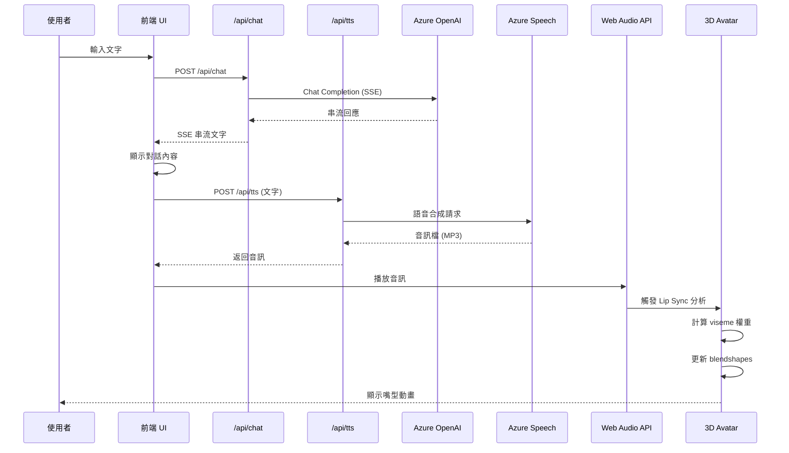

# POC 技術架構文件
## 3D Avatar 即時對話系統 - 概念驗證階段

**文件版本**: v1.0  
**建立日期**: 2025-10-14  
**負責人**: System Architect (Winston)  
**架構類型**: POC（Proof of Concept）輕量級架構

---

## 📋 文件目的

本架構文件專為 **POC（概念驗證）階段** 設計，目的是：
1. 定義輕量級技術架構，優先驗證核心技術可行性
2. 避免過度設計，保持架構簡潔可快速實現
3. 為後續產品化提供架構演進基礎
4. 確保 Azure 整合順暢，便於雲端部署

**重要原則**: 
- ✅ 優先「可運作」而非「完美」
- ✅ 單體架構（Monolith），避免微服務複雜性
- ✅ 直接整合 Azure 服務，減少中間層
- ❌ 不追求生產級別的容錯、監控、安全性

---

## 🎯 架構目標與約束

### 架構目標

| 目標 | 說明 | 優先級 |
|-----|------|-------|
| **快速驗證** | 3-4 週內完成可運行原型 | ⭐⭐⭐⭐⭐ |
| **技術整合** | 驗證 3D、LLM、TTS、Lip Sync 整合 | ⭐⭐⭐⭐⭐ |
| **雲端部署** | 可順利部署到 Azure 環境 | ⭐⭐⭐⭐ |
| **效能驗證** | 達到基本效能指標（FPS、延遲） | ⭐⭐⭐⭐ |
| **可擴展性** | 架構可演進為產品級（選做） | ⭐⭐⭐ |

### 技術約束

**必須使用（基於 Phase 1 研究）**:
- ✅ Next.js 14（App Router）
- ✅ Three.js（3D 渲染）
- ✅ Azure OpenAI Service（LLM）
- ✅ Azure Cognitive Services Speech（TTS/STT）
- ✅ Ready Player Me（Avatar 模型）

**可選技術（根據開發進度）**:
- Oculus Lipsync（Lip Sync，可用音素分析替代）
- Zustand（狀態管理，可用 React Context 替代）
- Framer Motion（動畫，可用 CSS 替代）

### 非功能需求（POC 階段）

| 需求類別 | 目標值 | 測試方式 |
|---------|--------|---------|
| **效能** | 3D 渲染 FPS ≥ 30 | Chrome DevTools |
| **延遲** | 端到端對話 < 2.5 秒 | 手動計時 |
| **相容性** | Chrome, Edge, Safari 最新版 | 手動測試 |
| **可用性** | 連續對話 10 輪無崩潰 | 手動測試 |
| **安全性** | HTTPS + API Key 保護 | 部署檢查 |

---

## 🏛️ 系統架構總覽

### 高階架構圖

```
┌─────────────────────────────────────────────────────────────┐
│                     使用者瀏覽器 (Client)                      │
│                                                             │
│  ┌────────────────────────────────────────────────────┐    │
│  │          Next.js 前端應用 (App Router)              │    │
│  │                                                    │    │
│  │  ┌──────────────┐  ┌──────────────────────────┐  │    │
│  │  │   UI Layer    │  │    3D Rendering Layer    │  │    │
│  │  │  (React)      │  │  (Three.js + R3F)        │  │    │
│  │  └──────┬───────┘  └──────────┬───────────────┘  │    │
│  │         │                     │                   │    │
│  │         ↓                     ↓                   │    │
│  │  ┌──────────────────────────────────────────┐    │    │
│  │  │     Client State Management              │    │    │
│  │  │     (Zustand or React Context)           │    │    │
│  │  └──────────────┬───────────────────────────┘    │    │
│  │                 │                                 │    │
│  │                 ↓                                 │    │
│  │  ┌──────────────────────────────────────────┐    │    │
│  │  │        Audio Processing Layer            │    │    │
│  │  │        (Web Audio API)                   │    │    │
│  │  └──────────────────────────────────────────┘    │    │
│  └────────────────────────────────────────────────────┘    │
│                                                             │
└─────────────────────────┬───────────────────────────────────┘
                          │
                          │ HTTPS/Fetch API
                          ↓
┌─────────────────────────────────────────────────────────────┐
│        Next.js 後端 (API Routes in App Router)               │
│                                                             │
│  ┌─────────────────┐  ┌─────────────────┐  ┌────────────┐ │
│  │  Chat API       │  │  TTS API        │  │  Lip Sync  │ │
│  │  /api/chat      │  │  /api/tts       │  │  Processor │ │
│  └────────┬────────┘  └────────┬────────┘  └─────┬──────┘ │
│           │                    │                  │        │
│           ↓                    ↓                  ↓        │
│  ┌──────────────────────────────────────────────────────┐ │
│  │           Azure Service Integration Layer           │ │
│  └──────────────────────────────────────────────────────┘ │
└─────────────────────────┬───────────────────────────────────┘
                          │
                          │ Azure SDK (HTTPS)
                          ↓
┌─────────────────────────────────────────────────────────────┐
│                    Azure 雲端服務                            │
│                                                             │
│  ┌──────────────────────┐      ┌──────────────────────┐   │
│  │  Azure OpenAI        │      │  Azure Cognitive     │   │
│  │  Service             │      │  Services (Speech)   │   │
│  │  - GPT-4 Turbo       │      │  - TTS (Neural)      │   │
│  │  - Chat Completions  │      │  - STT (選做)         │   │
│  └──────────────────────┘      └──────────────────────┘   │
│                                                             │
└─────────────────────────────────────────────────────────────┘
```

### 架構層級說明

#### 1. **前端層（瀏覽器）**
- **UI Layer**: React 組件，處理用戶交互
- **3D Rendering Layer**: Three.js 渲染 Avatar
- **State Management**: 管理應用狀態（對話、音訊、Avatar 狀態）
- **Audio Layer**: 處理 TTS 音訊播放

#### 2. **後端層（Next.js API Routes）**
- **Chat API**: 處理 LLM 對話請求（SSE 串流）
- **TTS API**: 處理文字轉語音請求
- **Lip Sync Processor**: 音素分析與 viseme 數據生成

#### 3. **雲端服務層（Azure）**
- **Azure OpenAI**: 提供 GPT-4 Turbo LLM 能力
- **Azure Speech**: 提供 TTS/STT 語音服務

---

## 🖥️ 前端架構設計

### Next.js App Router 結構

```
app/
├── layout.tsx                 # 根佈局
├── page.tsx                   # 主頁（Avatar 對話介面）
├── globals.css               # 全域樣式
├── api/                      # API Routes
│   ├── chat/
│   │   └── route.ts         # LLM 對話 API (SSE)
│   ├── tts/
│   │   └── route.ts         # TTS 語音合成 API
│   └── stt/                 # (選做) STT 語音辨識 API
│       └── route.ts
│
components/                   # React 組件
├── AvatarCanvas.tsx         # Three.js 3D Canvas
├── ChatInterface.tsx        # 對話介面
├── AudioPlayer.tsx          # 音訊播放器
└── LipSyncController.tsx    # Lip Sync 控制器
│
lib/                         # 工具庫
├── azure/
│   ├── openai.ts           # Azure OpenAI 客戶端
│   └── speech.ts           # Azure Speech 客戶端
├── three/
│   ├── avatar-loader.ts    # Ready Player Me 載入
│   ├── animator.ts         # 動畫控制器
│   └── lipsync.ts          # Lip Sync 處理
└── utils/
    ├── audio.ts            # Web Audio API 工具
    └── stream.ts           # SSE 串流工具
│
store/                       # 狀態管理（Zustand）
├── chatStore.ts            # 對話狀態
├── avatarStore.ts          # Avatar 狀態
└── audioStore.ts           # 音訊狀態
│
types/                       # TypeScript 類型
├── chat.ts
├── avatar.ts
└── audio.ts
│
public/                      # 靜態資源
└── avatars/                # Avatar 模型快取（選做）
```

### 核心前端組件設計

#### 1. **AvatarCanvas.tsx** - 3D 渲染核心

```typescript
'use client';

import { Canvas } from '@react-three/fiber';
import { OrbitControls } from '@react-three/drei';
import AvatarModel from './AvatarModel';

export default function AvatarCanvas() {
  return (
    <div className="h-[70vh] w-full bg-gradient-to-b from-gray-900 to-black">
      <Canvas camera={{ position: [0, 1.5, 2], fov: 50 }}>
        {/* 燈光設置 */}
        <ambientLight intensity={0.5} />
        <directionalLight position={[5, 5, 5]} intensity={0.8} />
        
        {/* Avatar 模型 */}
        <AvatarModel />
        
        {/* 相機控制（開發用） */}
        <OrbitControls 
          enableZoom={false} 
          minPolarAngle={Math.PI / 2.5} 
          maxPolarAngle={Math.PI / 1.8}
        />
      </Canvas>
    </div>
  );
}
```

**技術要點**:
- 使用 **React Three Fiber** 簡化 Three.js 整合
- 固定相機位置模擬「視訊通話」視角
- 基本燈光設置確保 Avatar 可見

#### 2. **ChatInterface.tsx** - 對話介面

```typescript
'use client';

import { useState } from 'react';
import { useChatStore } from '@/store/chatStore';
import { sendMessage } from '@/lib/api/chat';

export default function ChatInterface() {
  const [input, setInput] = useState('');
  const { messages, addMessage, isLoading } = useChatStore();

  const handleSubmit = async (e: React.FormEvent) => {
    e.preventDefault();
    if (!input.trim() || isLoading) return;

    // 新增使用者訊息
    addMessage({ role: 'user', content: input });
    setInput('');

    // 呼叫 LLM API (SSE)
    await sendMessage(input);
  };

  return (
    <div className="flex flex-col h-[30vh] bg-gray-800 p-4">
      {/* 對話記錄 */}
      <div className="flex-1 overflow-y-auto mb-4 space-y-2">
        {messages.slice(-5).map((msg, idx) => (
          <div key={idx} className={`text-sm ${msg.role === 'user' ? 'text-blue-400' : 'text-green-400'}`}>
            <strong>{msg.role === 'user' ? '你' : 'Avatar'}:</strong> {msg.content}
          </div>
        ))}
      </div>

      {/* 輸入區 */}
      <form onSubmit={handleSubmit} className="flex gap-2">
        <input
          type="text"
          value={input}
          onChange={(e) => setInput(e.target.value)}
          placeholder="輸入訊息..."
          className="flex-1 px-3 py-2 bg-gray-700 text-white rounded"
          disabled={isLoading}
        />
        <button 
          type="submit" 
          disabled={isLoading}
          className="px-4 py-2 bg-blue-600 text-white rounded hover:bg-blue-700 disabled:opacity-50"
        >
          {isLoading ? '思考中...' : '送出'}
        </button>
      </form>
    </div>
  );
}
```

**技術要點**:
- 簡單的對話 UI，顯示最近 5 則訊息
- 使用 Zustand store 管理狀態
- Loading 狀態防止重複提交

#### 3. **LipSyncController.tsx** - Lip Sync 控制

```typescript
'use client';

import { useEffect } from 'react';
import { useAudioStore } from '@/store/audioStore';
import { useAvatarStore } from '@/store/avatarStore';
import { analyzeLipSync } from '@/lib/three/lipsync';

export default function LipSyncController() {
  const { currentAudio } = useAudioStore();
  const { setVisemes } = useAvatarStore();

  useEffect(() => {
    if (!currentAudio) return;

    // 分析音訊產生 viseme 數據
    const visemeData = analyzeLipSync(currentAudio);
    
    // 更新 Avatar 狀態
    setVisemes(visemeData);
  }, [currentAudio, setVisemes]);

  return null; // 無 UI 的邏輯組件
}
```

**技術要點**:
- 監聽音訊播放事件
- 即時分析音素產生 viseme 權重
- 驅動 3D 模型的嘴型 blendshapes

---

## 🔧 後端架構設計

### API Routes 設計

#### 1. **Chat API** - `/api/chat/route.ts`

```typescript
import { NextRequest } from 'next/server';
import { AzureOpenAI } from '@azure/openai';

const client = new AzureOpenAI({
  apiKey: process.env.AZURE_OPENAI_API_KEY,
  endpoint: process.env.AZURE_OPENAI_ENDPOINT,
  deployment: 'gpt-4-turbo', // 部署名稱
});

export async function POST(request: NextRequest) {
  const { messages } = await request.json();

  // 使用 Server-Sent Events (SSE) 串流回應
  const encoder = new TextEncoder();
  const stream = new ReadableStream({
    async start(controller) {
      try {
        const response = await client.chat.completions.create({
          model: 'gpt-4-turbo',
          messages,
          stream: true,
        });

        for await (const chunk of response) {
          const content = chunk.choices[0]?.delta?.content || '';
          if (content) {
            controller.enqueue(encoder.encode(`data: ${JSON.stringify({ content })}\n\n`));
          }
        }

        controller.close();
      } catch (error) {
        controller.error(error);
      }
    },
  });

  return new Response(stream, {
    headers: {
      'Content-Type': 'text/event-stream',
      'Cache-Control': 'no-cache',
      'Connection': 'keep-alive',
    },
  });
}
```

**技術要點**:
- ✅ 使用 **SSE（Server-Sent Events）** 實現串流回應
- ✅ Azure OpenAI SDK 官方支援
- ✅ 錯誤處理與 stream 關閉

**為什麼用 SSE 而非 WebSocket？**
- POC 階段 SSE 更簡單（單向通訊足夠）
- Next.js API Routes 原生支援
- 未來可升級為 WebSocket

#### 2. **TTS API** - `/api/tts/route.ts`

```typescript
import { NextRequest } from 'next/server';
import * as sdk from 'microsoft-cognitiveservices-speech-sdk';

export async function POST(request: NextRequest) {
  const { text } = await request.json();

  const speechConfig = sdk.SpeechConfig.fromSubscription(
    process.env.AZURE_SPEECH_KEY!,
    process.env.AZURE_SPEECH_REGION!
  );
  
  speechConfig.speechSynthesisVoiceName = 'zh-TW-HsiaoChenNeural'; // 繁中女聲
  speechConfig.speechSynthesisOutputFormat = sdk.SpeechSynthesisOutputFormat.Audio16Khz32KBitRateMonoMp3;

  const synthesizer = new sdk.SpeechSynthesizer(speechConfig, undefined);

  return new Promise((resolve) => {
    synthesizer.speakTextAsync(
      text,
      (result) => {
        if (result.audioData) {
          resolve(new Response(result.audioData, {
            headers: {
              'Content-Type': 'audio/mpeg',
            },
          }));
        }
        synthesizer.close();
      },
      (error) => {
        console.error(error);
        resolve(new Response(JSON.stringify({ error }), { status: 500 }));
        synthesizer.close();
      }
    );
  });
}
```

**技術要點**:
- ✅ Azure Speech SDK 直接返回音訊 Buffer
- ✅ 使用 Neural Voice（自然語音）
- ✅ MP3 格式（瀏覽器原生支援）

#### 3. **STT API** - `/api/stt/route.ts`（選做）

```typescript
import { NextRequest } from 'next/server';
import * as sdk from 'microsoft-cognitiveservices-speech-sdk';

export async function POST(request: NextRequest) {
  const formData = await request.formData();
  const audioFile = formData.get('audio') as Blob;

  const speechConfig = sdk.SpeechConfig.fromSubscription(
    process.env.AZURE_SPEECH_KEY!,
    process.env.AZURE_SPEECH_REGION!
  );
  speechConfig.speechRecognitionLanguage = 'zh-TW';

  const audioConfig = sdk.AudioConfig.fromWavFileInput(await audioFile.arrayBuffer());
  const recognizer = new sdk.SpeechRecognizer(speechConfig, audioConfig);

  return new Promise((resolve) => {
    recognizer.recognizeOnceAsync(
      (result) => {
        resolve(Response.json({ text: result.text }));
        recognizer.close();
      },
      (error) => {
        console.error(error);
        resolve(new Response(JSON.stringify({ error }), { status: 500 }));
        recognizer.close();
      }
    );
  });
}
```

**技術要點**:
- ✅ 支援繁體中文辨識
- ✅ 接收前端錄製的音訊檔
- ⚠️ POC 階段可用 **Web Speech API** 替代（免後端實作）

---

## 🎵 Lip Sync 技術實作

### 方案選擇：音素分析法

**POC 階段推薦**: 使用 **Web Audio API + 音素映射表**，避免依賴 Oculus Lipsync（需編譯 C++ 套件）。

### Lip Sync 流程

```
TTS 音訊 → Web Audio API 分析 → 
音素時間軸生成 → Viseme 權重計算 → 
Avatar Blendshape 驅動 → 嘴型動畫
```

### 核心代碼：`lib/three/lipsync.ts`

```typescript
// Viseme 音素對照表（簡化版）
const VISEME_MAP: Record<string, string> = {
  'sil': 'neutral',  // 靜音
  'aa': 'aa',        // 「啊」
  'E': 'E',          // 「欸」
  'I': 'I',          // 「衣」
  'O': 'O',          // 「喔」
  'U': 'U',          // 「烏」
  // ... 其他音素
};

export function analyzeLipSync(audioBuffer: AudioBuffer): VisemeData[] {
  const analyser = new AnalyserNode(audioContext);
  const dataArray = new Uint8Array(analyser.frequencyBinCount);
  
  const visemeTimeline: VisemeData[] = [];
  
  // 簡化實作：基於音量峰值估算嘴型變化
  analyser.getByteFrequencyData(dataArray);
  
  const volume = dataArray.reduce((sum, val) => sum + val, 0) / dataArray.length;
  
  if (volume > 50) {
    visemeTimeline.push({
      time: audioContext.currentTime,
      viseme: 'aa', // 張嘴
      weight: volume / 255,
    });
  } else {
    visemeTimeline.push({
      time: audioContext.currentTime,
      viseme: 'neutral',
      weight: 0,
    });
  }
  
  return visemeTimeline;
}
```

**進階方案（如時間允許）**:
- 整合 **Rhubarb Lip Sync**（開源，支援 CLI）
- 使用 Azure Speech 的 **Viseme Output**（需 SDK 支援）

### Viseme 到 Blendshape 映射

```typescript
// 在 Avatar 模型中應用 viseme 權重
export function applyViseme(mesh: THREE.SkinnedMesh, viseme: string, weight: number) {
  const morphTargetDictionary = mesh.morphTargetDictionary;
  
  if (morphTargetDictionary && viseme in morphTargetDictionary) {
    const index = morphTargetDictionary[viseme];
    mesh.morphTargetInfluences![index] = weight;
  }
}
```

---

## 🌊 資料流設計

### 完整對話流程（端到端）

```
1. 使用者輸入文字
   ↓
2. 前端送出 POST /api/chat
   ↓
3. Next.js API Route → Azure OpenAI (SSE 串流)
   ↓
4. LLM 回應文字 → 前端顯示
   ↓
5. 自動觸發: POST /api/tts (文字 → 語音)
   ↓
6. Azure Speech TTS → 返回音訊檔
   ↓
7. 前端 Web Audio API 播放音訊
   ↓
8. 同時: Lip Sync 分析音訊 → 產生 viseme 數據
   ↓
9. 驅動 Three.js Avatar 的嘴型 blendshapes
   ↓
10. Avatar 嘴型與語音同步動畫
```

### 時序圖（Mermaid）



### 狀態管理流程（Zustand）

```typescript
// store/chatStore.ts
interface ChatState {
  messages: Message[];
  isLoading: boolean;
  addMessage: (msg: Message) => void;
  setLoading: (loading: boolean) => void;
}

// store/audioStore.ts
interface AudioState {
  currentAudio: AudioBuffer | null;
  isPlaying: boolean;
  playAudio: (buffer: AudioBuffer) => void;
}

// store/avatarStore.ts
interface AvatarState {
  visemes: VisemeData[];
  currentAnimation: string;
  setVisemes: (data: VisemeData[]) => void;
}
```

---

## ☁️ Azure 部署架構

### 部署目標：Azure Static Web Apps

**為什麼選擇 Static Web Apps？**
- ✅ 原生支援 Next.js（零設定）
- ✅ 內建 CI/CD（GitHub Actions）
- ✅ 免費層額度充足（POC 階段）
- ✅ 自動 HTTPS 憑證

### 部署架構圖

```
┌─────────────────────────────────────────────────┐
│           Azure Static Web Apps                 │
│                                                 │
│  ┌─────────────────────────────────────────┐   │
│  │      Next.js 應用程式                    │   │
│  │  - Frontend (SSG/SSR)                   │   │
│  │  - API Routes (Serverless Functions)    │   │
│  └─────────────────────────────────────────┘   │
│                                                 │
│  ┌─────────────────────────────────────────┐   │
│  │      環境變數 (Environment Vars)         │   │
│  │  - AZURE_OPENAI_API_KEY                 │   │
│  │  - AZURE_OPENAI_ENDPOINT                │   │
│  │  - AZURE_SPEECH_KEY                     │   │
│  │  - AZURE_SPEECH_REGION                  │   │
│  └─────────────────────────────────────────┘   │
└─────────────────────────────────────────────────┘
                    │
                    │ HTTPS
                    ↓
┌─────────────────────────────────────────────────┐
│              Azure OpenAI Service               │
│  - Deployment: gpt-4-turbo                      │
│  - Region: East US / Japan East                 │
└─────────────────────────────────────────────────┘
                    │
                    ↓
┌─────────────────────────────────────────────────┐
│          Azure Cognitive Services               │
│  - Speech Service (TTS/STT)                     │
│  - Region: East Asia                            │
└─────────────────────────────────────────────────┘
```

### 部署步驟（GitHub Actions 自動化）

```yaml
# .github/workflows/azure-static-web-apps.yml
name: Azure Static Web Apps CI/CD

on:
  push:
    branches:
      - main

jobs:
  build_and_deploy:
    runs-on: ubuntu-latest
    steps:
      - uses: actions/checkout@v3
      
      - name: Build And Deploy
        uses: Azure/static-web-apps-deploy@v1
        with:
          azure_static_web_apps_api_token: ${{ secrets.AZURE_STATIC_WEB_APPS_API_TOKEN }}
          repo_token: ${{ secrets.GITHUB_TOKEN }}
          action: "upload"
          app_location: "/"
          api_location: "app/api"
          output_location: ".next"
```

### 環境變數設定

```bash
# .env.local (本地開發)
AZURE_OPENAI_API_KEY=your_key_here
AZURE_OPENAI_ENDPOINT=https://your-resource.openai.azure.com/
AZURE_SPEECH_KEY=your_speech_key
AZURE_SPEECH_REGION=eastasia

# Azure Portal 設定相同變數
```

---

## 🔒 安全性考量（POC 階段）

### 基本安全措施

| 層級 | 措施 | 實作方式 |
|-----|------|---------|
| **傳輸安全** | HTTPS 加密 | Azure Static Web Apps 自動提供 |
| **API 保護** | 環境變數 | Azure 環境變數，不寫入程式碼 |
| **CORS** | 限制來源 | Next.js 中間件設定 |
| **速率限制** | 簡單節流 | 前端防抖動（debounce） |

### ❌ POC 階段不做

- 用戶認證（無登入系統）
- 資料加密（無資料儲存）
- DDoS 防護（Azure 基本防護）
- 審計日誌（僅基本 console.log）

---

## 📊 效能優化策略

### 前端效能

| 優化項目 | 策略 | 預期效果 |
|---------|------|---------|
| **3D 渲染** | 降低模型 LOD | FPS +10 |
| **音訊載入** | 預載入快取 | 延遲 -0.5s |
| **程式碼分割** | Dynamic Import | 首屏載入 -30% |
| **圖片優化** | Next.js Image | 頻寬 -50% |

### 後端效能

| 優化項目 | 策略 | 預期效果 |
|---------|------|---------|
| **LLM 請求** | SSE 串流 | 首字延遲 -1s |
| **TTS 快取** | 相同文字快取 | 重複請求 -100% |
| **Edge 部署** | Azure CDN | 全球延遲 -200ms |

---

## 🧪 測試策略

### 功能測試清單

**前端測試**:
- [ ] 3D Avatar 正常載入與顯示
- [ ] 對話輸入與顯示功能
- [ ] TTS 音訊正常播放
- [ ] Lip Sync 基本同步

**後端測試**:
- [ ] /api/chat SSE 串流正常
- [ ] /api/tts 返回有效音訊
- [ ] Azure 服務整合無誤

**整合測試**:
- [ ] 完整對話流程（端到端）
- [ ] 多輪對話穩定性
- [ ] 瀏覽器相容性（Chrome, Edge, Safari）

### 效能測試

```bash
# 使用 Lighthouse 測試
npm run build
npm start
npx lighthouse http://localhost:3000 --view

# 目標指標
- Performance Score: > 70
- FPS: > 30
- 端到端延遲: < 2.5s
```

---

## 📦 技術債務與限制

### 已知技術債務

| 債務項目 | 影響 | 未來改善方案 |
|---------|------|------------|
| **Lip Sync 準確度** | 僅 60-70% | 整合專業 Lip Sync SDK |
| **無快取機制** | 重複請求浪費 | 加入 Redis 快取 |
| **無錯誤恢復** | 服務中斷無回退 | 實作 Circuit Breaker |
| **硬編碼 Avatar** | 僅單一模型 | 實作角色庫系統 |

### POC 架構限制

**不支援**:
- ❌ 多用戶並行（單一 session）
- ❌ 聊天記錄持久化
- ❌ 自訂 Avatar（固定模型）
- ❌ 行動裝置優化
- ❌ 離線模式

---

## 🚀 未來擴展路徑

### 從 POC 到 MVP 的演進

```
POC (當前)
   ↓ 驗證成功
MVP 階段
   ↓ 加入功能
   - 用戶系統
   - 角色庫
   - 聊天記錄
   ↓
Beta 版本
   ↓ 優化性能
   - 微服務拆分
   - CDN 加速
   - 監控系統
   ↓
生產環境
```

### 架構演進建議

1. **資料層**: 加入 Azure Cosmos DB 儲存用戶數據
2. **服務拆分**: LLM、TTS、Lip Sync 獨立微服務
3. **即時通訊**: 升級為 WebSocket（SignalR）
4. **監控**: Application Insights 完整監控
5. **CDN**: Azure Front Door 全球加速

---

## 📋 開發檢查清單

### Sprint 0: 專案初始化

- [ ] 建立 Next.js 14 專案（App Router + TypeScript）
- [ ] 設定 ESLint + Prettier
- [ ] 安裝核心依賴（Three.js, Azure SDK）
- [ ] 設定 Azure 服務（OpenAI, Speech）
- [ ] 配置環境變數

### Sprint 1: 3D Avatar 渲染

- [ ] 整合 Ready Player Me
- [ ] 設定 Three.js + React Three Fiber
- [ ] 實作基本 Avatar 載入與顯示
- [ ] 加入待機動畫（呼吸、眨眼）

### Sprint 2: LLM + TTS

- [ ] 實作 /api/chat (SSE)
- [ ] 實作 /api/tts
- [ ] 前端對話介面
- [ ] 音訊播放功能

### Sprint 3: Lip Sync

- [ ] 音素分析實作
- [ ] Viseme 映射到 Blendshapes
- [ ] 嘴型動畫同步測試

### Sprint 4: 整合與部署

- [ ] 端到端測試
- [ ] 效能優化
- [ ] Azure 部署
- [ ] 文件撰寫

---

## 附錄

### A. 關鍵技術文件連結

- [Next.js App Router 文件](https://nextjs.org/docs/app)
- [Three.js 官方教學](https://threejs.org/docs/)
- [React Three Fiber](https://docs.pmnd.rs/react-three-fiber)
- [Azure OpenAI Service](https://learn.microsoft.com/azure/ai-services/openai/)
- [Azure Speech Service](https://learn.microsoft.com/azure/ai-services/speech-service/)
- [Ready Player Me SDK](https://docs.readyplayer.me/)

### B. 開發工具建議

- **IDE**: VS Code + Next.js 擴充
- **API 測試**: Thunder Client / Postman
- **3D 調試**: Three.js Inspector
- **效能分析**: Chrome DevTools

### C. 專案術語表

- **SSE**: Server-Sent Events，單向伺服器推送
- **Viseme**: 視覺音素，嘴型的基本單位
- **Blendshape**: 3D 模型的形變目標
- **R3F**: React Three Fiber 縮寫
- **LOD**: Level of Detail，細節層次

---

**文件狀態**: ✅ 完成  
**下一步**: 由 Dev Agent 執行 Sprint 0 - 專案初始化  
**最後更新**: 2025-10-14

