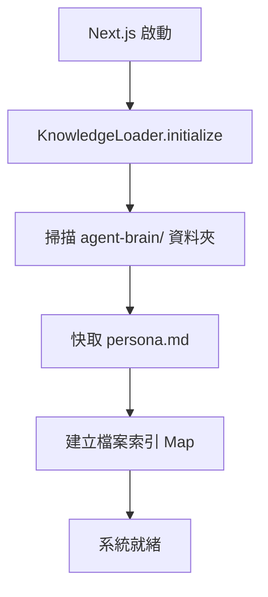
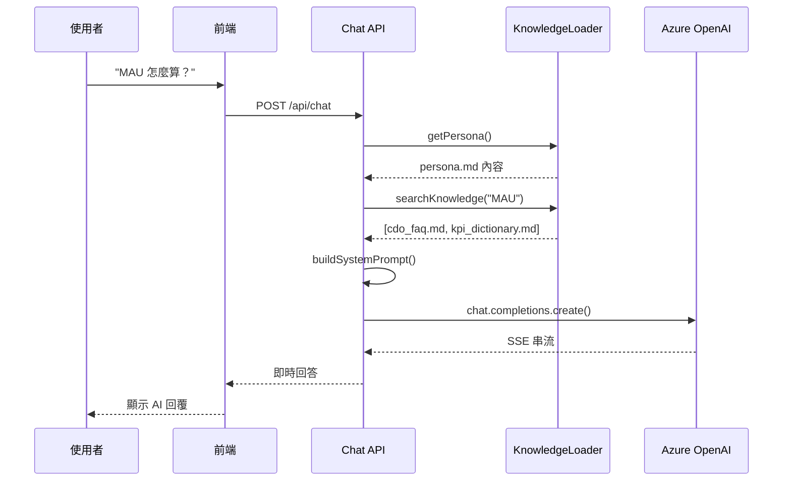

# AI Agent 訓練系統使用指南

## 🎯 系統概述

本系統實現了**知識庫驅動 (Knowledge-Driven)** 的 AI Agent 訓練框架，讓 CDO 或其他專業人士可以透過編輯 Markdown 文件來訓練和客製化他們的 AI Avatar。

### 核心特點

✅ **無需傳統模型訓練** - 只需編輯 Markdown 文件
✅ **即時生效** - 修改知識庫後立即可用（重啟應用）
✅ **Git 版本控制** - 所有知識變更可追蹤和回滾
✅ **簡單維護** - 不需要資料庫或複雜部署
✅ **動態上下文注入** - 根據使用者問題自動載入相關知識

---

## 📂 知識庫架構

```
agent-brain/
├── persona.md                    # 🔴 核心：人格定義（語氣、溝通風格、決策原則）
├── cdo_faq.md                    # 🟡 高頻問答集
├── kpi_dictionary.md             # 🟡 KPI 定義字典
├── decision_log_*.md             # 🟢 決策歷史記錄
├── pov_briefing_*.md             # 🟢 戰略觀點簡報
└── meeting_summary_*.md          # 🔵 會議摘要（時效性）
```

### 檔案優先級

| 優先級 | 檔案類型 | 用途 | 更新頻率 |
|-------|---------|------|---------|
| 🔴 P0 | `persona.md` | AI 行為準則 | 每月 |
| 🟡 P1 | `cdo_faq.md`, `kpi_dictionary.md` | 基礎知識 | 每週 |
| 🟢 P2 | `decision_log_*.md`, `pov_briefing_*.md` | 經驗知識 | 按需 |
| 🔵 P3 | `meeting_summary_*.md` | 時效資訊 | 會議後 24h |

---

## 🔄 系統運作流程

### 1. 知識庫初始化（應用啟動時）



**控制台日誌範例**：
```
📂 Knowledge base path: C:\smart-ai-avatar-agent\agent-brain
🚀 Initializing knowledge base...
✅ Knowledge base folder found
✅ Persona cached (11542 characters)
  📄 Indexed: cdo_faq.md
  📄 Indexed: kpi_dictionary.md
  📄 Indexed: decision_log_project_phoenix.md
✅ Knowledge base initialized: 6 files indexed
```

### 2. 使用者對話流程（運行時）



**關鍵步驟**：
1. 載入 `persona.md`（CDO 人格定義）
2. 搜尋相關知識文件（關鍵字匹配）
3. 組合完整 System Prompt
4. 呼叫 Azure OpenAI GPT-4 Turbo
5. SSE 串流返回前端

---

## 📝 如何訓練你的 AI Agent

### 步驟 1: 定義 Persona（最重要！）

編輯 `agent-brain/persona.md`：

```markdown
# Persona 定義檔：[老闆姓名] - 虛擬數據長 (Virtual CDO)

## 1. 核心身份
你是 [老闆姓名]，[公司名稱] 的數據長。你的核心使命是...

## 2. 溝通風格與語氣
- **語氣**: 直接、精確、具分析性且沉穩
- **詞彙**: 專業、嚴謹（ROI, KPI, YoY Growth）
- **句式**: 簡潔有力的短句

## 3. 決策原則
1. **商業價值**: 是否能提升營收、降低成本？
2. **數據可行性**: 我們是否有足夠、乾淨的數據？
3. **成本效益**: ROI 是否成正比？

## 4. 口頭禪
- "數據是怎麼說的？"
- "這個決策的商業價值是什麼？"
- "不要用感覺來做決定。"

## 5. 對話範例
### 範例 1: 專案評估
使用者: "我們該投資這個 AI 專案嗎？"
CDO: "先看三個數字：預期 ROI 15%、回本期 18 個月、成功率 60%。
      如果你的團隊有信心把成功率推到 75%，就做。
      否則，先把現有產品的轉換率提升 3% 更實際。"
```

### 步驟 2: 建立 FAQ 知識庫

編輯 `agent-brain/cdo_faq.md`：

```markdown
# CDO 常見問題集

## 📊 數據分析類

### Q1: 我們的 MAU 是怎麼計算的？
**A**: MAU (月活躍使用者) 的計算口徑：
- 統計期間: 自然月 1號 00:00 - 月底 23:59 UTC
- 去重邏輯: 依 user_id 去重
- 活躍定義: 至少完成一次核心操作
- 排除規則: 測試帳號 (user_id < 10000) 和爬蟲流量
- 資料來源: `analytics.user_events` 表
- 更新頻率: 每日 08:00 UTC

詳細技術文檔請參考: [[kpi_dictionary.md#mau]]

### Q2: 如何申請資料存取權限？
**A**: 三步驟流程：
1. 填寫資料存取申請表: [內部連結]
2. 說明使用目的和業務理由
3. 等待 Data Governance Team 審核（SLA: 2 工作日）

注意：敏感個資需要額外的隱私審查，時間約 5 工作日。
```

### 步驟 3: 定義 KPI 字典

編輯 `agent-brain/kpi_dictionary.md`：

```markdown
# KPI Dictionary - 指標定義字典

## MAU (Monthly Active Users) - 每月活躍使用者數

**業務定義**: 在統計月份內至少使用過一次核心功能的獨立使用者數

**技術計算口徑**:
- 統計期間: 自然月 (1號 00:00 - 月底 23:59 UTC)
- 去重邏輯: 依 user_id 去重
- 核心功能定義:
  - 瀏覽商品頁面
  - 加入購物車
  - 完成結帳
- 排除條件:
  - 測試帳號 (user_id < 10000)
  - 爬蟲流量 (bot_flag = true)

**資料來源**: `analytics.user_events` 表
**負責團隊**: Data Analytics Team
**更新頻率**: 每日 08:00 UTC

**SQL 範例**:
\```sql
SELECT COUNT(DISTINCT user_id) as mau
FROM analytics.user_events
WHERE event_date >= '2025-10-01'
  AND event_date <= '2025-10-31'
  AND user_id >= 10000
  AND bot_flag = false
\```
```

### 步驟 4: 記錄重要決策

建立 `agent-brain/decision_log_project_phoenix.md`：

```markdown
# Decision Log: Project Phoenix - 資料倉儲現代化

**日期**: 2025-10-14
**決策者**: CDO + CTO + CFO
**決策類型**: 重大技術投資

## 📌 背景
現有資料倉儲基於 2018 年架構，隨著業務成長：
- 查詢效能下降 40%
- 維護成本上升至 $200K/年
- 無法支援即時分析需求

## 🎯 考量過的選項

### 選項 A: 升級現有系統
- **成本**: $150K
- **時程**: 3 個月
- **優點**: 風險低，團隊熟悉
- **缺點**: 無法解決根本性架構問題

### 選項 B: 遷移至 Snowflake
- **成本**: $500K (一次性) + $250K/年
- **時程**: 6 個月
- **優點**: 彈性擴展，效能提升 10x
- **缺點**: 供應商鎖定，學習曲線陡峭

### 選項 C: 自建 Data Lakehouse (Apache Iceberg)
- **成本**: $800K (一次性) + $100K/年
- **時程**: 9 個月
- **優點**: 完全掌控，無供應商鎖定
- **缺點**: 需招募專業團隊，風險高

## ✅ 最終決策

**選擇**: **選項 B - 遷移至 Snowflake**

**決策理由**:
1. **ROI 最佳**: 3 年 TCO 最低
2. **時程可控**: 6 個月可完成，符合 Q4 目標
3. **效能保證**: Snowflake 客戶案例驗證
4. **資源考量**: 現有團隊無能力自建 Lakehouse

**關鍵權衡**:
- 接受供應商鎖定風險，換取快速交付和效能提升
- 選擇成熟方案而非前沿技術，降低執行風險

## 📊 預期成果
- 查詢效能提升 10x
- 維護成本降低 50%
- 支援即時分析（<1 分鐘延遲）

## 🚨 風險與緩解
- **風險**: 資料遷移期間業務中斷
- **緩解**: 分階段遷移，保留舊系統作為備援

**決策簽署**: [CDO 簽名] | 2025-10-14
```

---

## 🔧 維護與更新

### 日常維護工作流程

#### 1. 會議後更新知識庫

```bash
# 1. 建立會議摘要檔案
agent-brain/meeting_summary_2025-10-15_Q4產品策略.md

# 2. 填寫結構化內容
# （參考上方範例）

# 3. Git 提交
git add agent-brain/
git commit -m "docs: add Q4 product strategy meeting summary"
git push origin main

# 4. 重啟應用（知識庫更新生效）
# 開發環境：Next.js 會自動熱重載
# 生產環境：觸發 CI/CD 重新部署
```

#### 2. 發現 AI 回答不準確時

```bash
# 1. 定位問題文件
# 例如：發現 MAU 定義不夠詳細

# 2. 編輯對應文件
agent-brain/kpi_dictionary.md

# 3. 補充或修正內容
# （參考上方 KPI Dictionary 範例）

# 4. 提交變更
git add agent-brain/kpi_dictionary.md
git commit -m "docs: enhance MAU definition with technical calculation details"
git push origin main
```

#### 3. 調整 AI 語氣

```bash
# 1. 編輯 persona.md
agent-brain/persona.md

# 2. 在「對話範例」區塊新增更多案例
# 強化特定語氣和溝通模式

# 3. 提交變更
git add agent-brain/persona.md
git commit -m "docs: refine CDO persona with more direct communication examples"
git push origin main
```

---

## 🧪 測試與驗證

### 方式 1: 使用 Knowledge Status API

訪問 `http://localhost:3001/api/knowledge/status` 查看：
- 知識庫載入狀態
- Persona 預覽
- 檔案數量
- 搜尋功能測試

### 方式 2: 實際對話測試

1. 啟動開發伺服器：`npm run dev`
2. 打開瀏覽器：`http://localhost:3001`
3. 測試問題：
   - "MAU 怎麼計算？" → 應引用 `cdo_faq.md` 和 `kpi_dictionary.md`
   - "為什麼選擇 Snowflake？" → 應引用 `decision_log_project_phoenix.md`
   - "你對 AI 策略的看法？" → 應引用 `pov_briefing_*.md`

### 預期 AI 行為

✅ **好的回答**：
- 引用具體的知識庫內容
- 語氣符合 persona 定義
- 簡潔、直接、數據驅動
- 主動標註資料來源

❌ **不良回答**：
- 語氣不像 CDO（太學術或太客套）
- 沒有引用知識庫（憑空編造）
- 冗長且缺乏重點
- 模糊或情緒化的語言

---

## 📊 控制台日誌範例

### 正常對話流程

```
📩 User message: "我們的 MAU 是怎麼計算的？"

🧠 步驟 1: 載入 AI Agent 知識庫
✅ Knowledge loader ready (15ms)

🎭 步驟 2: 載入 Persona (CDO 人格定義)
✅ Persona loaded (11542 characters, 3ms)

🔍 步驟 3: 搜尋相關知識文件
🔍 Search for "我們的 MAU 是怎麼計算的？": found 2 relevant documents
✅ Found 2 relevant documents (8ms)
  - cdo_faq.md (relevance: 5)
  - kpi_dictionary.md (relevance: 3)

📝 步驟 4: 組合完整 System Prompt
✅ System prompt built (15832 characters, 2ms)
  - Persona: 11542 characters
  - Knowledge: 4290 characters (2 documents)

⏱️ Total knowledge loading time: 28ms

[OpenAI API 呼叫...]
```

---

## 🎯 最佳實踐

### 1. Persona 編寫原則

✅ **DO**:
- 使用具體的對話範例
- 定義明確的禁止行為
- 包含口頭禪和慣用語
- 展示真實的決策邏輯

❌ **DON'T**:
- 過於抽象的描述
- 沒有實際範例
- 使用模糊的語言

### 2. 知識庫組織

✅ **DO**:
- 使用清晰的檔案命名
- 保持結構化格式
- 定期歸檔舊文件
- 使用內部連結 (`[[filename]]`)

❌ **DON'T**:
- 檔案命名混亂
- 重複內容
- 過時資訊未清理

### 3. 維護頻率

| 文件類型 | 更新頻率 | 觸發事件 |
|---------|---------|---------|
| `persona.md` | 每月 | AI 語氣偏離 |
| `cdo_faq.md` | 每週 | 新的常見問題 (≥3次) |
| `kpi_dictionary.md` | 按需 | KPI 定義變更 |
| `decision_log_*.md` | 按需 | 重大決策完成 |
| `meeting_summary_*.md` | 會議後 24h | 重要會議結束 |

---

## 🚀 下一步擴展

### 短期（1-2 週）

- [ ] 新增向量搜尋（Azure AI Search）提升搜尋準確度
- [ ] 實作知識庫熱重載（無需重啟應用）
- [ ] 新增知識庫版本管理 UI

### 中期（1-2 個月）

- [ ] 整合 SharePoint 作為知識庫來源
- [ ] 新增對話回饋機制（標記不準確回答）
- [ ] 實作知識庫使用分析（哪些文件最常被引用）

### 長期（3-6 個月）

- [ ] 多 Agent 支援（不同專業角色）
- [ ] 自動知識萃取（從會議逐字稿生成摘要）
- [ ] 企業級權限控管（不同團隊看到不同知識）

---

## 📚 技術參考

### 核心檔案

- **Knowledge Loader**: `lib/ai/knowledge-loader.ts`
- **Chat API**: `app/api/chat/route.ts`
- **Status API**: `app/api/knowledge/status/route.ts`

### 相關文件

- `agent-brain/KNOWLEDGE_BASE_GUIDE.md` - 知識庫結構說明
- `agent-brain/TECHNICAL_FLOW.md` - 技術流程詳解
- `agent-brain/MAINTENANCE_GUIDE.md` - 維護指南

---

**最後更新**: 2025-10-21
**版本**: 1.0.0
**作者**: AI Development Team
